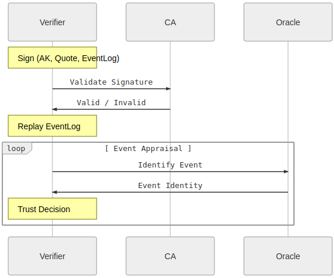

# TPM Remote Attestation protocol using go-tpm and gRPC

This repo contains a sample `gRPC` client server application that uses a Trusted Platform Module for:

* TPM [Remote Attestation](https://tpm2-software.github.io/tpm2-tss/getting-started/2019/12/18/Remote-Attestation.html)
* TPM [Quote-Verify](https://github.com/salrashid123/tpm2/tree/master/quote_verify)
* Sealed and PCR bound Transfer of RSA or AES keys.
* Parse TPM EventLog


Attestation:

( Images taken from [Remote Attestation](https://tpm2-software.github.io/tpm2-tss/getting-started/2019/12/18/Remote-Attestation.html) )


Quote/Verify:


EventLog



>>> **NOTE** the code and procedure outlined here is **NOT** supported by google.


You can use this standalone to setup a gRPC client/server for remote attestation.

There are two parts:

* `attestor`:  a `gRPC` server which accepts connections from a verifier, performs remote attestation, quote/verify and then then securely receives a sealed key from a verifier.  The key is distributed such that it can _only_ get loaded or decoded on the attestor that has the TPM

* `verifier`: a `gRPC` client which connects to the corresponding attestor, and the attestor proves it owns a specific TPM.  Once complete, the verifier will send a sealed RSA or AES Key that can only be decoded by that client.

---

As you can see, the whole protocol is rather complicated but hinges on being able to trust the initial Endorsement Key.   As mentioned, this is normally done by validating that the EndorsementPublic certificate is infact real and signed by a 3rd party (eg, the manufacturer of the TPM).  In the case of google's shielded vTPM, it is signed by google's subordinate CA and includes information about the VM's instance_id value.  This protocol also "validates" the PlatformCA which itself includes a reference (serial# reference) to the EndorsementKey.  I suppose it can contain the hash of the EKcert as another attribute...

---

also see

 - [go-attestation](https://github.com/google/go-attestation)
 - [CA scratchpad](https://github.com/salrashid123/ca_scratchpad)

## Setup

We will use a GCP Shielded VM for these tests 

First create two VMs

```bash
gcloud compute instances create attestor \
  --zone=us-central1-a --machine-type=e2-medium --no-service-account --no-scopes \
  --image=debian-11-bullseye-v20211105 --image-project=debian-cloud  \
  --shielded-secure-boot --shielded-vtpm --shielded-integrity-monitoring

gcloud compute instances create verifier \
  --zone=us-central1-a --machine-type=e2-medium --no-service-account --no-scopes \
  --image=debian-11-bullseye-v20211105 --image-project=debian-cloud  \
  --shielded-secure-boot --shielded-vtpm --shielded-integrity-monitoring
```

On each, install `go 1.19+` and setup `libtspi-dev`, `gcc` (`apt-get update && apt-get install gcc libtspi-dev`)

```bash
apt-get update
apt-get install libtspi-dev wget gcc git -y

wget https://golang.org/dl/go1.19.linux-amd64.tar.gz
rm -rf /usr/local/go && tar -C /usr/local -xzf go1.19.linux-amd64.tar.gz
export PATH=$PATH:/usr/local/go/bin/

```

on the *verifier* (which in this case is the client)  VM, edit `/etc/hosts`

and set the value of `attestor.esodemoapp2.com` to the IP of the client (in my case, its `10.128.0.14`).

```
$ gcloud compute instances list --filter=name=attestor
NAME      ZONE           MACHINE_TYPE  PREEMPTIBLE  INTERNAL_IP  EXTERNAL_IP      STATUS
attestor  us-central1-a  e2-medium                  10.128.0.14  104.197.204.181  RUNNING
```

```
root@verifier:# hostname
verifier

root@verifier:# more /etc/hosts
10.128.0.14 attestor.esodemoapp2.com
```


ofcourse you can use any hostname here but the certificated provided in this repo matches the SAN values for TLS.


## Tests

Now test the client-server by transmitting both an RSA and AES key.


On startup, the verifier will:

1. Verifier contacts the Attestor
2. Attestor returns EKCert (EK), if available*
3. Verifier checks Issuer of EKCert
  
Begin Remote Attestation

4. Verifier Requests Attestation Key (AK). Attestor return AK
5. Verifier uses (EK,AK) to begin Remote Attestation (MakeCredential) which involves using AK,EK to encrypt a value that it sends to Attestor
6. Attestor decodes the secret sent by Verifier (ActivateCredential) and returns the decrypted value to Verifier
7. Verifier confirms the secret sent matches.  Verifier associates AK with EK

End Remote Attestation

Begin Quote/Verify

8. Verifier Requests Quote over PCR values 
9. Attestor generates Quote over PCR value and uses AK to sign
10. Attestor generates EventLog 
11. Attestor returns Quote and EventLog to Verifier 
12. Verifier checks signature of the Attestation is by the AK and the PCR values from the Quote.  Verifier replays the eventLog to confirm derived PCR value.
13. Verifier uses CA private key to sign an x509 certificate tied to the AK.  The verifier _could_ return this x509 back to the attestor over a new (unimplemented) gRPC API call.

End Quote/Verify

Begin Sealed Transfer (PushSecret)

14. Verifier uses EK to encrypt either a local RSA or AES Key 
15. Verifier transmits encrypted Key to Attestor 
16. Attestor either decrypts the AES key or imports the External RSA key into its TPM
17. Attestor generates a test signature using the RSA key or calculates the Hash value of AES key.
18. Attestor returns the signature or hash to Verifier. 
19. Verifier confirms the signature value or hash (thereby confirming the Attestor decoded the RSA or AES key)

End Sealed Transfer

Begin Unrestricted SigningKey Transfer (PullSecret)

20. Verifier Requests Unrestricted Signing Key
21. Attestor generates RSA Key on TPM as a child of EK
22. Attestor uses AK to [Certify](https://github.com/tpm2-software/tpm2-tools/blob/master/man/tpm2_certify.1.md) the new key
23. Attestor transmits the TPM Wire firmat of the RSA key and test signature over some preshared data.
24. Verifier uses AK to confirm the authenticity of the Certification and RSA Public key is attested.
25. Verifier uses RSA Public key to verify the signature provided over preshared data
26. Verifier extracts the public key from the TPM Wireformat and compares it with the Key embedded in the attestation
27. Verifier uses the TPM Wire format Public key to verify the specifications for the unrestricted key (e,g matches template)
28. Verifier uses CA private key to sign an x509certificate tied to the SigningKey.  The verifier _could_ return this x509 back to the attestor over a new (unimplemented) gRPC API call.
    The attestor could use this x509 and private key on its TPM to create an mTLS connection.  See [crypto.Signer for TPM](https://github.com/salrashid123/signer#usage-tls) and [mTLS with TPM bound private key](https://github.com/salrashid123/go_tpm_https_embed) 

End Unrestricted SigningKey Transfer

### AES

#### Attestor AES

```bash
git clone https://github.com/salrashid123/go_tpm_remote_attestation.git
cd go_tpm_remote_attestation

go run src/grpc_attestor.go --grpcport :50051 \
 --unsealPcrs=0,7 \
 --caCertTLS certs/CA_crt.pem \
 --servercert certs/attestor_crt.pem \
 --serverkey certs/attestor_key.pem \
  -useFullAttestation=true --readEventLog=true \
  --platformCertFile certs/platform_cert.der \
  --v=10 -alsologtostderr
```

#### Verifier AES

```bash
git clone https://github.com/salrashid123/go_tpm_remote_attestation.git
cd go_tpm_remote_attestation

# make sure /etc/hosts contains the internal ip for the attestor's vm set as "attestor.esodemoapp2.com" in /etc/hosts

go run src/grpc_verifier.go --importMode=AES  --uid 369c327d-ad1f-401c-aa91-d9b0e69bft67  -aes256Key "G-KaPdSgUkXp2s5v8y/B?E(H+MbQeThW" \
   --host attestor.esodemoapp2.com:50051 \
   --expectedPCRMapSHA256 0:d0c70a9310cd0b55767084333022ce53f42befbb69c059ee6c0a32766f160783,7:3d91599581f7a3a3a1bb7c7a55a7b8a50967be6506a5f47a9e89fef756fab07a \
   --expectedPCRMapSHA1 0:0f2d3a2a1adaa479aeeca8f5df76aadc41b862ea \
   --caCertTLS certs/CA_crt.pem --caCertIssuer certs/CA_crt.pem --caKeyIssuer certs/CA_key.pem --platformCA certs/CA_crt.pem \
   --readEventLog=true \
   --useFullAttestation=true --v=10 -alsologtostderr 
```


Note, you can get the pcr values for 0,7 on the attestor using [pcr_utils](https://github.com/salrashid123/tpm2/tree/master/pcr_utils).  As of `6/13/23`:

```log
$ go run main.go --mode=read --pcr=0 -v 10 -alsologtostderr
I0613 18:56:49.776491    8823 main.go:66] ======= Print PCR  ========
I0613 18:56:49.778764    8823 main.go:71] PCR(0) d0c70a9310cd0b55767084333022ce53f42befbb69c059ee6c0a32766f160783
$ go run main.go --mode=read --pcr=7 -v 10 -alsologtostderr
I0613 18:56:54.544843    8870 main.go:66] ======= Print PCR  ========
I0613 18:56:54.547071    8870 main.go:71] PCR(7) 3d91599581f7a3a3a1bb7c7a55a7b8a50967be6506a5f47a9e89fef756fab07a
```

### RSA

#### Attestor RSA

```log
go run src/grpc_attestor.go --grpcport :50051 \
  --unsealPcrs=0,7 \
  --caCertTLS certs/CA_crt.pem \
  --servercert certs/attestor_crt.pem -useFullAttestation=true  --readEventLog=true \
  --serverkey certs/attestor_key.pem --platformCertFile certs/platform_cert.der  \
  --v=10 -alsologtostderr
```

#### Verifier RSA

```log
go run src/grpc_verifier.go --importMode=RSA  --uid 369c327d-ad1f-401c-aa91-d9b0e69bft67 \
  --expectedPCRMapSHA256 0:24af52a4f429b71a3184a6d64cddad17e54ea030e2aa6576bf3a5a3d8bd3328f,7:3d91599581f7a3a3a1bb7c7a55a7b8a50967be6506a5f47a9e89fef756fab07a \
  --expectedPCRMapSHA1 0:0f2d3a2a1adaa479aeeca8f5df76aadc41b862ea \
  --rsaCert=certs/tpm_client.crt \
  --readEventLog=true --useFullAttestation=true \
  --caCertTLS certs/CA_crt.pem --caCertIssuer certs/CA_crt.pem --caKeyIssuer certs/CA_key.pem    --platformCA certs/CA_crt.pem \
  --rsaKey=certs/tpm_client.key  --host attestor.esodemoapp2.com:50051   \
  --v=10 -alsologtostderr 
```


#### EventLog

Please see the following for background on the eventlog and how to use it 

- [TPMJS Event Log](https://google.github.io/tpm-js/#pg_attestation)

>> Note, on [GCP Shielded VM](https://cloud.google.com/compute/docs/instances/integrity-monitoring), the default `PCR0` value is:

```bash
# tpm2_pcrread sha1:0+sha256:0
  sha1:
    0 : 0x0F2D3A2A1ADAA479AEECA8F5DF76AADC41B862EA
  sha256:
    0 : 0x24AF52A4F429B71A3184A6D64CDDAD17E54EA030E2AA6576BF3A5A3D8BD3328F
```

You can find a full end-to-end trace for the AES example under the `example/` folder

---

### Platform Certificate

The platform certificate used in this protocol is just a sample, static one tied to a ShieldedVM's EKCert serial number.

I did this because i do not know how to generate a platform cert in go.  Instead i used  NSA's [Platform Attribute Certificate Creator (paccor)](https://github.com/nsacyber/paccor) in java to create the cert separately.

What this means is we just make believe/pretend that the platform cert is valid by statically comparing the serialnumbers. In reality the verifier should check the certificate serial number and that a valid privacy ca signed the cert..

[Attribute Certificate](https://github.com/salrashid123/attribute_certificate).

Note a sample serial number that is in the EKCert

```bash
tpm2_nvread -o ekcert.der 0x01c00002
openssl x509 -in ekcert.der -inform DER -outform PEM -out ekcert.pem

# openssl x509 -in ekcert.der -inform DER -outform PEM -out ekcert.pem
openssl x509 -in ekcert.pem -text
    Certificate:
        Data:
            Version: 3 (0x2)
            Serial Number:
                01:b0:01:fe:40:bf:96:77:47:51:a7:2e:9f:5d:e5:33:3d:6b:62
            Signature Algorithm: sha256WithRSAEncryption
            Issuer: C = US, ST = California, L = Mountain View, O = Google LLC, OU = Cloud, CN = "tpm_ek_v1_cloud_host-signer-0-2021-10-12T04:22:11-07:00 K:1, 3:nbvaGZFLcuc:0:18"
```

and the encoded reference of the same in the `platform_cert.der`


```bash
$ openssl asn1parse -inform DER -in certs/platform_cert.der

    0:d=0  hl=4 l=1268 cons: SEQUENCE          
    4:d=1  hl=4 l= 988 cons: SEQUENCE          
    8:d=2  hl=2 l=   1 prim: INTEGER           :01
   11:d=2  hl=3 l= 218 cons: SEQUENCE          
...
  713:d=4  hl=2 l=   3 prim: OBJECT            :X509v3 Authority Key Identifier
  718:d=4  hl=2 l= 113 prim: OCTET STRING      [HEX DUMP]:306F8014B7BAB002A1E7BE34C6C1055C6678E5BB535DA154A154A4523050310B3009060355040613025553310F300D060355040A0C06476F6F676C6531133011060355040B0C0A456E7465727072697365311B301906035504030C12456E746572707269736520526F6F74204341820102
  833:d=3  hl=2 l=  65 cons: SEQUENCE          
  835:d=4  hl=2 l=   3 prim: OBJECT            :X509v3 Certificate Policies
  840:d=4  hl=2 l=  58 prim: OCTET STRING      [HEX DUMP]:3038303606022A033030302E06082B0601050507020230220C20544347205472757374656420506C6174666F726D20456E646F7273656D656E74
  900:d=3  hl=2 l=  94 cons: SEQUENCE          
  902:d=4  hl=2 l=   3 prim: OBJECT            :X509v3 Subject Alternative Name
  907:d=4  hl=2 l=  87 prim: OCTET STRING      [HEX DUMP]:3055A45330513119301706066781050501040C0D4E6F74205370656369666965643119301706066781050501010C0D4E6F74205370656369666965643119301706066781050501050C0D4E6F7420537065636966696564
   
```

This links the platform cert with that specific EKCert

You can verify the Platform cert was signed by a given CA by using [go-attestation.attributecert.AttributeCertificate.CheckSignatureFrom](https://pkg.go.dev/github.com/google/go-attestation@v0.3.2/attributecert#AttributeCertificate.CheckSignatureFrom)


- [`2.1.5 Assertions Made by a Platform Certificate`](https://trustedcomputinggroup.org/wp-content/uploads/IWG_Platform_Certificate_Profile_v1p1_r19_pub_fixed.pdf)

```
3.2 Platform Certificate
This section contains the format for a Platform Certificate conforming to version 1.0 of this specification.
The Platform Certificate makes the assertions listed in section 2.1.6. This certificate format
adheres to RFC 5755 [11] and all requirements and limitations from that specification apply unless otherwise noted.
```

- [Host Integrity at Runtime and Start-up (HIRS)](https://github.com/nsacyber/HIRS/tree/master)


### Applications

This is just an academic exercise (so do not use the code as is).   However, some applications of this


- [TPM based Google Service Account Credentials](https://github.com/salrashid123/oauth2#usage-tpmtokensource)
- [TPM based mTLS](https://github.com/salrashid123/signer#usage-tls)
- [Trusted Platform Module (TPM) recipes with tpm2_tools and go-tpm](https://github.com/salrashid123/tpm2)


### Ubuntu with AMD-SEV (--confidential-compute)

If you use a GCP Confidential Compute VM for the attestor, use the pcr values it currently holds

```bash
gcloud compute instances create attestor-cc --zone=us-central1-a --machine-type=n2d-standard-2 \
  --confidential-compute --maintenance-policy=TERMINATE \
  --image=ubuntu-2004-focal-v20210927 --image-project=confidential-vm-images \
  --no-service-account --no-scopes \
  --shielded-secure-boot --shielded-vtpm --shielded-integrity-monitoring

tpm2_pcrread  sha1:0,7+sha256:0,7
  sha1:
    0 : 0xC032C3B51DBB6F96B047421512FD4B4DFDE496F3
    7 : 0x45B6A836BDC555783626C9E4E6234AC692F76B0B
  sha256:
    0 : 0x0F35C214608D93C7A6E68AE7359B4A8BE5A0E99EEA9107ECE427C4DEA4E439CF
    7 : 0xDD0276B3BF0E30531A575A1CB5A02171EA0AD0F164D51E81F4CD0AB0BD5BAADD


go run src/grpc_verifier.go --importMode=RSA  --uid 369c327d-ad1f-401c-aa91-d9b0e69bft67 \
  --expectedPCRMapSHA256 0:0f35c214608d93c7a6e68ae7359b4a8be5a0e99eea9107ece427c4dea4e439cf,7:dd0276b3bf0e30531a575a1cb5a02171ea0ad0f164d51e81f4cd0ab0bd5baadd \
  --expectedPCRMapSHA1 0:c032c3b51dbb6f96b047421512fd4b4dfde496f3 \
  --rsaCert=certs/tpm_client.crt \
  --readEventLog --useFullAttestation \
  --caCertTLS certs/CA_crt.pem --caCertIssuer certs/CA_crt.pem --caKeyIssuer certs/CA_key.pem \
  --rsaKey=certs/tpm_client.key  --host verify.esodemoapp2.com:50051   \
  --v=10 -alsologtostderr 
```

### EKCert and AKCert

Google signed Endorsement *Certificates* are not available on VMs. 

On any other platform ([even a raspberry pi](https://gist.github.com/salrashid123/d99e698f84e5d35a863225b747af1f48), you can usually extract the signing certificate bound on the tpm)..

While the API documentation for [getShieldedInstanceIdentity](https://cloud.google.com/compute/docs/reference/rest/v1/instances/getShieldedInstanceIdentity) shows a placeholder for the certificates:

```
{
  "kind": string,
  "signingKey": {
    "ekCert": string,
    "ekPub": string
  },
  "encryptionKey": {
    "ekCert": string,
    "ekPub": string
  }
}
```

it is not populated (see[retrieving-endorsement-key](https://cloud.google.com/compute/shielded-vm/docs/retrieving-endorsement-key))

```bash
gcloud compute instances get-shielded-identity attestor

encryptionKey:
  ekPub: |
    -----BEGIN PUBLIC KEY-----
    MIIBIjANBgkqhkiG9w0BAQEFAAOCAQ8AMIIBCgKCAQEAyLLB37zQTi3KfKridPpY
    tj9yKm0ci/QUGqrzBsVVqxqOsQUxocsaKMZPIO7VxJlJd8KHWMoGY6f1VOdNUFCN
    ufg5WMqA/t6rXvjF4NtPTvR05dCV4JegBBDnOjF9NgmV67+NgAm3afq/Z1qvJ336
    WUop2prbTWpseNtdlp2+4TOBSsNZgsum3CFr40qIsa2rb9xFDrqoMTVkgKGpJk+z
    ta+pcxGXYFJfU9sb7F7cs3e+TzjucGFcpVEiFzVq6Mga8cmh32sufM/PuifVYSLi
    BYV4s4c53gVq7v0Oda9LqaxT2A9EmKopcWUU8CEgbsBxhmVAhsnKwLDmJYKULkAk
    uwIDAQAB
    -----END PUBLIC KEY-----
kind: compute#shieldedInstanceIdentity
signingKey:
  ekPub: |
    -----BEGIN PUBLIC KEY-----
    MIIBIjANBgkqhkiG9w0BAQEFAAOCAQ8AMIIBCgKCAQEAtvr8f4lOUaHIMDoC9Baq
    sLs2Irh1RrKmTbgf/cWZHvhCQUT3qGGB5gqI96/efF3pCKx/KL9tYpJ7iQ3TpJhv
    E8sG+bfxA3qvoDXIzO8bsAPyEp6c77UfvHkasi4cKZP2kBIURy/TwOSeZco7qU51
    V10pL4kcw8J0CeDr4KKap6m4gWXcdo4rOpRMy62bBRIaxWEbPrAlotHSoD6hvtlT
    W0zBhs4zFrau+85YZNuobvvkPoZho/NosLKqNZ2gb2/ueY/mU0uAPhhtHtk7KWiN
    p5iSqcWHyrzU/tZ3LwiRB/vOxeQhWH3+o3BJPU0z9Dm+5fFlO6Se4hm1/S8VxYZ4
    owIDAQAB
    -----END PUBLIC KEY-----

```
