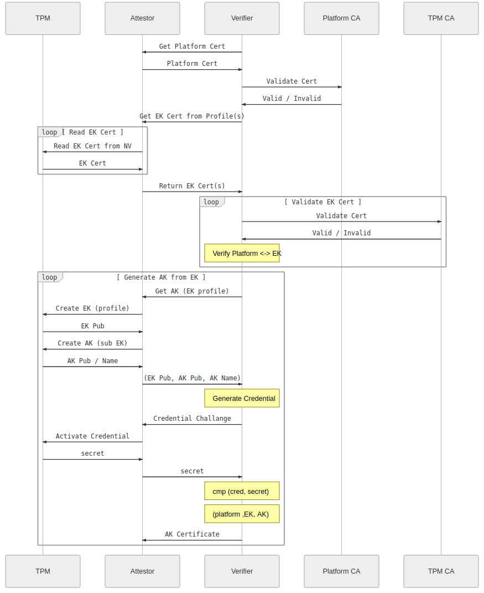
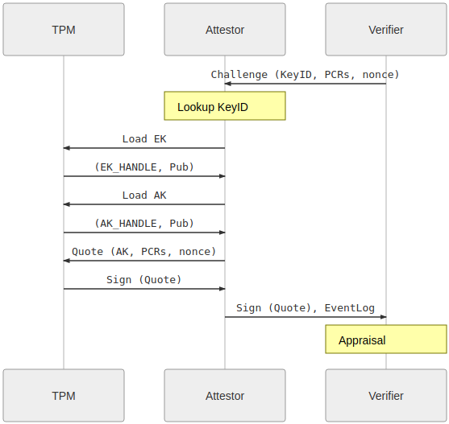

# TPM Remote Attestation protocol using go-tpm and gRPC


This repo contains a sample `gRPC` client server application that uses a Trusted Platform Module for:

It basically an implementation in go of

* TPM [Remote Attestation](https://tpm2-software.github.io/tpm2-tss/getting-started/2019/12/18/Remote-Attestation.html)
* TPM [Quote-Verify](https://github.com/salrashid123/tpm2/tree/master/quote_verify)
* Sealed and PCR bound Transfer of RSA or AES keys.

Attestation:



Quote/Verify:



( Images taken from [Remote Attestation](https://tpm2-software.github.io/tpm2-tss/getting-started/2019/12/18/Remote-Attestation.html) )

>>> **NOTE** the code and procedure outlined here is **NOT** supported by google.

This is a 'minimal' variation of [TPM based Secret Sharing with Google Compute Engine](https://github.com/salrashid123/tpm_key_distribution) without using GCE specific metadata.

You can use this standalone to setup a gRPC client/server for remote attestation.

There are two parts:

* `attestor`:  a `gRPC` server which accepts connections from a verifier, performs remote attestation, quote/verify and then then securely receives a sealed key from a verifier.  The key is distributed such that it can _only_ get loaded or decoded on the attestor that has the TPM

* `verifier`: a `gRPC` client which connects to the corresponding attestor, proves it owns a specific TPM and then sends a sealed Key that can only be decoded by that client.

---

As you can see, the whole protocol is rather complicated but hinges on being able to trust the initial Endorsement Key.   As mentioned, this is normally done by validating that the EndorsementPublic certificate is infact real and signed by a 3rd party (eg, the manufacturer of the TPM).  In the case of google's shielded vTPM, it is signed by google's subordinate CA and includes information about the VM's instance_id value.

---

also see

 - [go-attestation](https://github.com/google/go-attestation)


## Setup

We will use a GCP Shielded VM for these tests 

First create two VMs

```bash
gcloud compute instances create attestor \
  --zone=us-central1-a --machine-type=e2-medium --no-service-account --no-scopes \
  --image=debian-10-buster-v20210817 --image-project=debian-cloud  \
  --shielded-secure-boot --shielded-vtpm --shielded-integrity-monitoring

gcloud compute instances create verifier \
  --zone=us-central1-a --machine-type=e2-medium --no-service-account --no-scopes \
  --image=debian-10-buster-v20210817 --image-project=debian-cloud  \
  --shielded-secure-boot --shielded-vtpm --shielded-integrity-monitoring
```

On each, install `go 1.16+` and setup `libtspi-dev`, `gcc` (`apt-get update && apt-get install gcc libtspi-dev`)

```bash
apt-get update
apt-get install libtspi-dev wget gcc -y

wget https://golang.org/dl/go1.17.linux-amd64.tar.gz
rm -rf /usr/local/go && tar -C /usr/local -xzf go1.17.linux-amd64.tar.gz

```

the client  VM, edit `/etc/hosts`

and set the value of `verify.esodemoapp2.com` to the IP of the server (in my case, its `10.128.0.58`)

```
10.128.0.58 verify.esodemoapp2.com
```

ofcourse you can use any hostname here but the certificated provided in this repo matches the SAN values for TLS.


## Tests

Now test the client-server by transmitting both an RSA and AES key:


### EventLog

>> Note, on [GCP Shielded VM](https://cloud.google.com/compute/docs/instances/integrity-monitoring), the default `PCR0` value is:

```bash
# tpm2_pcrread sha1:0+sha256:0
  sha1:
    0 : 0x0F2D3A2A1ADAA479AEECA8F5DF76AADC41B862EA
  sha256:
    0 : 0x24AF52A4F429B71A3184A6D64CDDAD17E54EA030E2AA6576BF3A5A3D8BD3328F
```

which you can specify with arguments

`--pcr=0 --expectedPCR0SHA1 0f2d3a2a1adaa479aeeca8f5df76aadc41b862ea --expectedPCRValue 24af52a4f429b71a3184a6d64cddad17e54ea030e2aa6576bf3a5a3d8bd3328f`

We're using PCR0 for the [TPM EventLog](https://www.kernel.org/doc/html/latest/security/tpm/tpm_event_log.html) that is returned during quote/verify.

see [go-tpm-tools/server/eventlog_test.go](https://github.com/google/go-tpm-tools/blob/master/server/eventlog_test.go#L226)

for debian10 on GCE with secureboot: `0f2d3a2a1adaa479aeeca8f5df76aadc41b862ea`


### AES

#### Attestor AES

```log
$ go run src/grpc_attestor.go --grpcport :50051 \
 --cacert certs/CA_crt.pem --servercert certs/server_crt.pem \
 --serverkey certs/server_key.pem --pcr=0 --v=10 -alsologtostderr

I0901 00:37:25.718028   32554 grpc_attestor.go:1091] Starting gRPC server on port :50051
I0901 00:37:54.655652   32554 grpc_attestor.go:123] >> inbound request
I0901 00:37:54.655685   32554 grpc_attestor.go:143] HealthCheck called for Service [verifier.VerifierServer]
I0901 00:37:54.657245   32554 grpc_attestor.go:123] >> inbound request
I0901 00:37:54.657281   32554 grpc_attestor.go:157] ======= GetPlatformCert ========
I0901 00:37:54.657292   32554 grpc_attestor.go:158]      client provided uid: 369c327d-ad1f-401c-aa91-d9b0e69bft67
CERTIFICATE
I0901 00:37:54.657491   32554 grpc_attestor.go:171]      Found Platform Cert Issuer CN=tpm_ek_v1_cloud_host_root-signer-0-2018-04-06T10:58:26-07:00 K:1\, 1:Pw003HsFYO4:0:18,OU=Cloud,O=Google LLC,L=Mountain View,ST=California,C=US ========
I0901 00:37:54.657514   32554 grpc_attestor.go:172]      Returning GetPlatformCert ========
I0901 00:37:54.658376   32554 grpc_attestor.go:123] >> inbound request
I0901 00:37:54.658402   32554 grpc_attestor.go:180] ======= GetEKCert ========
I0901 00:37:54.658409   32554 grpc_attestor.go:181]      client provided uid: 369c327d-ad1f-401c-aa91-d9b0e69bft67
I0901 00:37:54.658417   32554 grpc_attestor.go:187] =============== Load EncryptionKey and Certifcate from NV ===============
I0901 00:37:54.676397   32554 grpc_attestor.go:203]      Encryption PEM 
-----BEGIN PUBLIC KEY-----
MIIBIjANBgkqhkiG9w0BAQEFAAOCAQ8AMIIBCgKCAQEAwsY6zrTncJqdkbccZuoe
2eyDcvd2FzsCBDCyD6E31O2vMmy0Co/w8sqDutyeTZ4N6LvirGSdQxNZ/iv5nLRB
nlUXiJi8Spxz9FvtHoNN4ptmveqDvRl2l6NkxHZBIxLxPi0k9zmpbb5iqHcDqkyz
iQlPnWZDZMBZTnY2pOHOzn7c7qR/uuwsMxIUCXH8g93YL00b7mn53GiBn9rqg2L1
GcioHkfu8dROyoTUhrRn56ap4bwI0LsoGwiMfSw2ITFsJXHFkXcshe2ev+z29jHd
LspYW5wt+FEm1c1IYS076L4dk+yEUVZZ1JQ3iaHKn3/KDb5d5/1+yz1heBEdz83e
ZwIDAQAB
-----END PUBLIC KEY-----
I0901 00:37:54.690546   32554 grpc_attestor.go:221]      Encryption Issuer x509 tpm_ek_v1_cloud_host-signer-0-2020-10-22T14:02:08-07:00 K:1, 2:HBNpA3TPAbM:0:18
I0901 00:37:54.690586   32554 grpc_attestor.go:222]      Returning GetEKCert ========
I0901 00:37:54.691834   32554 grpc_attestor.go:123] >> inbound request
I0901 00:37:54.691862   32554 grpc_attestor.go:230] ======= GetAK ========
I0901 00:37:54.691871   32554 grpc_attestor.go:231]      client provided uid: 369c327d-ad1f-401c-aa91-d9b0e69bft67
I0901 00:37:54.693771   32554 grpc_attestor.go:238]      Current PCR 0 Value 24af52a4f429b71a3184a6d64cddad17e54ea030e2aa6576bf3a5a3d8bd3328f
I0901 00:37:54.693803   32554 grpc_attestor.go:243]      createPrimary
I0901 00:37:54.791720   32554 grpc_attestor.go:274]      ekPub Name: 000b4bd5d7f30dc3a1975ae9529404f2ec73ae5a404669c5e87d74186fa2a4c280db
I0901 00:37:54.791765   32554 grpc_attestor.go:275]      ekPubPEM: 
-----BEGIN PUBLIC KEY-----
MIIBIjANBgkqhkiG9w0BAQEFAAOCAQ8AMIIBCgKCAQEAwsY6zrTncJqdkbccZuoe
2eyDcvd2FzsCBDCyD6E31O2vMmy0Co/w8sqDutyeTZ4N6LvirGSdQxNZ/iv5nLRB
nlUXiJi8Spxz9FvtHoNN4ptmveqDvRl2l6NkxHZBIxLxPi0k9zmpbb5iqHcDqkyz
iQlPnWZDZMBZTnY2pOHOzn7c7qR/uuwsMxIUCXH8g93YL00b7mn53GiBn9rqg2L1
GcioHkfu8dROyoTUhrRn56ap4bwI0LsoGwiMfSw2ITFsJXHFkXcshe2ev+z29jHd
LspYW5wt+FEm1c1IYS076L4dk+yEUVZZ1JQ3iaHKn3/KDb5d5/1+yz1heBEdz83e
ZwIDAQAB
-----END PUBLIC KEY-----
I0901 00:37:54.791818   32554 grpc_attestor.go:282]      CreateKeyUsingAuth
I0901 00:37:54.966256   32554 grpc_attestor.go:320]      ContextSave (ek)
I0901 00:37:54.977777   32554 grpc_attestor.go:331]      ContextLoad (ek)
I0901 00:37:54.986439   32554 grpc_attestor.go:342]      LoadUsingAuth
I0901 00:37:54.995185   32554 grpc_attestor.go:370]      AK keyName 0022000ba0d9d4a67426f32a152b361db30632e1d7142cb1dfc3558b31c04ad865942397
I0901 00:37:54.998744   32554 grpc_attestor.go:392]      akPubPEM: 
-----BEGIN PUBLIC KEY-----
MIIBIjANBgkqhkiG9w0BAQEFAAOCAQ8AMIIBCgKCAQEAvOhGfRvJY6HV86IuSg4N
uyLHtjaU1JQeUrAtt3ptpiWnJUcX+iqG2lJ714E93YhqUEUWIQc97LePVpAJtCWq
4XU7fW6WsLe2LUXzie4PNZvXzXKN3unv9a/DMxHOp3zqRUm3dVDiDlZRL4FCIuW2
9LFN2DuvyrG1b4Z8wRduDX6ES3OwJ9E3WMjRt9M0cEzar165SnV/8Sn9cQueYV7o
oE8ypNU9QN+pB4aQyll6Fis86iRCxETEMDWNLMvanBm2XfKrIDHjqlk0lzdR1uIv
YYTPHmj3qJHTz0vyTOfhHYnuum1f2eVcWdaRaqbDs2sRzIwlxMPHV2pqchozjtW2
rwIDAQAB
-----END PUBLIC KEY-----
I0901 00:37:54.998800   32554 grpc_attestor.go:394]      Write (akPub) ========
I0901 00:37:54.999064   32554 grpc_attestor.go:399]      Write (akPriv) ========
I0901 00:37:54.999177   32554 grpc_attestor.go:409]      Returning GetAK ========
I0901 00:37:55.018674   32554 grpc_attestor.go:123] >> inbound request
I0901 00:37:55.018741   32554 grpc_attestor.go:421] ======= ActivateCredential ========
I0901 00:37:55.018749   32554 grpc_attestor.go:422]      client provided uid: 369c327d-ad1f-401c-aa91-d9b0e69bft67
I0901 00:37:55.018759   32554 grpc_attestor.go:424]      ContextLoad (ek)
I0901 00:37:55.027932   32554 grpc_attestor.go:435]      Read (akPub)
I0901 00:37:55.028055   32554 grpc_attestor.go:440]      Read (akPriv)
I0901 00:37:55.036199   32554 grpc_attestor.go:471]      keyName 0022000ba0d9d4a67426f32a152b361db30632e1d7142cb1dfc3558b31c04ad865942397
I0901 00:37:55.036238   32554 grpc_attestor.go:473]      ActivateCredentialUsingAuth
I0901 00:37:55.047544   32554 grpc_attestor.go:521]      <--  activateCredential()
I0901 00:37:55.055895   32554 grpc_attestor.go:123] >> inbound request
I0901 00:37:55.055929   32554 grpc_attestor.go:531] ======= Quote ========
I0901 00:37:55.055939   32554 grpc_attestor.go:532]      client provided uid: 369c327d-ad1f-401c-aa91-d9b0e69bft67
I0901 00:37:55.057890   32554 grpc_attestor.go:539]      PCR 0 Value 24af52a4f429b71a3184a6d64cddad17e54ea030e2aa6576bf3a5a3d8bd3328f 
I0901 00:37:55.057918   32554 grpc_attestor.go:544]      ContextLoad (ek) ========
I0901 00:37:55.067594   32554 grpc_attestor.go:554]      LoadUsingAuth ========
I0901 00:37:55.071106   32554 grpc_attestor.go:576]      Read (akPub) ========
I0901 00:37:55.071249   32554 grpc_attestor.go:581]      Read (akPriv) ========
I0901 00:37:55.076506   32554 grpc_attestor.go:593]      AK keyName 0022000ba0d9d4a67426f32a152b361db30632e1d7142cb1dfc3558b31c04ad865942397
I0901 00:37:55.083113   32554 grpc_attestor.go:608]      <-- End Quote
I0901 00:37:55.091341   32554 grpc_attestor.go:123] >> inbound request
I0901 00:37:55.091380   32554 grpc_attestor.go:620] ======= PushSecret ========
I0901 00:37:55.091390   32554 grpc_attestor.go:621]      client provided uid: 
I0901 00:37:55.091398   32554 grpc_attestor.go:624]      Loading EndorsementKeyRSA
I0901 00:37:55.098486   32554 grpc_attestor.go:639]      Importing External Key
I0901 00:37:55.120784   32554 grpc_attestor.go:644]      <-- End importKey()
I0901 00:37:55.120834   32554 grpc_attestor.go:648]      Hash of imported Key bZeQ9G0KuKpHVwfZuobcMf7tL/ViU1maVaJCAY+QjfU=
I0901 00:37:55.124891   32554 grpc_attestor.go:123] >> inbound request
I0901 00:37:55.124924   32554 grpc_attestor.go:729] ======= PullRSAKey ========
I0901 00:37:55.124943   32554 grpc_attestor.go:730]      client provided uid: 369c327d-ad1f-401c-aa91-d9b0e69bft67
I0901 00:37:55.124953   32554 grpc_attestor.go:732] ======= Generate UnrestrictedKey ========
I0901 00:37:55.124960   32554 grpc_attestor.go:734]      ContextLoad (ek) ========
I0901 00:37:55.134559   32554 grpc_attestor.go:745]      Loading AttestationKey
I0901 00:37:55.143943   32554 grpc_attestor.go:781]      AK keyName: ACIAC6DZ1KZ0JvMqFSs2HbMGMuHXFCyx38NVizHASthllCOX,
I0901 00:37:55.145681   32554 grpc_attestor.go:805]      akPub PEM 
-----BEGIN PUBLIC KEY-----
MIIBIjANBgkqhkiG9w0BAQEFAAOCAQ8AMIIBCgKCAQEAvOhGfRvJY6HV86IuSg4N
uyLHtjaU1JQeUrAtt3ptpiWnJUcX+iqG2lJ714E93YhqUEUWIQc97LePVpAJtCWq
4XU7fW6WsLe2LUXzie4PNZvXzXKN3unv9a/DMxHOp3zqRUm3dVDiDlZRL4FCIuW2
9LFN2DuvyrG1b4Z8wRduDX6ES3OwJ9E3WMjRt9M0cEzar165SnV/8Sn9cQueYV7o
oE8ypNU9QN+pB4aQyll6Fis86iRCxETEMDWNLMvanBm2XfKrIDHjqlk0lzdR1uIv
YYTPHmj3qJHTz0vyTOfhHYnuum1f2eVcWdaRaqbDs2sRzIwlxMPHV2pqchozjtW2
rwIDAQAB
-----END PUBLIC KEY-----
I0901 00:37:55.145794   32554 grpc_attestor.go:809]      ======= CreateKeyUsingAuthUnrestricted ========
I0901 00:37:55.150098   32554 grpc_attestor.go:839]      PCR 0 Value 24af52a4f429b71a3184a6d64cddad17e54ea030e2aa6576bf3a5a3d8bd3328f 
I0901 00:37:55.372652   32554 grpc_attestor.go:906]      uakPub PEM 
-----BEGIN PUBLIC KEY-----
MIIBIjANBgkqhkiG9w0BAQEFAAOCAQ8AMIIBCgKCAQEAtjP77cw/vKnR7AepP6gR
ZCDuSqEJ4wUk8sVUuTsUK9hNCc0Ts3LLnIgcG3VUzj5/7Eis2x2KFuyi8KPZ6lIm
/pRp/G12/AEBLTRHY288PDg7VE+VOn5fwPqUJojsvJdkOufDx4aqvfP98Ezs9EJ9
YnPWxBjr/Man7WUHbQ+u8yzO3H+k72g/ksAubynXrDLpAXVxN9L5wgNRYaZtM6Ox
+g36cxvfyFW88IDunNLeK3hW+yRYhxmvbeTQmqRDDcaMoaM2DOoroVtWg++R2Ptv
/5RxPAnTkXzxpRQePv5lsaCnAOqxIb6rrUyMjPB2JwTX/S4tviQ/UuAjzqfDSjpz
twIDAQAB
-----END PUBLIC KEY-----
I0901 00:37:55.388045   32554 grpc_attestor.go:932]      Signature data:  cJKKs9SANPRAMrKBW7egBei9h6dtYY4XSpPYZtDHP9dgw+T0/WEk3X37o15zZW/JwZSQJMjewnWnnZY0GpWgoifL9c7HKBxunu36x3LZmwYF1KNn03/NDc3MiQ+s6/XXtaYjIeNu916KHMbDv37dlKZsvJtgInyBkUfjGKjbGXV4YCHkcfluXNUq21BHAIJL/zL4UxG49Fuyy08F9qekLOcoKYMTZ24oZIEnQCOfY3OFluxdLA3CkiwsVbNZvXrDHazhyO9bBAj3kN5I2INP8O5fwCKk+lAYzx+rq9YzCTFvewHlk53nDN5jVS/v10wtjOdhBrGHITgvcu0Pj0m9ww
I0901 00:37:55.388172   32554 grpc_attestor.go:1017]      Returning PullRSAKeyResponse
```

#### Verifier AES

```log
$ go run src/grpc_verifier.go --importMode=AES  --uid 369c327d-ad1f-401c-aa91-d9b0e69bft67 \
   -aes256Key "G-KaPdSgUkXp2s5v8y/B?E(H+MbQeThW" --expectedPCR0SHA1 0f2d3a2a1adaa479aeeca8f5df76aadc41b862ea \
   --host verify.esodemoapp2.com:50051 --pcr=0 --expectedPCRValue 24af52a4f429b71a3184a6d64cddad17e54ea030e2aa6576bf3a5a3d8bd3328f \
   --v=10 -alsologtostderr 

I0901 00:37:54.656356    6680 grpc_verifier.go:140] RPC HealthChekStatus:SERVING
I0901 00:37:54.656557    6680 grpc_verifier.go:144] =============== GetPlatformCert ===============
I0901 00:37:54.657876    6680 grpc_verifier.go:153] =============== GetPlatformCert Returned from remote ===============
I0901 00:37:54.657969    6680 grpc_verifier.go:171]     Platform Cert Issuer tpm_ek_v1_cloud_host_root-signer-0-2018-04-06T10:58:26-07:00 K:1, 1:Pw003HsFYO4:0:18
I0901 00:37:54.691296    6680 grpc_verifier.go:184] =============== GetEKCert Returned from remote ===============
I0901 00:37:54.691412    6680 grpc_verifier.go:202]     EkCert Cert Issuer tpm_ek_v1_cloud_host-signer-0-2020-10-22T14:02:08-07:00 K:1, 2:HBNpA3TPAbM:0:18
I0901 00:37:54.691432    6680 grpc_verifier.go:203]     EkCert Public Key 
-----BEGIN PUBLIC KEY-----
MIIBIjANBgkqhkiG9w0BAQEFAAOCAQ8AMIIBCgKCAQEAwsY6zrTncJqdkbccZuoe
2eyDcvd2FzsCBDCyD6E31O2vMmy0Co/w8sqDutyeTZ4N6LvirGSdQxNZ/iv5nLRB
nlUXiJi8Spxz9FvtHoNN4ptmveqDvRl2l6NkxHZBIxLxPi0k9zmpbb5iqHcDqkyz
iQlPnWZDZMBZTnY2pOHOzn7c7qR/uuwsMxIUCXH8g93YL00b7mn53GiBn9rqg2L1
GcioHkfu8dROyoTUhrRn56ap4bwI0LsoGwiMfSw2ITFsJXHFkXcshe2ev+z29jHd
LspYW5wt+FEm1c1IYS076L4dk+yEUVZZ1JQ3iaHKn3/KDb5d5/1+yz1heBEdz83e
ZwIDAQAB
-----END PUBLIC KEY-----

I0901 00:37:54.691459    6680 grpc_verifier.go:206] =============== GetAKCert ===============
I0901 00:37:55.006724    6680 grpc_verifier.go:218] =============== MakeCredential ===============
I0901 00:37:55.006841    6680 grpc_verifier.go:240]      Decoded EkPublic Key: 
-----BEGIN PUBLIC KEY-----
MIIBIjANBgkqhkiG9w0BAQEFAAOCAQ8AMIIBCgKCAQEAwsY6zrTncJqdkbccZuoe
2eyDcvd2FzsCBDCyD6E31O2vMmy0Co/w8sqDutyeTZ4N6LvirGSdQxNZ/iv5nLRB
nlUXiJi8Spxz9FvtHoNN4ptmveqDvRl2l6NkxHZBIxLxPi0k9zmpbb5iqHcDqkyz
iQlPnWZDZMBZTnY2pOHOzn7c7qR/uuwsMxIUCXH8g93YL00b7mn53GiBn9rqg2L1
GcioHkfu8dROyoTUhrRn56ap4bwI0LsoGwiMfSw2ITFsJXHFkXcshe2ev+z29jHd
LspYW5wt+FEm1c1IYS076L4dk+yEUVZZ1JQ3iaHKn3/KDb5d5/1+yz1heBEdz83e
ZwIDAQAB
-----END PUBLIC KEY-----
I0901 00:37:55.010945    6680 grpc_verifier.go:268]      Decoded AkPub: 
-----BEGIN PUBLIC KEY-----
MIIBIjANBgkqhkiG9w0BAQEFAAOCAQ8AMIIBCgKCAQEAvOhGfRvJY6HV86IuSg4N
uyLHtjaU1JQeUrAtt3ptpiWnJUcX+iqG2lJ714E93YhqUEUWIQc97LePVpAJtCWq
4XU7fW6WsLe2LUXzie4PNZvXzXKN3unv9a/DMxHOp3zqRUm3dVDiDlZRL4FCIuW2
9LFN2DuvyrG1b4Z8wRduDX6ES3OwJ9E3WMjRt9M0cEzar165SnV/8Sn9cQueYV7o
oE8ypNU9QN+pB4aQyll6Fis86iRCxETEMDWNLMvanBm2XfKrIDHjqlk0lzdR1uIv
YYTPHmj3qJHTz0vyTOfhHYnuum1f2eVcWdaRaqbDs2sRzIwlxMPHV2pqchozjtW2
rwIDAQAB
-----END PUBLIC KEY-----
I0901 00:37:55.010994    6680 grpc_verifier.go:271]      AK Default parameter match template
I0901 00:37:55.014185    6680 grpc_verifier.go:280]      Loaded AK KeyName 000ba0d9d4a67426f32a152b361db30632e1d7142cb1dfc3558b31c04ad865942397
I0901 00:37:55.014225    6680 grpc_verifier.go:282]      MakeCredential Start
I0901 00:37:55.017833    6680 grpc_verifier.go:294]      <-- End makeCredential()
I0901 00:37:55.017875    6680 grpc_verifier.go:299] =============== ActivateCredential ===============
I0901 00:37:55.055253    6680 grpc_verifier.go:310]      Secret: blxPWRHZnmWXymBOZjlpVNKTXLlqVHre
I0901 00:37:55.055301    6680 grpc_verifier.go:311]      Nonce: blxPWRHZnmWXymBOZjlpVNKTXLlqVHre
I0901 00:37:55.055314    6680 grpc_verifier.go:313] =============== Quote/Verify ===============
I0901 00:37:55.089309    6680 grpc_verifier.go:357]      Expected PCR Value:           --> 24af52a4f429b71a3184a6d64cddad17e54ea030e2aa6576bf3a5a3d8bd3328f
I0901 00:37:55.089354    6680 grpc_verifier.go:358]      sha256 of Expected PCR Value: --> 2ba7022b59f2158786ea3ea29a7ad12ff0c6c9d6682da6555d8926075b643b1f
I0901 00:37:55.089382    6680 grpc_verifier.go:360]      Decoding PublicKey for AK ========
I0901 00:37:55.089548    6680 grpc_verifier.go:377]      Attestation Signature Verified 
I0901 00:37:55.089582    6680 grpc_verifier.go:379]      Reading EventLog
I0901 00:37:55.089695    6680 grpc_verifier.go:394]      Event Type EV_S_CRTM_VERSION
I0901 00:37:55.089742    6680 grpc_verifier.go:395]      PCR Index 0
I0901 00:37:55.089779    6680 grpc_verifier.go:396]      Event Data 47004300450020005600690072007400750061006c0020004600690072006d0077006100720065002000760031000000
I0901 00:37:55.089814    6680 grpc_verifier.go:397]      Event Digest 3f708bdbaff2006655b540360e16474c100c1310
I0901 00:37:55.089847    6680 grpc_verifier.go:394]      Event Type EV_NONHOST_INFO
I0901 00:37:55.089884    6680 grpc_verifier.go:395]      PCR Index 0
I0901 00:37:55.089914    6680 grpc_verifier.go:396]      Event Data 474345204e6f6e486f7374496e666f0000000000000000000000000000000000
I0901 00:37:55.089957    6680 grpc_verifier.go:397]      Event Digest 9e8af742718df04092551f27c117723769acfe7e
I0901 00:37:55.089992    6680 grpc_verifier.go:394]      Event Type EV_SEPARATOR
I0901 00:37:55.090023    6680 grpc_verifier.go:395]      PCR Index 0
I0901 00:37:55.090058    6680 grpc_verifier.go:396]      Event Data 00000000
I0901 00:37:55.090092    6680 grpc_verifier.go:397]      Event Digest 9069ca78e7450a285173431b3e52c5c25299e473
I0901 00:37:55.090115    6680 grpc_verifier.go:399]      EventLog Verified 
I0901 00:37:55.090141    6680 grpc_verifier.go:401]      <-- End verifyQuote()
I0901 00:37:55.090169    6680 grpc_verifier.go:403] =============== PushSecret ===============
I0901 00:37:55.090190    6680 grpc_verifier.go:405]      Pushing AES
I0901 00:37:55.090595    6680 grpc_verifier.go:434]      Hash of AES Key:  bZeQ9G0KuKpHVwfZuobcMf7tL/ViU1maVaJCAY+QjfU
I0901 00:37:55.124374    6680 grpc_verifier.go:496]      Verification bZeQ9G0KuKpHVwfZuobcMf7tL/ViU1maVaJCAY+QjfU=
I0901 00:37:55.124439    6680 grpc_verifier.go:498] =============== PullRSAKey ===============
I0901 00:37:55.397051    6680 grpc_verifier.go:565]      Pulled Signing Key 369c327d-ad1f-401c-aa91-d9b0e69bft67
```

### RSA

#### Attestor RSA

```log
$ go run src/grpc_attestor.go --grpcport :50051 --cacert certs/CA_crt.pem \
  --servercert certs/server_crt.pem \
  --serverkey certs/server_key.pem --pcr=0 \
  --v=10 -alsologtostderr

I0901 00:39:52.771896   32601 grpc_attestor.go:1091] Starting gRPC server on port :50051
I0901 00:40:05.774510   32601 grpc_attestor.go:123] >> inbound request
I0901 00:40:05.774557   32601 grpc_attestor.go:143] HealthCheck called for Service [verifier.VerifierServer]
I0901 00:40:05.776269   32601 grpc_attestor.go:123] >> inbound request
I0901 00:40:05.776298   32601 grpc_attestor.go:157] ======= GetPlatformCert ========
I0901 00:40:05.776319   32601 grpc_attestor.go:158]      client provided uid: 369c327d-ad1f-401c-aa91-d9b0e69bft67
CERTIFICATE
I0901 00:40:05.776484   32601 grpc_attestor.go:171]      Found Platform Cert Issuer CN=tpm_ek_v1_cloud_host_root-signer-0-2018-04-06T10:58:26-07:00 K:1\, 1:Pw003HsFYO4:0:18,OU=Cloud,O=Google LLC,L=Mountain View,ST=California,C=US ========
I0901 00:40:05.776587   32601 grpc_attestor.go:172]      Returning GetPlatformCert ========
I0901 00:40:05.777354   32601 grpc_attestor.go:123] >> inbound request
I0901 00:40:05.777374   32601 grpc_attestor.go:180] ======= GetEKCert ========
I0901 00:40:05.777381   32601 grpc_attestor.go:181]      client provided uid: 369c327d-ad1f-401c-aa91-d9b0e69bft67
I0901 00:40:05.777389   32601 grpc_attestor.go:187] =============== Load EncryptionKey and Certifcate from NV ===============
I0901 00:40:05.798948   32601 grpc_attestor.go:203]      Encryption PEM 
-----BEGIN PUBLIC KEY-----
MIIBIjANBgkqhkiG9w0BAQEFAAOCAQ8AMIIBCgKCAQEAwsY6zrTncJqdkbccZuoe
2eyDcvd2FzsCBDCyD6E31O2vMmy0Co/w8sqDutyeTZ4N6LvirGSdQxNZ/iv5nLRB
nlUXiJi8Spxz9FvtHoNN4ptmveqDvRl2l6NkxHZBIxLxPi0k9zmpbb5iqHcDqkyz
iQlPnWZDZMBZTnY2pOHOzn7c7qR/uuwsMxIUCXH8g93YL00b7mn53GiBn9rqg2L1
GcioHkfu8dROyoTUhrRn56ap4bwI0LsoGwiMfSw2ITFsJXHFkXcshe2ev+z29jHd
LspYW5wt+FEm1c1IYS076L4dk+yEUVZZ1JQ3iaHKn3/KDb5d5/1+yz1heBEdz83e
ZwIDAQAB
-----END PUBLIC KEY-----
I0901 00:40:05.813705   32601 grpc_attestor.go:221]      Encryption Issuer x509 tpm_ek_v1_cloud_host-signer-0-2020-10-22T14:02:08-07:00 K:1, 2:HBNpA3TPAbM:0:18
I0901 00:40:05.813756   32601 grpc_attestor.go:222]      Returning GetEKCert ========
I0901 00:40:05.815112   32601 grpc_attestor.go:123] >> inbound request
I0901 00:40:05.815139   32601 grpc_attestor.go:230] ======= GetAK ========
I0901 00:40:05.815146   32601 grpc_attestor.go:231]      client provided uid: 369c327d-ad1f-401c-aa91-d9b0e69bft67
I0901 00:40:05.816890   32601 grpc_attestor.go:238]      Current PCR 0 Value 24af52a4f429b71a3184a6d64cddad17e54ea030e2aa6576bf3a5a3d8bd3328f
I0901 00:40:05.816915   32601 grpc_attestor.go:243]      createPrimary
I0901 00:40:05.904588   32601 grpc_attestor.go:274]      ekPub Name: 000b4bd5d7f30dc3a1975ae9529404f2ec73ae5a404669c5e87d74186fa2a4c280db
I0901 00:40:05.904621   32601 grpc_attestor.go:275]      ekPubPEM: 
-----BEGIN PUBLIC KEY-----
MIIBIjANBgkqhkiG9w0BAQEFAAOCAQ8AMIIBCgKCAQEAwsY6zrTncJqdkbccZuoe
2eyDcvd2FzsCBDCyD6E31O2vMmy0Co/w8sqDutyeTZ4N6LvirGSdQxNZ/iv5nLRB
nlUXiJi8Spxz9FvtHoNN4ptmveqDvRl2l6NkxHZBIxLxPi0k9zmpbb5iqHcDqkyz
iQlPnWZDZMBZTnY2pOHOzn7c7qR/uuwsMxIUCXH8g93YL00b7mn53GiBn9rqg2L1
GcioHkfu8dROyoTUhrRn56ap4bwI0LsoGwiMfSw2ITFsJXHFkXcshe2ev+z29jHd
LspYW5wt+FEm1c1IYS076L4dk+yEUVZZ1JQ3iaHKn3/KDb5d5/1+yz1heBEdz83e
ZwIDAQAB
-----END PUBLIC KEY-----
I0901 00:40:05.904652   32601 grpc_attestor.go:282]      CreateKeyUsingAuth
I0901 00:40:06.042526   32601 grpc_attestor.go:320]      ContextSave (ek)
I0901 00:40:06.053064   32601 grpc_attestor.go:331]      ContextLoad (ek)
I0901 00:40:06.062029   32601 grpc_attestor.go:342]      LoadUsingAuth
I0901 00:40:06.070705   32601 grpc_attestor.go:370]      AK keyName 0022000b72ee1efd215c37b35393fd6775e8e89394384b21ddcbe93bf07ea6dde072b330
I0901 00:40:06.073069   32601 grpc_attestor.go:392]      akPubPEM: 
-----BEGIN PUBLIC KEY-----
MIIBIjANBgkqhkiG9w0BAQEFAAOCAQ8AMIIBCgKCAQEAp5VuRuYLj2McqwAX3vLK
F24vNnzimQYF7VNT56FZ8vselwtRnR1WMwFOsi1ZY85d3RiZoqnqTFj43ETW0W74
j9su1SbaDE+6cqLwbhpi34MdifJOIzTFj9wK+YHYg7podk6tohH/w/IWbvSwFlAs
EuJD2w6/PdY4IlEN6TFeyAv3/lFqKOtxj7XDQczIiRdlVpEKhSS3Xe2RTeErQ5pP
eODXzPDq+TMB67o3GP/i3U0/zkTUYkdOQitwIA4z1q++s9FqYJlfC/C88b1g2ASM
ERKsx23RH5XDd8OAiBCAS4/zMp7FgCAAlgHNj/NpgaLMrKKQ3fgxxbth+g1wjX2o
zwIDAQAB
-----END PUBLIC KEY-----
I0901 00:40:06.073112   32601 grpc_attestor.go:394]      Write (akPub) ========
I0901 00:40:06.073298   32601 grpc_attestor.go:399]      Write (akPriv) ========
I0901 00:40:06.073410   32601 grpc_attestor.go:409]      Returning GetAK ========
I0901 00:40:06.091433   32601 grpc_attestor.go:123] >> inbound request
I0901 00:40:06.091464   32601 grpc_attestor.go:421] ======= ActivateCredential ========
I0901 00:40:06.091474   32601 grpc_attestor.go:422]      client provided uid: 369c327d-ad1f-401c-aa91-d9b0e69bft67
I0901 00:40:06.091482   32601 grpc_attestor.go:424]      ContextLoad (ek)
I0901 00:40:06.100410   32601 grpc_attestor.go:435]      Read (akPub)
I0901 00:40:06.100497   32601 grpc_attestor.go:440]      Read (akPriv)
I0901 00:40:06.108216   32601 grpc_attestor.go:471]      keyName 0022000b72ee1efd215c37b35393fd6775e8e89394384b21ddcbe93bf07ea6dde072b330
I0901 00:40:06.108247   32601 grpc_attestor.go:473]      ActivateCredentialUsingAuth
I0901 00:40:06.120101   32601 grpc_attestor.go:521]      <--  activateCredential()
I0901 00:40:06.126980   32601 grpc_attestor.go:123] >> inbound request
I0901 00:40:06.127008   32601 grpc_attestor.go:531] ======= Quote ========
I0901 00:40:06.127014   32601 grpc_attestor.go:532]      client provided uid: 369c327d-ad1f-401c-aa91-d9b0e69bft67
I0901 00:40:06.128711   32601 grpc_attestor.go:539]      PCR 0 Value 24af52a4f429b71a3184a6d64cddad17e54ea030e2aa6576bf3a5a3d8bd3328f 
I0901 00:40:06.128740   32601 grpc_attestor.go:544]      ContextLoad (ek) ========
I0901 00:40:06.136719   32601 grpc_attestor.go:554]      LoadUsingAuth ========
I0901 00:40:06.139934   32601 grpc_attestor.go:576]      Read (akPub) ========
I0901 00:40:06.140013   32601 grpc_attestor.go:581]      Read (akPriv) ========
I0901 00:40:06.144545   32601 grpc_attestor.go:593]      AK keyName 0022000b72ee1efd215c37b35393fd6775e8e89394384b21ddcbe93bf07ea6dde072b330
I0901 00:40:06.151120   32601 grpc_attestor.go:608]      <-- End Quote
I0901 00:40:06.162348   32601 grpc_attestor.go:123] >> inbound request
I0901 00:40:06.162376   32601 grpc_attestor.go:620] ======= PushSecret ========
I0901 00:40:06.162382   32601 grpc_attestor.go:621]      client provided uid: 
I0901 00:40:06.162389   32601 grpc_attestor.go:624]      Loading EndorsementKeyRSA
I0901 00:40:06.168780   32601 grpc_attestor.go:652]      Loading ImportSigningKey
I0901 00:40:06.192206   32601 grpc_attestor.go:671]      Public portion of RSA Keypair to import: 
-----BEGIN PUBLIC KEY-----
MIIBIjANBgkqhkiG9w0BAQEFAAOCAQ8AMIIBCgKCAQEAqwK/eG8GB9TC8adQB0ph
+R8qZPePz6bVlKE+8mk1pqVxqpOS3odGID2yCVdflMO7apOmyzs3NOrulcGqhtc6
ZF7N9utLPcpOVppTEJQP3Q2eky5I3F9x03aWmk/OpjVDVaqWNJwIPePLqnlRIIsL
DKH1IXbBQHIs/wnbDgXxw1VHkdpXUlyXdCliUvVA/YAZhIPcIBBZipNBOzJHiHTk
I97KMb1acCm9aRi0A9odZUsQLduVqhwKALw+U5+aMInT/vI4JS0KLlzZfvov3wPR
PgaZnhDCLs2gr/BDM4mJAMZ4Tp9FMdeeg8fSCVbx75cyLTPwD2RQDKNBXxI+9LIj
9QIDAQAB
-----END PUBLIC KEY-----
I0901 00:40:06.192243   32601 grpc_attestor.go:673]      Saving Key Handle as importedKey.bin
I0901 00:40:06.201233   32601 grpc_attestor.go:686]     Generating Test Signature ========
I0901 00:40:06.209915   32601 grpc_attestor.go:715]      Test Signature data:  O08hu1EBS7nZTni9aqUtRiMZaJnR6nRvMIdT2+YjRc3R3gkUIYLCpExNmlWbezKPKBr+ToT1/T+7+5YFhEpm/P89h0UQThnDzWI0G3zCDnfipMbytPGe6WY1r2q6qzVk89IlROI2Vjhp4e9ohMo7X3or2rZJFYIKZyLpG5MbdCYE38Tck8+MIzJ/+HmwBHJdw4aTIEx7RamK3UB6sqTvwWQ8JR2pC7MPLeHBVx60o2V09cDAnHxoaXnrQpOApH/t51nPiqhyxA8Jog+FbCjJxv2iXz7NTEyzAi0UZfHJd6/I5Fz/OKSF+K6DXe5Ryf6E11Iljwj51Xs0Vk2/T/kMbw
I0901 00:40:06.217404   32601 grpc_attestor.go:123] >> inbound request
I0901 00:40:06.217431   32601 grpc_attestor.go:729] ======= PullRSAKey ========
I0901 00:40:06.217437   32601 grpc_attestor.go:730]      client provided uid: 369c327d-ad1f-401c-aa91-d9b0e69bft67
I0901 00:40:06.217446   32601 grpc_attestor.go:732] ======= Generate UnrestrictedKey ========
I0901 00:40:06.217461   32601 grpc_attestor.go:734]      ContextLoad (ek) ========
I0901 00:40:06.225627   32601 grpc_attestor.go:745]      Loading AttestationKey
I0901 00:40:06.234398   32601 grpc_attestor.go:781]      AK keyName: ACIAC3LuHv0hXDezU5P9Z3Xo6JOUOEsh3cvpO/B+pt3gcrMw,
I0901 00:40:06.235878   32601 grpc_attestor.go:805]      akPub PEM 
-----BEGIN PUBLIC KEY-----
MIIBIjANBgkqhkiG9w0BAQEFAAOCAQ8AMIIBCgKCAQEAp5VuRuYLj2McqwAX3vLK
F24vNnzimQYF7VNT56FZ8vselwtRnR1WMwFOsi1ZY85d3RiZoqnqTFj43ETW0W74
j9su1SbaDE+6cqLwbhpi34MdifJOIzTFj9wK+YHYg7podk6tohH/w/IWbvSwFlAs
EuJD2w6/PdY4IlEN6TFeyAv3/lFqKOtxj7XDQczIiRdlVpEKhSS3Xe2RTeErQ5pP
eODXzPDq+TMB67o3GP/i3U0/zkTUYkdOQitwIA4z1q++s9FqYJlfC/C88b1g2ASM
ERKsx23RH5XDd8OAiBCAS4/zMp7FgCAAlgHNj/NpgaLMrKKQ3fgxxbth+g1wjX2o
zwIDAQAB
-----END PUBLIC KEY-----
I0901 00:40:06.235924   32601 grpc_attestor.go:809]      ======= CreateKeyUsingAuthUnrestricted ========
I0901 00:40:06.241084   32601 grpc_attestor.go:839]      PCR 0 Value 24af52a4f429b71a3184a6d64cddad17e54ea030e2aa6576bf3a5a3d8bd3328f 
I0901 00:40:06.396522   32601 grpc_attestor.go:906]      uakPub PEM 
-----BEGIN PUBLIC KEY-----
MIIBIjANBgkqhkiG9w0BAQEFAAOCAQ8AMIIBCgKCAQEAxTVx3coyj1fqDliAK3DY
TagWYi4ry36rbv/ybLxDf9QBg0gSwy3ox7duve+kcQsQmKf3Qut+tI4HiU07ZQiZ
FSdV2h7VBdkdNTQizHeHbai7O8XJxarOwuUCMohxfOmAt09bnkfXqnmvK8aRzNx6
xhqMaNg4TD2QI+3c/AQWLr9coSwTBJ1BoLRAnHVPBy31d+CMedWfSSarcuSWY5n1
9z5oHG3cGWDGqTFQwqO/xd4pOrtBemI4fJtMfo6Upr6PYimrGkBIbVEvnOOhpVXy
51zzj6dsAwYjoGdcFK7hw/uDdeWqTHTfoTfF7XaVENRlE/4T/hHusEPxzD5tyrGW
kwIDAQAB
-----END PUBLIC KEY-----
I0901 00:40:06.411625   32601 grpc_attestor.go:932]      Signature data:  U/4v4M9zjW1cHJuv4nurGfc1WKhGfV7bw2ZC5UR15dLSxNULt1lydpXzKTw0lpXsNAHFt2O3Yu3MIn1jDXmKl24vqmanCA/PW7DQHfAWH0kK6aZbIQR8a7TtvO330DqHYhH8g8EaQ4EC2U9crOy8T7SNJGUSLHFSRmguORp1ewIv+97mYgTnEFNEalNqFYIqDKI5a4bDTOwiCpH3GgQ2XQdYYQy7wIAeRq0mCI+mrozV9ET1kNWjXPGG4/q6nbWOKJ48jdDboCUF0HjLJlJVGiOC9dhQ+7fR5n7Mj+8YgWHWItMwdoubgxzOBnD4/VikU1QTiBQZhn0qGXtB0glO2w
I0901 00:40:06.411740   32601 grpc_attestor.go:1017]      Returning PullRSAKeyResponse
```

#### Verifier RSA

```log
$ go run src/grpc_verifier.go --importMode=RSA  --uid 369c327d-ad1f-401c-aa91-d9b0e69bft67 \
  --pcr=0  --expectedPCRValue 24af52a4f429b71a3184a6d64cddad17e54ea030e2aa6576bf3a5a3d8bd3328f  --rsaCert=certs/tpm_client.crt \
  --expectedPCR0SHA1 0f2d3a2a1adaa479aeeca8f5df76aadc41b862ea \
  --rsaKey=certs/tpm_client.key  --host verify.esodemoapp2.com:50051   \
  --v=10 -alsologtostderr 

I0901 00:40:05.775215    6743 grpc_verifier.go:140] RPC HealthChekStatus:SERVING
I0901 00:40:05.775598    6743 grpc_verifier.go:144] =============== GetPlatformCert ===============
I0901 00:40:05.776888    6743 grpc_verifier.go:153] =============== GetPlatformCert Returned from remote ===============
I0901 00:40:05.776952    6743 grpc_verifier.go:171]     Platform Cert Issuer tpm_ek_v1_cloud_host_root-signer-0-2018-04-06T10:58:26-07:00 K:1, 1:Pw003HsFYO4:0:18
I0901 00:40:05.814234    6743 grpc_verifier.go:184] =============== GetEKCert Returned from remote ===============
I0901 00:40:05.814426    6743 grpc_verifier.go:202]     EkCert Cert Issuer tpm_ek_v1_cloud_host-signer-0-2020-10-22T14:02:08-07:00 K:1, 2:HBNpA3TPAbM:0:18
I0901 00:40:05.814470    6743 grpc_verifier.go:203]     EkCert Public Key 
-----BEGIN PUBLIC KEY-----
MIIBIjANBgkqhkiG9w0BAQEFAAOCAQ8AMIIBCgKCAQEAwsY6zrTncJqdkbccZuoe
2eyDcvd2FzsCBDCyD6E31O2vMmy0Co/w8sqDutyeTZ4N6LvirGSdQxNZ/iv5nLRB
nlUXiJi8Spxz9FvtHoNN4ptmveqDvRl2l6NkxHZBIxLxPi0k9zmpbb5iqHcDqkyz
iQlPnWZDZMBZTnY2pOHOzn7c7qR/uuwsMxIUCXH8g93YL00b7mn53GiBn9rqg2L1
GcioHkfu8dROyoTUhrRn56ap4bwI0LsoGwiMfSw2ITFsJXHFkXcshe2ev+z29jHd
LspYW5wt+FEm1c1IYS076L4dk+yEUVZZ1JQ3iaHKn3/KDb5d5/1+yz1heBEdz83e
ZwIDAQAB
-----END PUBLIC KEY-----

I0901 00:40:05.814585    6743 grpc_verifier.go:206] =============== GetAKCert ===============
I0901 00:40:06.079480    6743 grpc_verifier.go:218] =============== MakeCredential ===============
I0901 00:40:06.079583    6743 grpc_verifier.go:240]      Decoded EkPublic Key: 
-----BEGIN PUBLIC KEY-----
MIIBIjANBgkqhkiG9w0BAQEFAAOCAQ8AMIIBCgKCAQEAwsY6zrTncJqdkbccZuoe
2eyDcvd2FzsCBDCyD6E31O2vMmy0Co/w8sqDutyeTZ4N6LvirGSdQxNZ/iv5nLRB
nlUXiJi8Spxz9FvtHoNN4ptmveqDvRl2l6NkxHZBIxLxPi0k9zmpbb5iqHcDqkyz
iQlPnWZDZMBZTnY2pOHOzn7c7qR/uuwsMxIUCXH8g93YL00b7mn53GiBn9rqg2L1
GcioHkfu8dROyoTUhrRn56ap4bwI0LsoGwiMfSw2ITFsJXHFkXcshe2ev+z29jHd
LspYW5wt+FEm1c1IYS076L4dk+yEUVZZ1JQ3iaHKn3/KDb5d5/1+yz1heBEdz83e
ZwIDAQAB
-----END PUBLIC KEY-----
I0901 00:40:06.082859    6743 grpc_verifier.go:268]      Decoded AkPub: 
-----BEGIN PUBLIC KEY-----
MIIBIjANBgkqhkiG9w0BAQEFAAOCAQ8AMIIBCgKCAQEAp5VuRuYLj2McqwAX3vLK
F24vNnzimQYF7VNT56FZ8vselwtRnR1WMwFOsi1ZY85d3RiZoqnqTFj43ETW0W74
j9su1SbaDE+6cqLwbhpi34MdifJOIzTFj9wK+YHYg7podk6tohH/w/IWbvSwFlAs
EuJD2w6/PdY4IlEN6TFeyAv3/lFqKOtxj7XDQczIiRdlVpEKhSS3Xe2RTeErQ5pP
eODXzPDq+TMB67o3GP/i3U0/zkTUYkdOQitwIA4z1q++s9FqYJlfC/C88b1g2ASM
ERKsx23RH5XDd8OAiBCAS4/zMp7FgCAAlgHNj/NpgaLMrKKQ3fgxxbth+g1wjX2o
zwIDAQAB
-----END PUBLIC KEY-----
I0901 00:40:06.082913    6743 grpc_verifier.go:271]      AK Default parameter match template
I0901 00:40:06.086511    6743 grpc_verifier.go:280]      Loaded AK KeyName 000b72ee1efd215c37b35393fd6775e8e89394384b21ddcbe93bf07ea6dde072b330
I0901 00:40:06.086635    6743 grpc_verifier.go:282]      MakeCredential Start
I0901 00:40:06.090482    6743 grpc_verifier.go:294]      <-- End makeCredential()
I0901 00:40:06.090521    6743 grpc_verifier.go:299] =============== ActivateCredential ===============
I0901 00:40:06.126401    6743 grpc_verifier.go:310]      Secret: iarIfEwmupAjcFRYjlCKzndkEqhJLTEi
I0901 00:40:06.126445    6743 grpc_verifier.go:311]      Nonce: iarIfEwmupAjcFRYjlCKzndkEqhJLTEi
I0901 00:40:06.126465    6743 grpc_verifier.go:313] =============== Quote/Verify ===============
I0901 00:40:06.155698    6743 grpc_verifier.go:357]      Expected PCR Value:           --> 24af52a4f429b71a3184a6d64cddad17e54ea030e2aa6576bf3a5a3d8bd3328f
I0901 00:40:06.155742    6743 grpc_verifier.go:358]      sha256 of Expected PCR Value: --> 2ba7022b59f2158786ea3ea29a7ad12ff0c6c9d6682da6555d8926075b643b1f
I0901 00:40:06.155827    6743 grpc_verifier.go:360]      Decoding PublicKey for AK ========
I0901 00:40:06.155985    6743 grpc_verifier.go:377]      Attestation Signature Verified 
I0901 00:40:06.156024    6743 grpc_verifier.go:379]      Reading EventLog
I0901 00:40:06.156133    6743 grpc_verifier.go:394]      Event Type EV_S_CRTM_VERSION
I0901 00:40:06.156192    6743 grpc_verifier.go:395]      PCR Index 0
I0901 00:40:06.156233    6743 grpc_verifier.go:396]      Event Data 47004300450020005600690072007400750061006c0020004600690072006d0077006100720065002000760031000000
I0901 00:40:06.156271    6743 grpc_verifier.go:397]      Event Digest 3f708bdbaff2006655b540360e16474c100c1310
I0901 00:40:06.156310    6743 grpc_verifier.go:394]      Event Type EV_NONHOST_INFO
I0901 00:40:06.156347    6743 grpc_verifier.go:395]      PCR Index 0
I0901 00:40:06.156386    6743 grpc_verifier.go:396]      Event Data 474345204e6f6e486f7374496e666f0000000000000000000000000000000000
I0901 00:40:06.156424    6743 grpc_verifier.go:397]      Event Digest 9e8af742718df04092551f27c117723769acfe7e
I0901 00:40:06.156461    6743 grpc_verifier.go:394]      Event Type EV_SEPARATOR
I0901 00:40:06.156499    6743 grpc_verifier.go:395]      PCR Index 0
I0901 00:40:06.156541    6743 grpc_verifier.go:396]      Event Data 00000000
I0901 00:40:06.156584    6743 grpc_verifier.go:397]      Event Digest 9069ca78e7450a285173431b3e52c5c25299e473
I0901 00:40:06.156612    6743 grpc_verifier.go:399]      EventLog Verified 
I0901 00:40:06.156640    6743 grpc_verifier.go:401]      <-- End verifyQuote()
I0901 00:40:06.156669    6743 grpc_verifier.go:403] =============== PushSecret ===============
I0901 00:40:06.156703    6743 grpc_verifier.go:405]      Pushing RSA
I0901 00:40:06.156983    6743 grpc_verifier.go:454]      Loaded x509 CN=Enterprise Subordinate CA,OU=Enterprise,O=Google,C=US
I0901 00:40:06.161224    6743 grpc_verifier.go:474]      Test signature data:  O08hu1EBS7nZTni9aqUtRiMZaJnR6nRvMIdT2+YjRc3R3gkUIYLCpExNmlWbezKPKBr+ToT1/T+7+5YFhEpm/P89h0UQThnDzWI0G3zCDnfipMbytPGe6WY1r2q6qzVk89IlROI2Vjhp4e9ohMo7X3or2rZJFYIKZyLpG5MbdCYE38Tck8+MIzJ/+HmwBHJdw4aTIEx7RamK3UB6sqTvwWQ8JR2pC7MPLeHBVx60o2V09cDAnHxoaXnrQpOApH/t51nPiqhyxA8Jog+FbCjJxv2iXz7NTEyzAi0UZfHJd6/I5Fz/OKSF+K6DXe5Ryf6E11Iljwj51Xs0Vk2/T/kMbw==
I0901 00:40:06.161277    6743 grpc_verifier.go:475]      <-- End generateCertificate()
I0901 00:40:06.216751    6743 grpc_verifier.go:496]      Verification O08hu1EBS7nZTni9aqUtRiMZaJnR6nRvMIdT2+YjRc3R3gkUIYLCpExNmlWbezKPKBr+ToT1/T+7+5YFhEpm/P89h0UQThnDzWI0G3zCDnfipMbytPGe6WY1r2q6qzVk89IlROI2Vjhp4e9ohMo7X3or2rZJFYIKZyLpG5MbdCYE38Tck8+MIzJ/+HmwBHJdw4aTIEx7RamK3UB6sqTvwWQ8JR2pC7MPLeHBVx60o2V09cDAnHxoaXnrQpOApH/t51nPiqhyxA8Jog+FbCjJxv2iXz7NTEyzAi0UZfHJd6/I5Fz/OKSF+K6DXe5Ryf6E11Iljwj51Xs0Vk2/T/kMbw==
I0901 00:40:06.216808    6743 grpc_verifier.go:498] =============== PullRSAKey ===============
I0901 00:40:06.419834    6743 grpc_verifier.go:565]      Pulled Signing Key 369c327d-ad1f-401c-aa91-d9b0e69bft67
```


### Applications

This is just an academic exercise (so do not use the code as is).   However, some applications of this


- [TPM based Google Service Account Credentials](https://github.com/salrashid123/oauth2#usage-tpmtokensource)
- [TPM based mTLS](https://github.com/salrashid123/signer#usage-tls)
- [Trusted Platform Module (TPM) recipes with tpm2_tools and go-tpm](https://github.com/salrashid123/tpm2)


