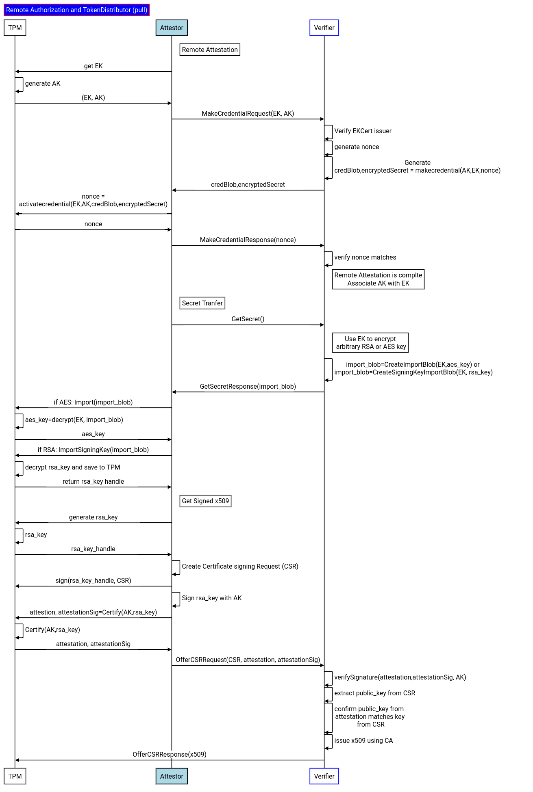

# TPM Remote Attestation protocol using go-tpm and gRPC (pull)

This repo contains a sample `gRPC` client server application that uses a Trusted Platform Module for:

* TPM [Remote Attestation](https://tpm2-software.github.io/tpm2-tss/getting-started/2019/12/18/Remote-Attestation.html)
* TPM [Quote-Verify](https://github.com/salrashid123/tpm2/tree/master/quote_verify)
* Sealed and PCR bound Transfer of RSA or AES keys.
* Parse TPM EventLog


Note: there are two branches to this repository:  `push` and `pull`

The main difference between them is which side initiates communication to attest a TPM.

* In the `push` model, the `verifier` is a remote server which *makes* an outbound API call _to_ the TPM device (`attestor`).  The TPM device now performs remote attestation but is driven by the the API calls from the remote server.

* In the `pull` model, the `verifier` is a remote server which *receives* an outbound API call _from_ the TPM device (`attestor`).  The TPM device is in control of when to initiate and perform remote attestation.


This gRPC specification in the `pull` model has several methods included in the flow here

```protobuf
service Verifier {

  Attestor acquires the Platform Certificate (if available)
    and sends that to the verifier
  rpc OfferPlatformCert (OfferPlatformCertRequest) returns (OfferPlatformCertResponse) { }  

  Attestor creates AK, EK and sends that to the Verifier
  Verifier check EK Certificate issuer, generates secret nonce using EK,AK
     and return that to Attestor  
  rpc MakeCredential (MakeCredentialRequest) returns (MakeCredentialResponse) { } 
      
  Attestor uses TPM to decrypt nonce and sends that to Verifier
  Verifier checks nonce values are same; associates AK with EK
  rpc ActivateCredential (ActivateCredentialRequest) returns (ActivateCredentialResponse) { }

  Attestor offers to provide a nonce
  Verifier selects PCR value to use and a nonce and returns that to Attestor
  rpc OfferQuote (OfferQuoteRequest) returns (OfferQuoteResponse) { }

  Attestor uses TPM to generate Quote using PCR and seals the nonce into the attestation
  Attestor return attestation and Signature
  Verifier confirms attestation signature using AK
  rpc ProvideQuote (ProvideQuoteRequest) returns (ProvideQuoteResponse) { }

  Attestor requests remote arbitrary RSA or AES secret from Verifier
  Verifier uses EK to encrypt the RSA or AES key and return to Attestor
  Attestor decrypts AES key using TPM.
  Attestor embeds RSA key into TPM.
  rpc GetSecret (GetSecretRequest) returns (GetSecretResponse) { }  

  Attestor generates an RSA key on TPM
  Attestor Certifies the RSA key using AK and receives attestation blob
  Attestor uses RSA key to generate a CSR
  Attestor sends TPM wire format for the generated RSA Public, CSR, attestation blob to Verifier
  Verifier confirms AK signed the attestation blog
  Verifier extracts the RSA public key from CSR and confirms it matches the key encoded into the attestation blob
  Verifier checks that the TPM wire format for the public key has the correct TPM template 
  Verifier extracts the RSA Public key from the TPM Wire format and cross checks with the CSR's RSA Public key   
  Verifier uses CA to sign the CSR
  Verifier returns x509 to Attestor
  rpc OfferCSR (OfferCSRRequest) returns (OfferCSRResponse) { }  
}
```




>>> **NOTE** the code and procedure outlined here is **NOT** supported by google.


You can use this standalone to setup a gRPC client/server for remote attestation.

There are two parts:

* `attestor`:  a `gRPC` client which makes outbound from a grpcServer (`verifier`), which inturn performs attestation, quote/verify and then then securely receives a sealed key from a verifier to the attestor.  The key is distributed such that it can _only_ get loaded or decoded on the attestor that has the TPM

* `verifier`: a `gRPC` server which accepts connections from attestor and then performs remote attestation, quote/verify, sealed transfer of keys as viewed from a server's end

---

As you can see, the whole protocol is rather complicated but hinges on being able to trust the initial Endorsement Key.   As mentioned, this is normally done by validating that the EndorsementPublic certificate is infact real and signed by a 3rd party (eg, the manufacturer of the TPM).  

---

also see

 - [go-attestation](https://github.com/google/go-attestation)

## Setup

We will use a GCP Shielded VM for these tests 

First create two VMs

```bash
gcloud compute instances create attestor \
  --zone=us-central1-a --machine-type=e2-medium --no-service-account --no-scopes \
  --image=debian-10-buster-v20210817 --image-project=debian-cloud  \
  --shielded-secure-boot --shielded-vtpm --shielded-integrity-monitoring

gcloud compute instances create verifier \
  --zone=us-central1-a --machine-type=e2-medium --no-service-account --no-scopes \
  --image=debian-10-buster-v20210817 --image-project=debian-cloud  \
  --shielded-secure-boot --shielded-vtpm --shielded-integrity-monitoring
```

On each, install `go 1.16+` and setup `libtspi-dev`, `gcc` (`apt-get update && apt-get install gcc libtspi-dev`) only on the `Verifier`

```bash
apt-get update
apt-get install libtspi-dev wget gcc -y

wget https://golang.org/dl/go1.17.linux-amd64.tar.gz
rm -rf /usr/local/go && tar -C /usr/local -xzf go1.17.linux-amd64.tar.gz
```

the client  VM, edit `/etc/hosts`

and set the value of `verify.esodemoapp2.com` to the IP of the server (in my case, its `10.128.0.58`)

```
10.128.0.58 verify.esodemoapp2.com
```

ofcourse you can use any hostname here but the certificated provided in this repo matches the SAN values for TLS.

Note, if you use `--importMode=AES` on server, use `--importMode=AES` on the client


### AES
```bash
## Verifier
go run src/verifier.go \
   --grpcport :50051 -pcr 0 \
   -aes256Key "G-KaPdSgUkXp2s5v8y/B?E(H+MbQeThW" \
   -expectedPCRValue 24af52a4f429b71a3184a6d64cddad17e54ea030e2aa6576bf3a5a3d8bd3328f \
   --importMode=AES \
   --cacert  certs/CA_crt.pem  \
   --servercert certs/server_crt.pem \
   --serverkey certs/server_key.pem \
   --usemTLS \
   --readEventLog \
   --v=10 -alsologtostderr 

## Attestor
go run src/attestor.go  \
   --uid 369c327d-ad1f-401c-aa91-d9b0e69bft67  \
   --unsealPcr=0  \
   --host verify.esodemoapp2.com:50051 \
   --importMode=AES \
   --cacert certs/CA_crt.pem  \
   --clientcert certs/client_crt.pem \
   --clientkey certs/client_key.pem \
   --usemTLS  \
   --readEventLog \
   --v=10 -alsologtostderr
```

### RSA

```bash
## Verifier
go run src/verifier.go \
   --grpcport :50051 -pcr 0 \
   -expectedPCRValue 24af52a4f429b71a3184a6d64cddad17e54ea030e2aa6576bf3a5a3d8bd3328f \
   -importMode=RSA \
   --cacert  certs/CA_crt.pem  \
   --servercert certs/server_crt.pem \
   --serverkey certs/server_key.pem \
   --usemTLS \
   --readEventLog \
   --v=10 -alsologtostderr 

## Attestor
go run src/attestor.go  \
   --uid 369c327d-ad1f-401c-aa91-d9b0e69bft67  \
   --unsealPcr=0  \
   --host verify.esodemoapp2.com:50051 \
   --importMode=RSA \
   --cacert certs/CA_crt.pem  \
   --clientcert certs/client_crt.pem \
   --clientkey certs/client_key.pem \
   --usemTLS \
   --readEventLog \
   --v=10 -alsologtostderr
```

---


### Sample Output

### AES

```log
go run src/verifier.go \
   --grpcport :50051 -pcr 0 \
   -aes256Key "G-KaPdSgUkXp2s5v8y/B?E(H+MbQeThW" \
   -expectedPCRValue 24af52a4f429b71a3184a6d64cddad17e54ea030e2aa6576bf3a5a3d8bd3328f \
   --importMode=AES \
   --cacert  certs/CA_crt.pem  \
   --servercert certs/server_crt.pem \
   --serverkey certs/server_key.pem \
   --usemTLS \
   --readEventLog \
   --v=10 -alsologtostderr 
   
I1027 12:47:49.625756   18715 verifier.go:198] Using mTLS for initial server connection
I1027 12:47:49.626965   18715 verifier.go:235] Starting gRPC server on port :50051
I1027 12:47:58.688262   18715 verifier.go:120] >> authenticating inbound request
I1027 12:47:58.688305   18715 verifier.go:135] HealthCheck called for Service [verifier.VerifierServer]
I1027 12:47:58.952267   18715 verifier.go:120] >> authenticating inbound request
I1027 12:47:58.952307   18715 verifier.go:242] ======= MakeCredential ========
I1027 12:47:58.952314   18715 verifier.go:243]      client provided uid: 369c327d-ad1f-401c-aa91-d9b0e69bft67
I1027 12:47:58.952331   18715 verifier.go:244]      Got AKName 0022000b1e30cba93ce2675ff56bac2a70ef21cbe92bb131464d290d2f7bb0ee5515e026
I1027 12:47:58.952339   18715 verifier.go:245]      Registry size 0
I1027 12:47:58.952347   18715 verifier.go:248]      Decoding ekCert from client
I1027 12:47:58.952427   18715 verifier.go:255]      EKCert Encryption Issuer x509 
CN=tpm_ek_v1_cloud_host-signer-0-2020-10-22T14:02:08-07:00 K:1\, 2:HBNpA3TPAbM:0:18,OU=Cloud,O=Google LLC,L=Mountain View,ST=California,C=US
I1027 12:47:58.952505   18715 verifier.go:256]      EKCert Encryption SerialNumber 
36068555215283791049850052083356829363286669
I1027 12:47:58.952563   18715 verifier.go:264]      Encryption EKCert 
-----BEGIN CERTIFICATE-----
MIIFMDCCBBigAwIBAgITAZ4L9Q39bRV8+XkuaQrK1F0yjTANBgkqhkiG9w0BAQsF
ADCBuTELMAkGA1UEBhMCVVMxEzARBgNVBAgTCkNhbGlmb3JuaWExFjAUBgNVBAcT
DU1vdW50YWluIFZpZXcxEzARBgNVBAoTCkdvb2dsZSBMTEMxDjAMBgNVBAsTBUNs
b3VkMVgwVgYDVQQDDE90cG1fZWtfdjFfY2xvdWRfaG9zdC1zaWduZXItMC0yMDIw
LTEwLTIyVDE0OjAyOjA4LTA3OjAwIEs6MSwgMjpIQk5wQTNUUEFiTTowOjE4MCAX
DTIxMDkwMTAwMDU1M1oYDzIwNTEwODI1MDAxMDUzWjAAMIIBIjANBgkqhkiG9w0B
AQEFAAOCAQ8AMIIBCgKCAQEAwsY6zrTncJqdkbccZuoe2eyDcvd2FzsCBDCyD6E3
1O2vMmy0Co/w8sqDutyeTZ4N6LvirGSdQxNZ/iv5nLRBnlUXiJi8Spxz9FvtHoNN
4ptmveqDvRl2l6NkxHZBIxLxPi0k9zmpbb5iqHcDqkyziQlPnWZDZMBZTnY2pOHO
zn7c7qR/uuwsMxIUCXH8g93YL00b7mn53GiBn9rqg2L1GcioHkfu8dROyoTUhrRn
56ap4bwI0LsoGwiMfSw2ITFsJXHFkXcshe2ev+z29jHdLspYW5wt+FEm1c1IYS07
6L4dk+yEUVZZ1JQ3iaHKn3/KDb5d5/1+yz1heBEdz83eZwIDAQABo4IB5TCCAeEw
DAYDVR0TAQH/BAIwADAfBgNVHSMEGDAWgBQTzXG6WLIKUaMoDmW5lp67HQ0RkzBW
BggrBgEFBQcBAQRKMEgwRgYIKwYBBQUHMAKGOmh0dHBzOi8vcGtpLmdvb2cvY2xv
dWRfaW50ZWdyaXR5L3RwbV9la19pbnRlcm1lZGlhdGVfMi5jcnQwSwYDVR0fBEQw
QjBAoD6gPIY6aHR0cHM6Ly9wa2kuZ29vZy9jbG91ZF9pbnRlZ3JpdHkvdHBtX2Vr
X2ludGVybWVkaWF0ZV8yLmNybDAOBgNVHQ8BAf8EBAMCBSAwEAYDVR0lBAkwBwYF
Z4EFCAEwIgYDVR0JBBswGTAXBgVngQUCEDEOMAwMAzIuMAIBAAICAI4wUQYDVR0R
AQH/BEcwRaRDMEExFjAUBgVngQUCAQwLaWQ6NDc0RjRGNDcxDzANBgVngQUCAgwE
dlRQTTEWMBQGBWeBBQIDDAtpZDoyMDE2MDUxMTByBgorBgEEAdZ5AgEVBGQwYgwN
dXMtY2VudHJhbDEtYQIGAPltg2V0DBNtaW5lcmFsLW1pbnV0aWEtODIwAggSc2jc
v4N77QwIYXR0ZXN0b3KgIDAeoAMCAQChAwEB/6IDAQEAowMBAQCkAwEBAKUDAQEA
MA0GCSqGSIb3DQEBCwUAA4IBAQBpxQIX/kzoOsOA4iSvgof9rfa2aiMmz+KXAdkN
oNLIVCcd3L7kR79tMJ/e4G/+8ETca9bvB6hsLKDw4IvVM0vAJwFtcpuPH4K2IkSY
jDJ6s3rOPwkzdrdVedcKlKOiXMX4ulOzpUiLKME3WIsMALmAhF8JLtRUEuIc5F9b
CFU49dha2CIEC7NEV08BaX3LFG8nRjbAWVEMbk8P/Nlbu+SclWssNkchik5gDsz2
qopi7YGTII6FfvJ1nxFw3hCbWK4VabqYTpm/jqv4cg/uD+Qj7nWkzltdzZjipi3U
479OiC1HRSNagrzT3Ka0zUZoHwEFdzgLrnMkxyyS+gkz6aQx
-----END CERTIFICATE-----
I1027 12:47:58.952705   18715 verifier.go:276]      EKPub from EKCert 
-----BEGIN PUBLIC KEY-----
MIIBIjANBgkqhkiG9w0BAQEFAAOCAQ8AMIIBCgKCAQEAwsY6zrTncJqdkbccZuoe
2eyDcvd2FzsCBDCyD6E31O2vMmy0Co/w8sqDutyeTZ4N6LvirGSdQxNZ/iv5nLRB
nlUXiJi8Spxz9FvtHoNN4ptmveqDvRl2l6NkxHZBIxLxPi0k9zmpbb5iqHcDqkyz
iQlPnWZDZMBZTnY2pOHOzn7c7qR/uuwsMxIUCXH8g93YL00b7mn53GiBn9rqg2L1
GcioHkfu8dROyoTUhrRn56ap4bwI0LsoGwiMfSw2ITFsJXHFkXcshe2ev+z29jHd
LspYW5wt+FEm1c1IYS076L4dk+yEUVZZ1JQ3iaHKn3/KDb5d5/1+yz1heBEdz83e
ZwIDAQAB
-----END PUBLIC KEY-----
I1027 12:47:58.952743   18715 verifier.go:279]      Decoding ekPub from client
I1027 12:47:58.952822   18715 verifier.go:300]      EKPubPEM: 
-----BEGIN PUBLIC KEY-----
MIIBIjANBgkqhkiG9w0BAQEFAAOCAQ8AMIIBCgKCAQEAwsY6zrTncJqdkbccZuoe
2eyDcvd2FzsCBDCyD6E31O2vMmy0Co/w8sqDutyeTZ4N6LvirGSdQxNZ/iv5nLRB
nlUXiJi8Spxz9FvtHoNN4ptmveqDvRl2l6NkxHZBIxLxPi0k9zmpbb5iqHcDqkyz
iQlPnWZDZMBZTnY2pOHOzn7c7qR/uuwsMxIUCXH8g93YL00b7mn53GiBn9rqg2L1
GcioHkfu8dROyoTUhrRn56ap4bwI0LsoGwiMfSw2ITFsJXHFkXcshe2ev+z29jHd
LspYW5wt+FEm1c1IYS076L4dk+yEUVZZ1JQ3iaHKn3/KDb5d5/1+yz1heBEdz83e
ZwIDAQAB
-----END PUBLIC KEY-----
I1027 12:47:58.952844   18715 verifier.go:302]      Verified EkPub here...somehow
I1027 12:47:58.952862   18715 verifier.go:312]      Sending Nonce XVlBzgbaiC,
I1027 12:47:58.952874   18715 verifier.go:502]      --> Starting makeCredential()
I1027 12:47:58.952880   18715 verifier.go:503]      Read (ekPub) from request
I1027 12:47:58.975936   18715 verifier.go:516]      Read (akPub) from request
I1027 12:47:58.976035   18715 verifier.go:538]      Decoded AkPub: 
-----BEGIN PUBLIC KEY-----
MIIBIjANBgkqhkiG9w0BAQEFAAOCAQ8AMIIBCgKCAQEAzE3YXlvf3TibgW46Z1NO
CYSe2L/uMxRmhBdURKfVrdCgLMjZNoaE8ZooWKB8pmyz3gLhlzbeNAoluF1Dm6i/
4AcB2Wy8IrSr4QfKjSxQ4m6LKj0xTlG7M7Zfk+GmcD6gu2+N+Ik8OHbbStu57C7v
1Iq8l1BE9WNfmTVloYiyRaO/Ct4jiViZguX0nv3KZhS4fdoZVff+RmbpXvXKmSxk
1KnMKBriSFquduWwFickBY1aRV3ISY8qvpo/6VtH6ne0wXZx1D1kRiNeu62D1c2c
r41IEFZJX+bltkpKfcfQCuOZrDeNf81HAycboS4rHMQgJPTcAgulqXOZri/YnM4A
GwIDAQAB
-----END PUBLIC KEY-----
I1027 12:47:58.976100   18715 verifier.go:541]      AK Default parameter match template
I1027 12:47:58.979884   18715 verifier.go:550]      Loaded AK KeyName 000b1e30cba93ce2675ff56bac2a70ef21cbe92bb131464d290d2f7bb0ee5515e026
I1027 12:47:58.979925   18715 verifier.go:552]      MakeCredential Start
I1027 12:47:58.983332   18715 verifier.go:558]      credBlob 00201974a59e3e4f3ca19e3653232def389c1f93ccc332eca3c7f66457339b2a4d62066cb2be335b9e2c62aef2a0
I1027 12:47:58.983395   18715 verifier.go:559]      encryptedSecret0 16db4f4e73b73bbb18cb3f5c5adf49cfde8419cee1085619ea4209f51c0cf643d77a002efec048ca905c4bdc8f49636c33039c8cbfd7d9045af3fd5fe7737d3a487a0bad3d996bdd8a48ecd4dd77b4e12d8048bf3ac554b249eb7dfa9b29cf82b04e51b8b70246795a77f9a621df8179f5b58a625d190d717ca96259aeb971f76872a935925b2b6097b71d3678c230432358c41417c9673c9c91fb4c8ccaf885a80f4d1f46713b4b80fea5c746ed8ba27994eea156e38bd67ea9eaa98179477ca4100d417be5eee1c9916f1c90b37f1eca282293679288c74bbef1f1dcb452a8201655cc18329e0953d5655807e43272137b9f1f50b7e9de28e32f091d2baab6
I1027 12:47:58.983414   18715 verifier.go:560]      <-- End makeCredential()
I1027 12:47:58.986260   18715 verifier.go:319]      Returning MakeCredentialResponse ========
I1027 12:48:00.025720   18715 verifier.go:120] >> authenticating inbound request
I1027 12:48:00.025752   18715 verifier.go:329] ======= ActivateCredential ========
I1027 12:48:00.026015   18715 verifier.go:330]      client provided uid: 369c327d-ad1f-401c-aa91-d9b0e69bft67
I1027 12:48:00.026030   18715 verifier.go:331]      Secret XVlBzgbaiC
I1027 12:48:00.026119   18715 verifier.go:338]      Returning ActivateCredentialResponse ========
I1027 12:48:00.027456   18715 verifier.go:120] >> authenticating inbound request
I1027 12:48:00.027557   18715 verifier.go:348] ======= GetSecret ========
I1027 12:48:00.027569   18715 verifier.go:349]      client provided uid: 369c327d-ad1f-401c-aa91-d9b0e69bft67
I1027 12:48:00.027587   18715 verifier.go:817]      --> Start createImportBlob()
I1027 12:48:00.027602   18715 verifier.go:818]      Load and decode ekPub from registry
I1027 12:48:00.027658   18715 verifier.go:831]      Decoding sealing PCR value in hex
I1027 12:48:00.027682   18715 verifier.go:867]      --> createImportBlob()
I1027 12:48:00.027690   18715 verifier.go:868]      Generating to AES sealedFile
I1027 12:48:00.028063   18715 verifier.go:881]      <-- End createImportBlob()
I1027 12:48:00.028081   18715 verifier.go:368]      Returning GetSecretResponse ========
I1027 12:48:00.058597   18715 verifier.go:120] >> authenticating inbound request
I1027 12:48:00.058629   18715 verifier.go:377] ======= OfferQuote ========
I1027 12:48:00.058635   18715 verifier.go:378]      client provided uid: 369c327d-ad1f-401c-aa91-d9b0e69bft67
I1027 12:48:00.058648   18715 verifier.go:383]      Returning OfferQuoteResponse ========
I1027 12:48:00.090572   18715 verifier.go:120] >> authenticating inbound request
I1027 12:48:00.090605   18715 verifier.go:393] ======= ProvideQuote ========
I1027 12:48:00.090615   18715 verifier.go:394]      client provided uid: 369c327d-ad1f-401c-aa91-d9b0e69bft67
I1027 12:48:00.090626   18715 verifier.go:420]      --> Starting verifyQuote()
I1027 12:48:00.090633   18715 verifier.go:425]      Read and Decode (attestion)
I1027 12:48:00.090661   18715 verifier.go:431]      Attestation ExtraData (nonce): 322b581e-46fa-43ee-ab76-4143d8657438 
I1027 12:48:00.090667   18715 verifier.go:432]      Attestation PCR#: [0] 
I1027 12:48:00.090691   18715 verifier.go:433]      Attestation Hash: 2ba7022b59f2158786ea3ea29a7ad12ff0c6c9d6682da6555d8926075b643b1f 
I1027 12:48:00.090707   18715 verifier.go:450]      Expected PCR Value:           --> 24af52a4f429b71a3184a6d64cddad17e54ea030e2aa6576bf3a5a3d8bd3328f
I1027 12:48:00.090715   18715 verifier.go:451]      sha256 of Expected PCR Value: --> 2ba7022b59f2158786ea3ea29a7ad12ff0c6c9d6682da6555d8926075b643b1f
I1027 12:48:00.090724   18715 verifier.go:453]      Decoding PublicKey for AK ========
I1027 12:48:00.090881   18715 verifier.go:472]      Attestation Signature Verified 
I1027 12:48:00.090897   18715 verifier.go:474]      Reading EventLog
I1027 12:48:00.090981   18715 verifier.go:489]      Event Type EV_S_CRTM_VERSION
I1027 12:48:00.091001   18715 verifier.go:490]      PCR Index 0
I1027 12:48:00.091015   18715 verifier.go:491]      Event Data 47004300450020005600690072007400750061006c0020004600690072006d0077006100720065002000760031000000
I1027 12:48:00.091029   18715 verifier.go:492]      Event Digest 3f708bdbaff2006655b540360e16474c100c1310
I1027 12:48:00.091039   18715 verifier.go:489]      Event Type EV_NONHOST_INFO
I1027 12:48:00.091050   18715 verifier.go:490]      PCR Index 0
I1027 12:48:00.091061   18715 verifier.go:491]      Event Data 474345204e6f6e486f7374496e666f0000000000000000000000000000000000
I1027 12:48:00.091073   18715 verifier.go:492]      Event Digest 9e8af742718df04092551f27c117723769acfe7e
I1027 12:48:00.091082   18715 verifier.go:489]      Event Type EV_SEPARATOR
I1027 12:48:00.091092   18715 verifier.go:490]      PCR Index 0
I1027 12:48:00.091137   18715 verifier.go:491]      Event Data 00000000
I1027 12:48:00.091154   18715 verifier.go:492]      Event Digest 9069ca78e7450a285173431b3e52c5c25299e473
I1027 12:48:00.091166   18715 verifier.go:494]      EventLog Verified 
I1027 12:48:00.091177   18715 verifier.go:496]      <-- End verifyQuote()
I1027 12:48:00.091185   18715 verifier.go:412]      Returning ProvideQuoteResponse ========
I1027 12:48:00.258358   18715 verifier.go:120] >> authenticating inbound request
I1027 12:48:00.258406   18715 verifier.go:658] ======= OfferCSR ========
I1027 12:48:00.258416   18715 verifier.go:659]      client provided uid: 369c327d-ad1f-401c-aa91-d9b0e69bft67
I1027 12:48:00.258424   18715 verifier.go:660]      client provided certificate: 
-----BEGIN PUBLIC KEY-----
MIIBIjANBgkqhkiG9w0BAQEFAAOCAQ8AMIIBCgKCAQEAsv1Ybf/8Tr6hbSNC+N5m
IAJ2MgBMbqnqaiCPdUrqGSkZyiTGnOfY0QyDHi31beE3O+0sZOSAjaut9Ztxvoyy
8y0O+uqa49eaoZnORsCB6biZa62wgPe/KSAC/FgRdlnkxQctqO6wEgl3cbeamBHn
relwYsCAxA+UQhzV0Kf4tjxYg3eQhWNdl+SXCrIkJuGnB3IquWpNTIw42UzdRF49
K19VW6jE8fgiGEpzawMXqLiFLwpokkaCbTCWk3VHJWiVFr0k0b9KIa2LBtV+qAv0
2C4a4P2eFbWGYQDxjQNBgI+subfqa3RD9KhK62jF6cn/D/eCA85+QJVP/msd/+1b
vwIDAQAB
-----END PUBLIC KEY-----
I1027 12:48:00.258437   18715 verifier.go:661]      client provided csr: 
-----BEGIN CERTIFICATE REQUEST-----
MIIDJTCCAdkCAQAwfTELMAkGA1UEBhMCVVMxEzARBgNVBAgTCkNhbGlmb3JuaWEx
FjAUBgNVBAcTDU1vdW50YWluIFZpZXcxEDAOBgNVBAoTB0FjbWUgQ28xEzARBgNV
BAsTCkVudGVycHJpc2UxGjAYBgNVBAMTEWNsaWVudC5kb21haW4uY29tMIIBIjAN
BgkqhkiG9w0BAQEFAAOCAQ8AMIIBCgKCAQEAsv1Ybf/8Tr6hbSNC+N5mIAJ2MgBM
bqnqaiCPdUrqGSkZyiTGnOfY0QyDHi31beE3O+0sZOSAjaut9Ztxvoyy8y0O+uqa
49eaoZnORsCB6biZa62wgPe/KSAC/FgRdlnkxQctqO6wEgl3cbeamBHnrelwYsCA
xA+UQhzV0Kf4tjxYg3eQhWNdl+SXCrIkJuGnB3IquWpNTIw42UzdRF49K19VW6jE
8fgiGEpzawMXqLiFLwpokkaCbTCWk3VHJWiVFr0k0b9KIa2LBtV+qAv02C4a4P2e
FbWGYQDxjQNBgI+subfqa3RD9KhK62jF6cn/D/eCA85+QJVP/msd/+1bvwIDAQAB
oC8wLQYJKoZIhvcNAQkOMSAwHjAcBgNVHREEFTATghFjbGllbnQuZG9tYWluLmNv
bTBBBgkqhkiG9w0BAQowNKAPMA0GCWCGSAFlAwQCAQUAoRwwGgYJKoZIhvcNAQEI
MA0GCWCGSAFlAwQCAQUAogMCASADggEBAFoJ8+htkaUBYsk9hUxZlD14sV8NRmbv
CP1vnhkNFlO++HZJMECtqINN7XElIZkPDjAMCyi7fX1lGFahXjZiB01MM5Ek4Cmf
WdP2SKSkichRB7TEX8tot5bSaxqyJLgPIjJhAUOD9To4NTSBMmWqheRJOipRaLNQ
5ti17KUbf9yX4BaJ1k/awGHLoqeF0Kf1CeOVhwJshBD5xPwOphvaBQd0LUIGvq4r
nIsxR4hjX7L4V6ktiphjb3VB8ViMhq3PG8OWr8OjyGlOAQvD06gTIoVRpzYNQm9c
wAdKp/PQ33iqu35BiZ3X5CsHf9v/YXWIA0078h0qN3juKDyXxqdVbj8=
-----END CERTIFICATE REQUEST-----
I1027 12:48:00.258664   18715 verifier.go:689]      Attestation of Unrestricted Signing Key Verified
I1027 12:48:00.258805   18715 verifier.go:699]      Verifying if Public key from CSR matches attested Public key
I1027 12:48:00.258874   18715 verifier.go:732]      --> Start signCSR() 
I1027 12:48:00.259180   18715 verifier.go:777]      Generated cert with Serial 52434312982376000814603218760064386106
I1027 12:48:00.262388   18715 verifier.go:811]      Returning Certificate:  
-----BEGIN CERTIFICATE-----
MIID3DCCAsSgAwIBAgIQJ3J7Oamm86aMF4Ha03VEOjANBgkqhkiG9w0BAQsFADBX
MQswCQYDVQQGEwJVUzEPMA0GA1UECgwGR29vZ2xlMRMwEQYDVQQLDApFbnRlcnBy
aXNlMSIwIAYDVQQDDBlFbnRlcnByaXNlIFN1Ym9yZGluYXRlIENBMB4XDTIxMTAy
NzEyNDgwMFoXDTIyMTAyNzEyNDgwMFowfTELMAkGA1UEBhMCVVMxEzARBgNVBAgT
CkNhbGlmb3JuaWExFjAUBgNVBAcTDU1vdW50YWluIFZpZXcxEDAOBgNVBAoTB0Fj
bWUgQ28xEzARBgNVBAsTCkVudGVycHJpc2UxGjAYBgNVBAMTEWNsaWVudC5kb21h
aW4uY29tMIIBIjANBgkqhkiG9w0BAQEFAAOCAQ8AMIIBCgKCAQEA2FXMxoPucnmP
beaYvtC7mwqMqS/DRGuGmk78f8cLLmtf4qcfQwS5t5UkEAUiHaDGTdkk8AWRVGc4
Sh/nwxlsEMw7thklW3zge8cU7V+pWjGokaYiLPqayV3CJ7VpYPIbXRGqeXQrSAh3
h5vPmFn2IN4TZF2E46Fob8xhqjYc9CAGqh8NevCyvyNvnb2ZTzQeC2jouRStltdH
h97ynK/iatyzyot0+9BrhI/9CBELS1MDGxcT35g48pEJzHr1/k3Wdz2VM0+pKSIB
hiJM1t4Q1LALhP7LKSr6Ex3H1OzaBEW8gpIoKlkH6I1D9lOs1rSSJU4ZEsVqft+3
j32SByZNmQIDAQABo34wfDAOBgNVHQ8BAf8EBAMCB4AwHQYDVR0lBBYwFAYIKwYB
BQUHAwEGCCsGAQUFBwMCMAwGA1UdEwEB/wQCMAAwHwYDVR0jBBgwFoAUv+Ec8CJI
j/w7z13Z7a6IcCHf3YYwHAYDVR0RBBUwE4IRY2xpZW50LmRvbWFpbi5jb20wDQYJ
KoZIhvcNAQELBQADggEBALgvEgroHj+4WtaEDyFQ8QmrOptHMEjxNSwH6MQbvTH+
DDGfYGFcA40Y3IPDpnk2nDMGum+7pwaJo1x+A4WD0PtR4O4IWBC3Pwt1O0h/Yzk/
FuF6DDd7RcntLE91VqlXu/Y5Qk0dU79d4LpyaGuFZD5FiUJDP0/3wCDSN9vKTI06
RHzipLMpuIQjIy29dvgMqP8rOaPs6YZ7gDiExABV7gLoMoQx5fERyV74f6dZYb4f
KmgwfhnuN2JM+o448rHH1WmjfQqHB9YhcrneD7WCy9vS3PP+Ch4DfIU5aSWcv4aX
cxNDYVL+/+rPEPZ/yLI6RistzD0cN/EMWPs20z+KypE=
-----END CERTIFICATE-----
I1027 12:48:00.262544   18715 verifier.go:724]      Returning OfferCSRResponse ========
```

```log
go run src/attestor.go  \
   --uid 369c327d-ad1f-401c-aa91-d9b0e69bft67  \
   --unsealPcr=0  \
   --host verify.esodemoapp2.com:50051 \
   --importMode=AES \
   --cacert certs/CA_crt.pem  \
   --clientcert certs/client_crt.pem \
   --clientkey certs/client_key.pem \
   --usemTLS \
   --readEventLog \
   --v=10 -alsologtostderr
   
I1027 12:47:58.639886   24082 attestor.go:187] Using mTLS
I1027 12:47:58.689189   24082 attestor.go:215] RPC HealthChekStatus:SERVING
I1027 12:47:58.689236   24082 attestor.go:221] =============== Load EncryptionKey and Certifcate from NV ===============
I1027 12:47:58.695050   24082 attestor.go:239]      Encryption PEM 
-----BEGIN PUBLIC KEY-----
MIIBIjANBgkqhkiG9w0BAQEFAAOCAQ8AMIIBCgKCAQEAwsY6zrTncJqdkbccZuoe
2eyDcvd2FzsCBDCyD6E31O2vMmy0Co/w8sqDutyeTZ4N6LvirGSdQxNZ/iv5nLRB
nlUXiJi8Spxz9FvtHoNN4ptmveqDvRl2l6NkxHZBIxLxPi0k9zmpbb5iqHcDqkyz
iQlPnWZDZMBZTnY2pOHOzn7c7qR/uuwsMxIUCXH8g93YL00b7mn53GiBn9rqg2L1
GcioHkfu8dROyoTUhrRn56ap4bwI0LsoGwiMfSw2ITFsJXHFkXcshe2ev+z29jHd
LspYW5wt+FEm1c1IYS076L4dk+yEUVZZ1JQ3iaHKn3/KDb5d5/1+yz1heBEdz83e
ZwIDAQAB
-----END PUBLIC KEY-----
I1027 12:47:58.708669   24082 attestor.go:259]      EKCert Encryption Issuer x509 
CN=tpm_ek_v1_cloud_host-signer-0-2020-10-22T14:02:08-07:00 K:1\, 2:HBNpA3TPAbM:0:18,OU=Cloud,O=Google LLC,L=Mountain View,ST=California,C=US
I1027 12:47:58.708767   24082 attestor.go:287] =============== MakeCredential ===============
I1027 12:47:58.708776   24082 attestor.go:839]      --> CreateKeys()
I1027 12:47:58.710554   24082 attestor.go:846]     Current PCR 0 Value 24af52a4f429b71a3184a6d64cddad17e54ea030e2aa6576bf3a5a3d8bd3328f 
I1027 12:47:58.710592   24082 attestor.go:851]      createPrimary
I1027 12:47:58.803838   24082 attestor.go:869]      tpmEkPub: 
&{24587981879886609016190333410614585581934428932802325019373332094708103489414767298265871272556666500890699470851746213804395299815448800477024017240826451805328658514963417511334860360106508224011381384018144229254641484302113994963351866213007687177378441455357878213587861857078262573610658357435104464790128892082579839338427661096529460684122625155672748839868971853115624193949432409236396237486863565492907842901004060077408890149233895122324259919954343347655290691786810633300267142246665792359677430745589552858220715206810769126134708915144916646736520201781649901338710921769326043549908877082710147718759 65537}
I1027 12:47:58.803994   24082 attestor.go:882]      ekPub Name: 000b4bd5d7f30dc3a1975ae9529404f2ec73ae5a404669c5e87d74186fa2a4c280db
I1027 12:47:58.804009   24082 attestor.go:883]      ekPubPEM: 
-----BEGIN PUBLIC KEY-----
MIIBIjANBgkqhkiG9w0BAQEFAAOCAQ8AMIIBCgKCAQEAwsY6zrTncJqdkbccZuoe
2eyDcvd2FzsCBDCyD6E31O2vMmy0Co/w8sqDutyeTZ4N6LvirGSdQxNZ/iv5nLRB
nlUXiJi8Spxz9FvtHoNN4ptmveqDvRl2l6NkxHZBIxLxPi0k9zmpbb5iqHcDqkyz
iQlPnWZDZMBZTnY2pOHOzn7c7qR/uuwsMxIUCXH8g93YL00b7mn53GiBn9rqg2L1
GcioHkfu8dROyoTUhrRn56ap4bwI0LsoGwiMfSw2ITFsJXHFkXcshe2ev+z29jHd
LspYW5wt+FEm1c1IYS076L4dk+yEUVZZ1JQ3iaHKn3/KDb5d5/1+yz1heBEdz83e
ZwIDAQAB
-----END PUBLIC KEY-----
I1027 12:47:58.804038   24082 attestor.go:890]      CreateKeyUsingAuth
I1027 12:47:58.913369   24082 attestor.go:916]      akPub: 0001000b00050072000000100014000b0800000000000100cc4dd85e5bdfdd389b816e3a67534e09849ed8bfee33146684175444a7d5add0a02cc8d9368684f19a2858a07ca66cb3de02e19736de340a25b85d439ba8bfe00701d96cbc22b4abe107ca8d2c50e26e8b2a3d314e51bb33b65f93e1a6703ea0bb6f8df8893c3876db4adbb9ec2eefd48abc975044f5635f993565a188b245a3bf0ade2389589982e5f49efdca6614b87dda1955f7fe4666e95ef5ca992c64d4a9cc281ae2485aae76e5b0162724058d5a455dc8498f2abe9a3fe95b47ea77b4c17671d43d6446235ebbad83d5cd9caf8d481056495fe6e5b64a4a7dc7d00ae399ac378d7fcd4703271ba12e2b1cc42024f4dc020ba5a97399ae2fd89cce001b,
I1027 12:47:58.913414   24082 attestor.go:917]      akPriv: 00207825deee532208738c8d026f3fc75bf1f4264485de2e4b473539553adc1a384c0010ca8f72bda2063ec38dd3613b16868d32ca6a1b9c04935e075b21a526d829884000c02bc71fb549fb97ce684d40b06d2d7d37566ddc216331a0dc205e31815e809f420a234ebd3368eb5f6c14585f1f34530c5c85057fcc73efdb2b95c371c577e93fe8c7a34dbf960bb21434218a4153b62dbd3c04e072d3ecb854b7ecef4a246ebba9701af31175bc4fc01c9df97285e5afe799f2d6ec85fe89b970e1b81bcb0fc4b70cf3a9db10f83aa3253e42ea73690e702720a5107d0a67,
I1027 12:47:58.913441   24082 attestor.go:924]      CredentialData.ParentName.Digest.Value 4bd5d7f30dc3a1975ae9529404f2ec73ae5a404669c5e87d74186fa2a4c280db
I1027 12:47:58.913452   24082 attestor.go:925]      CredentialTicket 59d50f667a86589048976dd6ad4fd2473cea4c536ff731a962c1567642d57ec2
I1027 12:47:58.913462   24082 attestor.go:926]      CredentialHash 4826680dc999e1211ebf30c2bc6de9e6a800bb801e95de588f5898160d95f6ba
I1027 12:47:58.913472   24082 attestor.go:928]      ContextSave (ek)
I1027 12:47:58.923951   24082 attestor.go:939]      ContextLoad (ek)
I1027 12:47:58.932145   24082 attestor.go:949]      LoadUsingAuth
I1027 12:47:58.940351   24082 attestor.go:977]      AK keyName 0022000b1e30cba93ce2675ff56bac2a70ef21cbe92bb131464d290d2f7bb0ee5515e026
I1027 12:47:58.943766   24082 attestor.go:999]      akPubPEM: 
-----BEGIN PUBLIC KEY-----
MIIBIjANBgkqhkiG9w0BAQEFAAOCAQ8AMIIBCgKCAQEAzE3YXlvf3TibgW46Z1NO
CYSe2L/uMxRmhBdURKfVrdCgLMjZNoaE8ZooWKB8pmyz3gLhlzbeNAoluF1Dm6i/
4AcB2Wy8IrSr4QfKjSxQ4m6LKj0xTlG7M7Zfk+GmcD6gu2+N+Ik8OHbbStu57C7v
1Iq8l1BE9WNfmTVloYiyRaO/Ct4jiViZguX0nv3KZhS4fdoZVff+RmbpXvXKmSxk
1KnMKBriSFquduWwFickBY1aRV3ISY8qvpo/6VtH6ne0wXZx1D1kRiNeu62D1c2c
r41IEFZJX+bltkpKfcfQCuOZrDeNf81HAycboS4rHMQgJPTcAgulqXOZri/YnM4A
GwIDAQAB
-----END PUBLIC KEY-----
I1027 12:47:58.943813   24082 attestor.go:1001]      Write (akPub) ========
I1027 12:47:58.944006   24082 attestor.go:1006]      Write (akPriv) ========
I1027 12:47:58.944105   24082 attestor.go:1012]      <-- CreateKeys()
I1027 12:47:59.988178   24082 attestor.go:305]      MakeCredential RPC Response with provided uid [369c327d-ad1f-401c-aa91-d9b0e69bft67]
I1027 12:47:59.988228   24082 attestor.go:307] =============== ActivateCredential  ===============
I1027 12:47:59.988252   24082 attestor.go:1018]      --> activateCredential()
I1027 12:47:59.988258   24082 attestor.go:1020]      ContextLoad (ek)
I1027 12:47:59.997319   24082 attestor.go:1031]      Read (akPub)
I1027 12:47:59.997424   24082 attestor.go:1036]      Read (akPriv)
I1027 12:47:59.997453   24082 attestor.go:1042]      LoadUsingAuth
I1027 12:48:00.005345   24082 attestor.go:1069]      keyName 0022000b1e30cba93ce2675ff56bac2a70ef21cbe92bb131464d290d2f7bb0ee5515e026
I1027 12:48:00.005379   24082 attestor.go:1071]      ActivateCredentialUsingAuth
I1027 12:48:00.017853   24082 attestor.go:1119]      <--  activateCredential()
I1027 12:48:00.024541   24082 attestor.go:317]     Activate Credential Secret XVlBzgbaiC
I1027 12:48:00.026792   24082 attestor.go:322]     Activate Credential Status true
I1027 12:48:00.026830   24082 attestor.go:324] =============== GetSecret  ===============
I1027 12:48:00.028700   24082 attestor.go:341] ===============  Importing sealed AES Key ===============
I1027 12:48:00.028777   24082 attestor.go:633]      --> Starting importKey()
I1027 12:48:00.028785   24082 attestor.go:635]      Loading EndorsementKeyRSA
I1027 12:48:00.054975   24082 attestor.go:651]      <-- End importKey()
I1027 12:48:00.057676   24082 attestor.go:346]      Unsealed Secret G-KaPdSgUkXp2s5v8y/B?E(H+MbQeThW
I1027 12:48:00.057714   24082 attestor.go:351] =============== OfferQuote ===============
I1027 12:48:00.059332   24082 attestor.go:360]      Quote Requested with nonce 322b581e-46fa-43ee-ab76-4143d8657438, pcr: 0
I1027 12:48:00.059369   24082 attestor.go:362] =============== Generating Quote ===============
I1027 12:48:00.059387   24082 attestor.go:757]      --> Start Quote
I1027 12:48:00.061212   24082 attestor.go:764]      PCR 0 Value 24af52a4f429b71a3184a6d64cddad17e54ea030e2aa6576bf3a5a3d8bd3328f 
I1027 12:48:00.061236   24082 attestor.go:769]      ContextLoad (ek) ========
I1027 12:48:00.069846   24082 attestor.go:779]      LoadUsingAuth ========
I1027 12:48:00.073169   24082 attestor.go:801]      Read (akPub) ========
I1027 12:48:00.073253   24082 attestor.go:806]      Read (akPriv) ========
I1027 12:48:00.077796   24082 attestor.go:818]      AK keyName 0022000b1e30cba93ce2675ff56bac2a70ef21cbe92bb131464d290d2f7bb0ee5515e026
I1027 12:48:00.084253   24082 attestor.go:824]      Quote Hex ff54434780180022000bac9c99df3a4c38131b8b060c60760454ddde3de2059b45aeb730a403664be461002433323262353831652d343666612d343365652d616237362d3431343364383635373433380000000123194cb7000000080000000001201605110016280000000001000b0301000000202ba7022b59f2158786ea3ea29a7ad12ff0c6c9d6682da6555d8926075b643b1f
I1027 12:48:00.084290   24082 attestor.go:825]      Quote Sig 730d020a3b049193aa5737776c58e4734a4244864b336d411ad29bd1c904b8f4e247ff957582e7f8bf0f121adb8fb0f85d5d1491156a81f65880570d714e689292ec2ba5dc497329cc1a3921091a491fa74c378ab8f91b63c84944cb8a113df9960118e70fa46baed67c1c429978d76a68f5363a9da6c46474a32bfc794ed68794b0341848fe9b2655c71cc20fe47bf503423a827181f3baea175f9f1bd24dc0d641ecc959bf52618551d45e17da56c8b24a8792830e9efff8f1a00a686f0f7b2b40a5ff8104d25f2b2046e80cce928e3d50313ffebaf83fefccee5197b0550b03fe35137ae585ae44c3131be35eedef7e8ea7fa7660b15b10c80f69bf1ddc9a
I1027 12:48:00.084687   24082 attestor.go:833]      <-- End Quote
I1027 12:48:00.088720   24082 attestor.go:367] =============== Providing Quote ===============
I1027 12:48:00.091719   24082 attestor.go:378]      Provided Quote verified: true
I1027 12:48:00.091758   24082 attestor.go:380] =============== Offer CSR ===============
I1027 12:48:00.091855   24082 attestor.go:412]      ======= CreateKeyUsingAuthUnrestricted ========
I1027 12:48:00.091862   24082 attestor.go:414]      ContextLoad (ek)
I1027 12:48:00.099780   24082 attestor.go:424]      Loading AttestationKey
I1027 12:48:00.106460   24082 attestor.go:460]      AK keyName: ACIACx4wy6k84mdf9WusKnDvIcvpK7ExRk0pDS97sO5VFeAm,
I1027 12:48:00.113259   24082 attestor.go:494]      PCR 0 Value 24af52a4f429b71a3184a6d64cddad17e54ea030e2aa6576bf3a5a3d8bd3328f 
I1027 12:48:00.221976   24082 attestor.go:510]      Write (ukPub) ========
I1027 12:48:00.222332   24082 attestor.go:515]      Write (ukPriv) ========
I1027 12:48:00.234773   24082 attestor.go:578]      uakPub PEM 
-----BEGIN PUBLIC KEY-----
MIIBIjANBgkqhkiG9w0BAQEFAAOCAQ8AMIIBCgKCAQEAsv1Ybf/8Tr6hbSNC+N5m
IAJ2MgBMbqnqaiCPdUrqGSkZyiTGnOfY0QyDHi31beE3O+0sZOSAjaut9Ztxvoyy
8y0O+uqa49eaoZnORsCB6biZa62wgPe/KSAC/FgRdlnkxQctqO6wEgl3cbeamBHn
relwYsCAxA+UQhzV0Kf4tjxYg3eQhWNdl+SXCrIkJuGnB3IquWpNTIw42UzdRF49
K19VW6jE8fgiGEpzawMXqLiFLwpokkaCbTCWk3VHJWiVFr0k0b9KIa2LBtV+qAv0
2C4a4P2eFbWGYQDxjQNBgI+subfqa3RD9KhK62jF6cn/D/eCA85+QJVP/msd/+1b
vwIDAQAB
-----END PUBLIC KEY-----
I1027 12:48:00.241886   24082 attestor.go:595] Creating CSR
I1027 12:48:00.250361   24082 attestor.go:627] CSR 
-----BEGIN CERTIFICATE REQUEST-----
MIIDJTCCAdkCAQAwfTELMAkGA1UEBhMCVVMxEzARBgNVBAgTCkNhbGlmb3JuaWEx
FjAUBgNVBAcTDU1vdW50YWluIFZpZXcxEDAOBgNVBAoTB0FjbWUgQ28xEzARBgNV
BAsTCkVudGVycHJpc2UxGjAYBgNVBAMTEWNsaWVudC5kb21haW4uY29tMIIBIjAN
BgkqhkiG9w0BAQEFAAOCAQ8AMIIBCgKCAQEAsv1Ybf/8Tr6hbSNC+N5mIAJ2MgBM
bqnqaiCPdUrqGSkZyiTGnOfY0QyDHi31beE3O+0sZOSAjaut9Ztxvoyy8y0O+uqa
49eaoZnORsCB6biZa62wgPe/KSAC/FgRdlnkxQctqO6wEgl3cbeamBHnrelwYsCA
xA+UQhzV0Kf4tjxYg3eQhWNdl+SXCrIkJuGnB3IquWpNTIw42UzdRF49K19VW6jE
8fgiGEpzawMXqLiFLwpokkaCbTCWk3VHJWiVFr0k0b9KIa2LBtV+qAv02C4a4P2e
FbWGYQDxjQNBgI+subfqa3RD9KhK62jF6cn/D/eCA85+QJVP/msd/+1bvwIDAQAB
oC8wLQYJKoZIhvcNAQkOMSAwHjAcBgNVHREEFTATghFjbGllbnQuZG9tYWluLmNv
bTBBBgkqhkiG9w0BAQowNKAPMA0GCWCGSAFlAwQCAQUAoRwwGgYJKoZIhvcNAQEI
MA0GCWCGSAFlAwQCAQUAogMCASADggEBAFoJ8+htkaUBYsk9hUxZlD14sV8NRmbv
CP1vnhkNFlO++HZJMECtqINN7XElIZkPDjAMCyi7fX1lGFahXjZiB01MM5Ek4Cmf
WdP2SKSkichRB7TEX8tot5bSaxqyJLgPIjJhAUOD9To4NTSBMmWqheRJOipRaLNQ
5ti17KUbf9yX4BaJ1k/awGHLoqeF0Kf1CeOVhwJshBD5xPwOphvaBQd0LUIGvq4r
nIsxR4hjX7L4V6ktiphjb3VB8ViMhq3PG8OWr8OjyGlOAQvD06gTIoVRpzYNQm9c
wAdKp/PQ33iqu35BiZ3X5CsHf9v/YXWIA0078h0qN3juKDyXxqdVbj8=
-----END CERTIFICATE REQUEST-----

I1027 12:48:00.263997   24082 attestor.go:406]      X509 issued by Verifier for unrestricted Key: 
-----BEGIN CERTIFICATE-----
LS0tLS1CRUdJTiBDRVJUSUZJQ0FURS0tLS0tCk1JSUQzRENDQXNTZ0F3SUJBZ0lR
SjNKN09hbW04NmFNRjRIYTAzVkVPakFOQmdrcWhraUc5dzBCQVFzRkFEQlgKTVFz
d0NRWURWUVFHRXdKVlV6RVBNQTBHQTFVRUNnd0dSMjl2WjJ4bE1STXdFUVlEVlFR
TERBcEZiblJsY25CeQphWE5sTVNJd0lBWURWUVFEREJsRmJuUmxjbkJ5YVhObElG
TjFZbTl5WkdsdVlYUmxJRU5CTUI0WERUSXhNVEF5Ck56RXlORGd3TUZvWERUSXlN
VEF5TnpFeU5EZ3dNRm93ZlRFTE1Ba0dBMVVFQmhNQ1ZWTXhFekFSQmdOVkJBZ1QK
Q2tOaGJHbG1iM0p1YVdFeEZqQVVCZ05WQkFjVERVMXZkVzUwWVdsdUlGWnBaWGN4
RURBT0JnTlZCQW9UQjBGagpiV1VnUTI4eEV6QVJCZ05WQkFzVENrVnVkR1Z5Y0hK
cGMyVXhHakFZQmdOVkJBTVRFV05zYVdWdWRDNWtiMjFoCmFXNHVZMjl0TUlJQklq
QU5CZ2txaGtpRzl3MEJBUUVGQUFPQ0FROEFNSUlCQ2dLQ0FRRUEyRlhNeG9QdWNu
bVAKYmVhWXZ0Qzdtd3FNcVMvRFJHdUdtazc4ZjhjTExtdGY0cWNmUXdTNXQ1VWtF
QVVpSGFER1Rka2s4QVdSVkdjNApTaC9ud3hsc0VNdzd0aGtsVzN6Z2U4Y1U3Vitw
V2pHb2thWWlMUHFheVYzQ0o3VnBZUEliWFJHcWVYUXJTQWgzCmg1dlBtRm4ySU40
VFpGMkU0NkZvYjh4aHFqWWM5Q0FHcWg4TmV2Q3l2eU52bmIyWlR6UWVDMmpvdVJT
dGx0ZEgKaDk3eW5LL2lhdHl6eW90MCs5QnJoSS85Q0JFTFMxTURHeGNUMzVnNDhw
RUp6SHIxL2szV2R6MlZNMCtwS1NJQgpoaUpNMXQ0UTFMQUxoUDdMS1NyNkV4M0gx
T3phQkVXOGdwSW9LbGtINkkxRDlsT3MxclNTSlU0WkVzVnFmdCszCmozMlNCeVpO
bVFJREFRQUJvMzR3ZkRBT0JnTlZIUThCQWY4RUJBTUNCNEF3SFFZRFZSMGxCQll3
RkFZSUt3WUIKQlFVSEF3RUdDQ3NHQVFVRkJ3TUNNQXdHQTFVZEV3RUIvd1FDTUFB
d0h3WURWUjBqQkJnd0ZvQVV2K0VjOENKSQpqL3c3ejEzWjdhNkljQ0hmM1lZd0hB
WURWUjBSQkJVd0U0SVJZMnhwWlc1MExtUnZiV0ZwYmk1amIyMHdEUVlKCktvWklo
dmNOQVFFTEJRQURnZ0VCQUxndkVncm9Iais0V3RhRUR5RlE4UW1yT3B0SE1FanhO
U3dINk1RYnZUSCsKRERHZllHRmNBNDBZM0lQRHBuazJuRE1HdW0rN3B3YUpvMXgr
QTRXRDBQdFI0TzRJV0JDM1B3dDFPMGgvWXprLwpGdUY2RERkN1JjbnRMRTkxVnFs
WHUvWTVRazBkVTc5ZDRMcHlhR3VGWkQ1RmlVSkRQMC8zd0NEU045dktUSTA2ClJI
emlwTE1wdUlRakl5MjlkdmdNcVA4ck9hUHM2WVo3Z0RpRXhBQlY3Z0xvTW9ReDVm
RVJ5Vjc0ZjZkWlliNGYKS21nd2ZobnVOMkpNK280NDhySEgxV21qZlFxSEI5WWhj
cm5lRDdXQ3k5dlMzUFArQ2g0RGZJVTVhU1djdjRhWApjeE5EWVZMKy8rclBFUFov
eUxJNlJpc3R6RDBjTi9FTVdQczIweitLeXBFPQotLS0tLUVORCBDRVJUSUZJQ0FU
RS0tLS0tCg==
-----END CERTIFICATE-----
```


### RSA

```log
go run src/verifier.go \
   --grpcport :50051 -pcr 0 \
   -expectedPCRValue 24af52a4f429b71a3184a6d64cddad17e54ea030e2aa6576bf3a5a3d8bd3328f \
   -importMode=RSA \
   --cacert  certs/CA_crt.pem  \
   --servercert certs/server_crt.pem \
   --serverkey certs/server_key.pem \
   --usemTLS \
   --readEventLog \
   --v=10 -alsologtostderr 

I1027 12:50:05.497866   18776 verifier.go:198] Using mTLS for initial server connection
I1027 12:50:05.498797   18776 verifier.go:235] Starting gRPC server on port :50051
I1027 12:50:19.822322   18776 verifier.go:120] >> authenticating inbound request
I1027 12:50:19.822379   18776 verifier.go:135] HealthCheck called for Service [verifier.VerifierServer]
I1027 12:50:20.240088   18776 verifier.go:120] >> authenticating inbound request
I1027 12:50:20.240152   18776 verifier.go:242] ======= MakeCredential ========
I1027 12:50:20.240172   18776 verifier.go:243]      client provided uid: 369c327d-ad1f-401c-aa91-d9b0e69bft67
I1027 12:50:20.240197   18776 verifier.go:244]      Got AKName 0022000b431f4da9b3498f2d32875d16cbe49e23edc5493df2a81a30cea0306eeb9615f3
I1027 12:50:20.240232   18776 verifier.go:245]      Registry size 0
I1027 12:50:20.240247   18776 verifier.go:248]      Decoding ekCert from client
I1027 12:50:20.240368   18776 verifier.go:255]      EKCert Encryption Issuer x509 
CN=tpm_ek_v1_cloud_host-signer-0-2020-10-22T14:02:08-07:00 K:1\, 2:HBNpA3TPAbM:0:18,OU=Cloud,O=Google LLC,L=Mountain View,ST=California,C=US
I1027 12:50:20.240446   18776 verifier.go:256]      EKCert Encryption SerialNumber 
36068555215283791049850052083356829363286669
I1027 12:50:20.240469   18776 verifier.go:264]      Encryption EKCert 
-----BEGIN CERTIFICATE-----
MIIFMDCCBBigAwIBAgITAZ4L9Q39bRV8+XkuaQrK1F0yjTANBgkqhkiG9w0BAQsF
ADCBuTELMAkGA1UEBhMCVVMxEzARBgNVBAgTCkNhbGlmb3JuaWExFjAUBgNVBAcT
DU1vdW50YWluIFZpZXcxEzARBgNVBAoTCkdvb2dsZSBMTEMxDjAMBgNVBAsTBUNs
b3VkMVgwVgYDVQQDDE90cG1fZWtfdjFfY2xvdWRfaG9zdC1zaWduZXItMC0yMDIw
LTEwLTIyVDE0OjAyOjA4LTA3OjAwIEs6MSwgMjpIQk5wQTNUUEFiTTowOjE4MCAX
DTIxMDkwMTAwMDU1M1oYDzIwNTEwODI1MDAxMDUzWjAAMIIBIjANBgkqhkiG9w0B
AQEFAAOCAQ8AMIIBCgKCAQEAwsY6zrTncJqdkbccZuoe2eyDcvd2FzsCBDCyD6E3
1O2vMmy0Co/w8sqDutyeTZ4N6LvirGSdQxNZ/iv5nLRBnlUXiJi8Spxz9FvtHoNN
4ptmveqDvRl2l6NkxHZBIxLxPi0k9zmpbb5iqHcDqkyziQlPnWZDZMBZTnY2pOHO
zn7c7qR/uuwsMxIUCXH8g93YL00b7mn53GiBn9rqg2L1GcioHkfu8dROyoTUhrRn
56ap4bwI0LsoGwiMfSw2ITFsJXHFkXcshe2ev+z29jHdLspYW5wt+FEm1c1IYS07
6L4dk+yEUVZZ1JQ3iaHKn3/KDb5d5/1+yz1heBEdz83eZwIDAQABo4IB5TCCAeEw
DAYDVR0TAQH/BAIwADAfBgNVHSMEGDAWgBQTzXG6WLIKUaMoDmW5lp67HQ0RkzBW
BggrBgEFBQcBAQRKMEgwRgYIKwYBBQUHMAKGOmh0dHBzOi8vcGtpLmdvb2cvY2xv
dWRfaW50ZWdyaXR5L3RwbV9la19pbnRlcm1lZGlhdGVfMi5jcnQwSwYDVR0fBEQw
QjBAoD6gPIY6aHR0cHM6Ly9wa2kuZ29vZy9jbG91ZF9pbnRlZ3JpdHkvdHBtX2Vr
X2ludGVybWVkaWF0ZV8yLmNybDAOBgNVHQ8BAf8EBAMCBSAwEAYDVR0lBAkwBwYF
Z4EFCAEwIgYDVR0JBBswGTAXBgVngQUCEDEOMAwMAzIuMAIBAAICAI4wUQYDVR0R
AQH/BEcwRaRDMEExFjAUBgVngQUCAQwLaWQ6NDc0RjRGNDcxDzANBgVngQUCAgwE
dlRQTTEWMBQGBWeBBQIDDAtpZDoyMDE2MDUxMTByBgorBgEEAdZ5AgEVBGQwYgwN
dXMtY2VudHJhbDEtYQIGAPltg2V0DBNtaW5lcmFsLW1pbnV0aWEtODIwAggSc2jc
v4N77QwIYXR0ZXN0b3KgIDAeoAMCAQChAwEB/6IDAQEAowMBAQCkAwEBAKUDAQEA
MA0GCSqGSIb3DQEBCwUAA4IBAQBpxQIX/kzoOsOA4iSvgof9rfa2aiMmz+KXAdkN
oNLIVCcd3L7kR79tMJ/e4G/+8ETca9bvB6hsLKDw4IvVM0vAJwFtcpuPH4K2IkSY
jDJ6s3rOPwkzdrdVedcKlKOiXMX4ulOzpUiLKME3WIsMALmAhF8JLtRUEuIc5F9b
CFU49dha2CIEC7NEV08BaX3LFG8nRjbAWVEMbk8P/Nlbu+SclWssNkchik5gDsz2
qopi7YGTII6FfvJ1nxFw3hCbWK4VabqYTpm/jqv4cg/uD+Qj7nWkzltdzZjipi3U
479OiC1HRSNagrzT3Ka0zUZoHwEFdzgLrnMkxyyS+gkz6aQx
-----END CERTIFICATE-----
I1027 12:50:20.240714   18776 verifier.go:276]      EKPub from EKCert 
-----BEGIN PUBLIC KEY-----
MIIBIjANBgkqhkiG9w0BAQEFAAOCAQ8AMIIBCgKCAQEAwsY6zrTncJqdkbccZuoe
2eyDcvd2FzsCBDCyD6E31O2vMmy0Co/w8sqDutyeTZ4N6LvirGSdQxNZ/iv5nLRB
nlUXiJi8Spxz9FvtHoNN4ptmveqDvRl2l6NkxHZBIxLxPi0k9zmpbb5iqHcDqkyz
iQlPnWZDZMBZTnY2pOHOzn7c7qR/uuwsMxIUCXH8g93YL00b7mn53GiBn9rqg2L1
GcioHkfu8dROyoTUhrRn56ap4bwI0LsoGwiMfSw2ITFsJXHFkXcshe2ev+z29jHd
LspYW5wt+FEm1c1IYS076L4dk+yEUVZZ1JQ3iaHKn3/KDb5d5/1+yz1heBEdz83e
ZwIDAQAB
-----END PUBLIC KEY-----
I1027 12:50:20.241003   18776 verifier.go:279]      Decoding ekPub from client
I1027 12:50:20.241099   18776 verifier.go:300]      EKPubPEM: 
-----BEGIN PUBLIC KEY-----
MIIBIjANBgkqhkiG9w0BAQEFAAOCAQ8AMIIBCgKCAQEAwsY6zrTncJqdkbccZuoe
2eyDcvd2FzsCBDCyD6E31O2vMmy0Co/w8sqDutyeTZ4N6LvirGSdQxNZ/iv5nLRB
nlUXiJi8Spxz9FvtHoNN4ptmveqDvRl2l6NkxHZBIxLxPi0k9zmpbb5iqHcDqkyz
iQlPnWZDZMBZTnY2pOHOzn7c7qR/uuwsMxIUCXH8g93YL00b7mn53GiBn9rqg2L1
GcioHkfu8dROyoTUhrRn56ap4bwI0LsoGwiMfSw2ITFsJXHFkXcshe2ev+z29jHd
LspYW5wt+FEm1c1IYS076L4dk+yEUVZZ1JQ3iaHKn3/KDb5d5/1+yz1heBEdz83e
ZwIDAQAB
-----END PUBLIC KEY-----
I1027 12:50:20.241122   18776 verifier.go:302]      Verified EkPub here...somehow
I1027 12:50:20.241136   18776 verifier.go:312]      Sending Nonce XVlBzgbaiC,
I1027 12:50:20.241157   18776 verifier.go:502]      --> Starting makeCredential()
I1027 12:50:20.241171   18776 verifier.go:503]      Read (ekPub) from request
I1027 12:50:20.257669   18776 verifier.go:516]      Read (akPub) from request
I1027 12:50:20.257763   18776 verifier.go:538]      Decoded AkPub: 
-----BEGIN PUBLIC KEY-----
MIIBIjANBgkqhkiG9w0BAQEFAAOCAQ8AMIIBCgKCAQEAumB0YQSIMwoa4gPNzYwn
n/dfv/dQbYXVWHZto9qtkQi4d8jZQI5eZGYitcTuWuhVbUh3+5mzR2HrGJPvGNeE
1zqwTsmo1b1jPeiPlhJDOIpBBEv/JpC8fg/LeGhwFw3FlHQ1YmRx7t/gfLhzYxgh
Z3bAzijNjq7TwJYdUc92eUeGlG/q/eZnoATuCcGgHBEHGb/oCu/58hrGXQXyKibY
aakU3ElrwGu0L7aLz5MSSXec0XLb90wXi0WnPAnfTp6dMshNrT3VRpc/coj5d6BR
/KvQ2PQGx94HR4d7kHLfYD7SUsUQFBqjxSy8PJNWrd886dKM/F8Zjw6qyZL1wTmy
RQIDAQAB
-----END PUBLIC KEY-----
I1027 12:50:20.257888   18776 verifier.go:541]      AK Default parameter match template
I1027 12:50:20.261384   18776 verifier.go:550]      Loaded AK KeyName 000b431f4da9b3498f2d32875d16cbe49e23edc5493df2a81a30cea0306eeb9615f3
I1027 12:50:20.261411   18776 verifier.go:552]      MakeCredential Start
I1027 12:50:20.264947   18776 verifier.go:558]      credBlob 002007b18c68b930a55d770e8e970a33c1a5d30c3eb20413cfd5d1ac1cea241ac6aca2dcc78d729472e7a0f0ea25
I1027 12:50:20.264982   18776 verifier.go:559]      encryptedSecret0 91887482666679a9abaffc0ab14d39c93b007f762871417957cc58f4a15bf0b81e0c1bb6fd03b72200bae05ad22141f45e0210b15e30a47773205b197c85231e840a0c471d41c2157540caef17151e349cb663dfa779392079327a486e79e970a387734ff620a1e56b7ead9df2bda5e2943a62745609b82bb971ffa0066697540149379c23a76f6d68464d85b1e2201bcb3b06defe86700fae6011084df28d0ed3c2b79128c8220a8eb0b7b5ea446d1498ef0d1d5e7332ceb206324900b04e7f7ff6ba1549cf457fc4151eb61b62786bcad58b5f0d3f166f5e7eedd47b807defca277f230a77d4391feb31e4b2971247333991662bdead0b25d32b1a9edff192
I1027 12:50:20.264996   18776 verifier.go:560]      <-- End makeCredential()
I1027 12:50:20.267824   18776 verifier.go:319]      Returning MakeCredentialResponse ========
I1027 12:50:21.307010   18776 verifier.go:120] >> authenticating inbound request
I1027 12:50:21.307044   18776 verifier.go:329] ======= ActivateCredential ========
I1027 12:50:21.307053   18776 verifier.go:330]      client provided uid: 369c327d-ad1f-401c-aa91-d9b0e69bft67
I1027 12:50:21.307062   18776 verifier.go:331]      Secret XVlBzgbaiC
I1027 12:50:21.307070   18776 verifier.go:338]      Returning ActivateCredentialResponse ========
I1027 12:50:21.308010   18776 verifier.go:120] >> authenticating inbound request
I1027 12:50:21.308025   18776 verifier.go:348] ======= GetSecret ========
I1027 12:50:21.308029   18776 verifier.go:349]      client provided uid: 369c327d-ad1f-401c-aa91-d9b0e69bft67
I1027 12:50:21.308034   18776 verifier.go:565]      --> Start generateCertificate()
I1027 12:50:21.308038   18776 verifier.go:566]      Generating Certificate for cn=369c327d-ad1f-401c-aa91-d9b0e69bft67
I1027 12:50:21.308224   18776 verifier.go:601]      Generated cert with Serial 142996111656533878113390227164417536391
I1027 12:50:21.452041   18776 verifier.go:643]      Generating Test Signature with private Key
I1027 12:50:21.454124   18776 verifier.go:652]      Test signature data:  KeIVFIrKTm/lOB/m+0rmwl/SHycT4UxyIjOPjAQQTv3LmgAyEzrF9pgSuaUTV2NN45QYvzjuYd7BJvkPLbIagQVocunPklbJk9jHgwsDaLk/T1NQAIF/tfv7gYNynktouqBKQAlwHSDz/DRBF0q3J9CFgZvju3Mnr1aBRLPAVVJ6BiRPk1spJiGOADy7xKQlo6+oT/2tjft+8l/sCzqtzmzHdDmwlrPhq+ySLC/eYBAeU5rEnuiKL/TK2SMmHxIdDNB22lZ47zOlXLSihcIo/cGucKYqh0DjDp8YYuTF4quZvhhaodeoiP4th9x9rk8HVQamhfCvyRxO9D4m7ZM7vQ
I1027 12:50:21.454150   18776 verifier.go:653]      <-- End generateCertificate()
I1027 12:50:21.454159   18776 verifier.go:817]      --> Start createImportBlob()
I1027 12:50:21.454179   18776 verifier.go:818]      Load and decode ekPub from registry
I1027 12:50:21.454218   18776 verifier.go:831]      Decoding sealing PCR value in hex
I1027 12:50:21.454239   18776 verifier.go:844]      --> createSigningKeyImportBlob()
I1027 12:50:21.454259   18776 verifier.go:845]      Generating to RSA sealedFile
I1027 12:50:21.454526   18776 verifier.go:859]      Returning sealed key
I1027 12:50:21.454696   18776 verifier.go:881]      <-- End createImportBlob()
I1027 12:50:21.454722   18776 verifier.go:368]      Returning GetSecretResponse ========
I1027 12:50:21.524603   18776 verifier.go:120] >> authenticating inbound request
I1027 12:50:21.524652   18776 verifier.go:377] ======= OfferQuote ========
I1027 12:50:21.524665   18776 verifier.go:378]      client provided uid: 369c327d-ad1f-401c-aa91-d9b0e69bft67
I1027 12:50:21.524685   18776 verifier.go:383]      Returning OfferQuoteResponse ========
I1027 12:50:21.554691   18776 verifier.go:120] >> authenticating inbound request
I1027 12:50:21.554745   18776 verifier.go:393] ======= ProvideQuote ========
I1027 12:50:21.554758   18776 verifier.go:394]      client provided uid: 369c327d-ad1f-401c-aa91-d9b0e69bft67
I1027 12:50:21.554773   18776 verifier.go:420]      --> Starting verifyQuote()
I1027 12:50:21.554784   18776 verifier.go:425]      Read and Decode (attestion)
I1027 12:50:21.554848   18776 verifier.go:431]      Attestation ExtraData (nonce): 02323c94-1409-4c61-ad26-2aca4cabdb58 
I1027 12:50:21.554869   18776 verifier.go:432]      Attestation PCR#: [0] 
I1027 12:50:21.554924   18776 verifier.go:433]      Attestation Hash: 2ba7022b59f2158786ea3ea29a7ad12ff0c6c9d6682da6555d8926075b643b1f 
I1027 12:50:21.554940   18776 verifier.go:450]      Expected PCR Value:           --> 24af52a4f429b71a3184a6d64cddad17e54ea030e2aa6576bf3a5a3d8bd3328f
I1027 12:50:21.554951   18776 verifier.go:451]      sha256 of Expected PCR Value: --> 2ba7022b59f2158786ea3ea29a7ad12ff0c6c9d6682da6555d8926075b643b1f
I1027 12:50:21.554964   18776 verifier.go:453]      Decoding PublicKey for AK ========
I1027 12:50:21.555101   18776 verifier.go:472]      Attestation Signature Verified 
I1027 12:50:21.555116   18776 verifier.go:474]      Reading EventLog
I1027 12:50:21.555214   18776 verifier.go:489]      Event Type EV_S_CRTM_VERSION
I1027 12:50:21.555250   18776 verifier.go:490]      PCR Index 0
I1027 12:50:21.555265   18776 verifier.go:491]      Event Data 47004300450020005600690072007400750061006c0020004600690072006d0077006100720065002000760031000000
I1027 12:50:21.555284   18776 verifier.go:492]      Event Digest 3f708bdbaff2006655b540360e16474c100c1310
I1027 12:50:21.555297   18776 verifier.go:489]      Event Type EV_NONHOST_INFO
I1027 12:50:21.555328   18776 verifier.go:490]      PCR Index 0
I1027 12:50:21.555345   18776 verifier.go:491]      Event Data 474345204e6f6e486f7374496e666f0000000000000000000000000000000000
I1027 12:50:21.555361   18776 verifier.go:492]      Event Digest 9e8af742718df04092551f27c117723769acfe7e
I1027 12:50:21.555425   18776 verifier.go:489]      Event Type EV_SEPARATOR
I1027 12:50:21.555441   18776 verifier.go:490]      PCR Index 0
I1027 12:50:21.555456   18776 verifier.go:491]      Event Data 00000000
I1027 12:50:21.555473   18776 verifier.go:492]      Event Digest 9069ca78e7450a285173431b3e52c5c25299e473
I1027 12:50:21.555843   18776 verifier.go:494]      EventLog Verified 
I1027 12:50:21.555860   18776 verifier.go:496]      <-- End verifyQuote()
I1027 12:50:21.555868   18776 verifier.go:412]      Returning ProvideQuoteResponse ========
I1027 12:50:21.764344   18776 verifier.go:120] >> authenticating inbound request
I1027 12:50:21.764371   18776 verifier.go:658] ======= OfferCSR ========
I1027 12:50:21.764379   18776 verifier.go:659]      client provided uid: 369c327d-ad1f-401c-aa91-d9b0e69bft67
I1027 12:50:21.764388   18776 verifier.go:660]      client provided certificate: 
-----BEGIN PUBLIC KEY-----
MIIBIjANBgkqhkiG9w0BAQEFAAOCAQ8AMIIBCgKCAQEAutmP3uNlT7jQlKb1t5Oy
k8e1RoGbhtahFHN3BX+m4BqxdDVCDVqn3qDOJ0FENW+oZ6ZSmvVMD/vDsD1/ZmiG
OB4V+bK+ZS26dBwHZzZSxR9NofZo7dum8n17nYfOha9jxsbN3pptBvJKxtgFQAX8
WJLPh7P791itoGw2ksSS9vEhaK9oWfy6YGd2VfO6bh30i2Q1pgXxE22UsBi1VLvQ
8dMJ6AhnkcgUwvKxW6TVeqpZyX0axMLVrrfrUI+px/yDof9zC/a9fC6X9sdKbyn4
qRd7n1ibOETlGiQahKQnjcbl0r4B+RdO5zCLC7Yu0v9dQYYmmEnvIqPEt/JR0jlt
SwIDAQAB
-----END PUBLIC KEY-----
I1027 12:50:21.764403   18776 verifier.go:661]      client provided csr: 
-----BEGIN CERTIFICATE REQUEST-----
MIIDJTCCAdkCAQAwfTELMAkGA1UEBhMCVVMxEzARBgNVBAgTCkNhbGlmb3JuaWEx
FjAUBgNVBAcTDU1vdW50YWluIFZpZXcxEDAOBgNVBAoTB0FjbWUgQ28xEzARBgNV
BAsTCkVudGVycHJpc2UxGjAYBgNVBAMTEWNsaWVudC5kb21haW4uY29tMIIBIjAN
BgkqhkiG9w0BAQEFAAOCAQ8AMIIBCgKCAQEAutmP3uNlT7jQlKb1t5Oyk8e1RoGb
htahFHN3BX+m4BqxdDVCDVqn3qDOJ0FENW+oZ6ZSmvVMD/vDsD1/ZmiGOB4V+bK+
ZS26dBwHZzZSxR9NofZo7dum8n17nYfOha9jxsbN3pptBvJKxtgFQAX8WJLPh7P7
91itoGw2ksSS9vEhaK9oWfy6YGd2VfO6bh30i2Q1pgXxE22UsBi1VLvQ8dMJ6Ahn
kcgUwvKxW6TVeqpZyX0axMLVrrfrUI+px/yDof9zC/a9fC6X9sdKbyn4qRd7n1ib
OETlGiQahKQnjcbl0r4B+RdO5zCLC7Yu0v9dQYYmmEnvIqPEt/JR0jltSwIDAQAB
oC8wLQYJKoZIhvcNAQkOMSAwHjAcBgNVHREEFTATghFjbGllbnQuZG9tYWluLmNv
bTBBBgkqhkiG9w0BAQowNKAPMA0GCWCGSAFlAwQCAQUAoRwwGgYJKoZIhvcNAQEI
MA0GCWCGSAFlAwQCAQUAogMCASADggEBAD4r9qiJHwT6O/+wyPJFu79HF1yoGGB3
TdwSqSk2Y4/bptSmjo+3816j+8rKy17twCn7urhsB5sKcTzSBZrUp3O6iEiP7Yyl
oz2cL0wmmWTHWBm6DyYur1+hs6CJeQSXBQNrOKprFequDYc0+LSKSChpmA3fAPsd
xitYbtv5LjqDKdm+GemYTQvSQlkp5YwMQzEvd4OHR3sN4GfLLJkBKdDqsTtFtFZ9
vMdcrTWyxedUjp9Ie8BZjJ6JWV35hVuLzT+7WxKc/b+tR8VwuTUfp8i59sA+n8Ii
21ekctSzzwZJ04sfiZwtXXkjc1N/pw1/7S63Eox0vwIxCMF7fAfz5Lk=
-----END CERTIFICATE REQUEST-----
I1027 12:50:21.764642   18776 verifier.go:689]      Attestation of Unrestricted Signing Key Verified
I1027 12:50:21.764825   18776 verifier.go:699]      Verifying if Public key from CSR matches attested Public key
I1027 12:50:21.764882   18776 verifier.go:732]      --> Start signCSR() 
I1027 12:50:21.765179   18776 verifier.go:777]      Generated cert with Serial 316093799924187300657950923477101238100
I1027 12:50:21.768867   18776 verifier.go:811]      Returning Certificate:  
-----BEGIN CERTIFICATE-----
MIID3TCCAsWgAwIBAgIRAO3Nc5JJf2yWrmZouHNW11QwDQYJKoZIhvcNAQELBQAw
VzELMAkGA1UEBhMCVVMxDzANBgNVBAoMBkdvb2dsZTETMBEGA1UECwwKRW50ZXJw
cmlzZTEiMCAGA1UEAwwZRW50ZXJwcmlzZSBTdWJvcmRpbmF0ZSBDQTAeFw0yMTEw
MjcxMjUwMjFaFw0yMjEwMjcxMjUwMjFaMH0xCzAJBgNVBAYTAlVTMRMwEQYDVQQI
EwpDYWxpZm9ybmlhMRYwFAYDVQQHEw1Nb3VudGFpbiBWaWV3MRAwDgYDVQQKEwdB
Y21lIENvMRMwEQYDVQQLEwpFbnRlcnByaXNlMRowGAYDVQQDExFjbGllbnQuZG9t
YWluLmNvbTCCASIwDQYJKoZIhvcNAQEBBQADggEPADCCAQoCggEBANhVzMaD7nJ5
j23mmL7Qu5sKjKkvw0RrhppO/H/HCy5rX+KnH0MEubeVJBAFIh2gxk3ZJPAFkVRn
OEof58MZbBDMO7YZJVt84HvHFO1fqVoxqJGmIiz6msldwie1aWDyG10Rqnl0K0gI
d4ebz5hZ9iDeE2RdhOOhaG/MYao2HPQgBqofDXrwsr8jb529mU80Hgto6LkUrZbX
R4fe8pyv4mrcs8qLdPvQa4SP/QgRC0tTAxsXE9+YOPKRCcx69f5N1nc9lTNPqSki
AYYiTNbeENSwC4T+yykq+hMdx9Ts2gRFvIKSKCpZB+iNQ/ZTrNa0kiVOGRLFan7f
t499kgcmTZkCAwEAAaN+MHwwDgYDVR0PAQH/BAQDAgeAMB0GA1UdJQQWMBQGCCsG
AQUFBwMBBggrBgEFBQcDAjAMBgNVHRMBAf8EAjAAMB8GA1UdIwQYMBaAFL/hHPAi
SI/8O89d2e2uiHAh392GMBwGA1UdEQQVMBOCEWNsaWVudC5kb21haW4uY29tMA0G
CSqGSIb3DQEBCwUAA4IBAQAYVv+lOv6aS3FgKOM4SwxAOxjwK0kx2Dd4ih0G1yT5
3keCo5wy2kJQPNBeeVjI9idOtYV4/RG0lGwAzG0BArvt9AqOkhERjUJxqxVaqib2
3m8uzFPW/EPilKgNugEJZOmTuMHa3ZCOe0YTcukuamKZyks9H6D5u9LZr7Sg7Q2p
nc2ckbRjuhrJreMvRgn4iOOGzLYgYf+2+NxxxIxaN7e8HXWk6fdYzI6cArxi3uE+
SFA4QLOSPyR2mKOrvLOpYXisCEEAEKwkvzDShB9gvxXUq0YGD+ywqbiqV+sI8SLq
rbC39Z2zBszjbPo4f81m7SRRF8KJiItQQV1BM9zW3vA1
-----END CERTIFICATE-----
I1027 12:50:21.768935   18776 verifier.go:724]      Returning OfferCSRResponse ========
```

```log
go run src/attestor.go  \
   --uid 369c327d-ad1f-401c-aa91-d9b0e69bft67  \
   --unsealPcr=0  \
   --host verify.esodemoapp2.com:50051 \
   --importMode=RSA \
   --cacert certs/CA_crt.pem  \
   --clientcert certs/client_crt.pem \
   --clientkey certs/client_key.pem \
   --usemTLS \
   --readEventLog \
   --v=10 -alsologtostderr

I1027 12:50:19.774223   24129 attestor.go:187] Using mTLS
I1027 12:50:19.823260   24129 attestor.go:215] RPC HealthChekStatus:SERVING
I1027 12:50:19.823308   24129 attestor.go:221] =============== Load EncryptionKey and Certifcate from NV ===============
I1027 12:50:19.828893   24129 attestor.go:239]      Encryption PEM 
-----BEGIN PUBLIC KEY-----
MIIBIjANBgkqhkiG9w0BAQEFAAOCAQ8AMIIBCgKCAQEAwsY6zrTncJqdkbccZuoe
2eyDcvd2FzsCBDCyD6E31O2vMmy0Co/w8sqDutyeTZ4N6LvirGSdQxNZ/iv5nLRB
nlUXiJi8Spxz9FvtHoNN4ptmveqDvRl2l6NkxHZBIxLxPi0k9zmpbb5iqHcDqkyz
iQlPnWZDZMBZTnY2pOHOzn7c7qR/uuwsMxIUCXH8g93YL00b7mn53GiBn9rqg2L1
GcioHkfu8dROyoTUhrRn56ap4bwI0LsoGwiMfSw2ITFsJXHFkXcshe2ev+z29jHd
LspYW5wt+FEm1c1IYS076L4dk+yEUVZZ1JQ3iaHKn3/KDb5d5/1+yz1heBEdz83e
ZwIDAQAB
-----END PUBLIC KEY-----
I1027 12:50:19.843627   24129 attestor.go:259]      EKCert Encryption Issuer x509 
CN=tpm_ek_v1_cloud_host-signer-0-2020-10-22T14:02:08-07:00 K:1\, 2:HBNpA3TPAbM:0:18,OU=Cloud,O=Google LLC,L=Mountain View,ST=California,C=US
I1027 12:50:19.843726   24129 attestor.go:287] =============== MakeCredential ===============
I1027 12:50:19.843737   24129 attestor.go:839]      --> CreateKeys()
I1027 12:50:19.845576   24129 attestor.go:846]     Current PCR 0 Value 24af52a4f429b71a3184a6d64cddad17e54ea030e2aa6576bf3a5a3d8bd3328f 
I1027 12:50:19.845606   24129 attestor.go:851]      createPrimary
I1027 12:50:19.935101   24129 attestor.go:869]      tpmEkPub: 
&{24587981879886609016190333410614585581934428932802325019373332094708103489414767298265871272556666500890699470851746213804395299815448800477024017240826451805328658514963417511334860360106508224011381384018144229254641484302113994963351866213007687177378441455357878213587861857078262573610658357435104464790128892082579839338427661096529460684122625155672748839868971853115624193949432409236396237486863565492907842901004060077408890149233895122324259919954343347655290691786810633300267142246665792359677430745589552858220715206810769126134708915144916646736520201781649901338710921769326043549908877082710147718759 65537}
I1027 12:50:19.935204   24129 attestor.go:882]      ekPub Name: 000b4bd5d7f30dc3a1975ae9529404f2ec73ae5a404669c5e87d74186fa2a4c280db
I1027 12:50:19.935217   24129 attestor.go:883]      ekPubPEM: 
-----BEGIN PUBLIC KEY-----
MIIBIjANBgkqhkiG9w0BAQEFAAOCAQ8AMIIBCgKCAQEAwsY6zrTncJqdkbccZuoe
2eyDcvd2FzsCBDCyD6E31O2vMmy0Co/w8sqDutyeTZ4N6LvirGSdQxNZ/iv5nLRB
nlUXiJi8Spxz9FvtHoNN4ptmveqDvRl2l6NkxHZBIxLxPi0k9zmpbb5iqHcDqkyz
iQlPnWZDZMBZTnY2pOHOzn7c7qR/uuwsMxIUCXH8g93YL00b7mn53GiBn9rqg2L1
GcioHkfu8dROyoTUhrRn56ap4bwI0LsoGwiMfSw2ITFsJXHFkXcshe2ev+z29jHd
LspYW5wt+FEm1c1IYS076L4dk+yEUVZZ1JQ3iaHKn3/KDb5d5/1+yz1heBEdz83e
ZwIDAQAB
-----END PUBLIC KEY-----
I1027 12:50:19.935260   24129 attestor.go:890]      CreateKeyUsingAuth
I1027 12:50:20.191817   24129 attestor.go:916]      akPub: 0001000b00050072000000100014000b0800000000000100ba6074610488330a1ae203cdcd8c279ff75fbff7506d85d558766da3daad9108b877c8d9408e5e646622b5c4ee5ae8556d4877fb99b34761eb1893ef18d784d73ab04ec9a8d5bd633de88f961243388a41044bff2690bc7e0fcb786870170dc5947435626471eedfe07cb8736318216776c0ce28cd8eaed3c0961d51cf76794786946feafde667a004ee09c1a01c110719bfe80aeff9f21ac65d05f22a26d869a914dc496bc06bb42fb68bcf931249779cd172dbf74c178b45a73c09df4e9e9d32c84dad3dd546973f7288f977a051fcabd0d8f406c7de0747877b9072df603ed252c510141aa3c52cbc3c9356addf3ce9d28cfc5f198f0eaac992f5c139b245,
I1027 12:50:20.191860   24129 attestor.go:917]      akPriv: 002021353151bf5c433a13c4e939cf9107592f1e17c59d62bc12c64d8af363941e17001053b5335c8846dff1166bbb11e5ad3a6a1beac7f7a4bd932a8e4928b98830a03f59964954aebeb64749ef21da2349217b1cab20686733b831a8523667fc35e922fd76f3f20cb6ce22dded3f99caad153dd216854fb40c3a2cfc7aec7bc5551aa194d19cc048003256882805f0ae9e10a0a10bb7fa2da7fc6877482382986d598ee7a42178b7b8e827f5097772a19c915a17c285bb8ed6ee45d550c17d68869d7e39fe84c3c7b361e8b7565b2051b634e193e43d6f8b14d2cba9e5,
I1027 12:50:20.191886   24129 attestor.go:924]      CredentialData.ParentName.Digest.Value 4bd5d7f30dc3a1975ae9529404f2ec73ae5a404669c5e87d74186fa2a4c280db
I1027 12:50:20.191898   24129 attestor.go:925]      CredentialTicket 035e1b69eb6e7f3c500e5749abe9be2ff8197b44713533d67d8dfc458d4f907a
I1027 12:50:20.191908   24129 attestor.go:926]      CredentialHash 4826680dc999e1211ebf30c2bc6de9e6a800bb801e95de588f5898160d95f6ba
I1027 12:50:20.191918   24129 attestor.go:928]      ContextSave (ek)
I1027 12:50:20.211448   24129 attestor.go:939]      ContextLoad (ek)
I1027 12:50:20.219934   24129 attestor.go:949]      LoadUsingAuth
I1027 12:50:20.227972   24129 attestor.go:977]      AK keyName 0022000b431f4da9b3498f2d32875d16cbe49e23edc5493df2a81a30cea0306eeb9615f3
I1027 12:50:20.232209   24129 attestor.go:999]      akPubPEM: 
-----BEGIN PUBLIC KEY-----
MIIBIjANBgkqhkiG9w0BAQEFAAOCAQ8AMIIBCgKCAQEAumB0YQSIMwoa4gPNzYwn
n/dfv/dQbYXVWHZto9qtkQi4d8jZQI5eZGYitcTuWuhVbUh3+5mzR2HrGJPvGNeE
1zqwTsmo1b1jPeiPlhJDOIpBBEv/JpC8fg/LeGhwFw3FlHQ1YmRx7t/gfLhzYxgh
Z3bAzijNjq7TwJYdUc92eUeGlG/q/eZnoATuCcGgHBEHGb/oCu/58hrGXQXyKibY
aakU3ElrwGu0L7aLz5MSSXec0XLb90wXi0WnPAnfTp6dMshNrT3VRpc/coj5d6BR
/KvQ2PQGx94HR4d7kHLfYD7SUsUQFBqjxSy8PJNWrd886dKM/F8Zjw6qyZL1wTmy
RQIDAQAB
-----END PUBLIC KEY-----
I1027 12:50:20.232256   24129 attestor.go:1001]      Write (akPub) ========
I1027 12:50:20.232502   24129 attestor.go:1006]      Write (akPriv) ========
I1027 12:50:20.232604   24129 attestor.go:1012]      <-- CreateKeys()
I1027 12:50:21.269768   24129 attestor.go:305]      MakeCredential RPC Response with provided uid [369c327d-ad1f-401c-aa91-d9b0e69bft67]
I1027 12:50:21.269833   24129 attestor.go:307] =============== ActivateCredential  ===============
I1027 12:50:21.269845   24129 attestor.go:1018]      --> activateCredential()
I1027 12:50:21.269851   24129 attestor.go:1020]      ContextLoad (ek)
I1027 12:50:21.278958   24129 attestor.go:1031]      Read (akPub)
I1027 12:50:21.279054   24129 attestor.go:1036]      Read (akPriv)
I1027 12:50:21.279082   24129 attestor.go:1042]      LoadUsingAuth
I1027 12:50:21.286395   24129 attestor.go:1069]      keyName 0022000b431f4da9b3498f2d32875d16cbe49e23edc5493df2a81a30cea0306eeb9615f3
I1027 12:50:21.286430   24129 attestor.go:1071]      ActivateCredentialUsingAuth
I1027 12:50:21.298965   24129 attestor.go:1119]      <--  activateCredential()
I1027 12:50:21.306134   24129 attestor.go:317]     Activate Credential Secret XVlBzgbaiC
I1027 12:50:21.307589   24129 attestor.go:322]     Activate Credential Status true
I1027 12:50:21.307621   24129 attestor.go:324] =============== GetSecret  ===============
I1027 12:50:21.455481   24129 attestor.go:335] ===============  Importing sealed RSA Key ===============
I1027 12:50:21.455520   24129 attestor.go:657]      --> Starting importRSAKey()
I1027 12:50:21.455528   24129 attestor.go:659]      Loading EndorsementKeyRSA
I1027 12:50:21.461940   24129 attestor.go:666]      Loading sealedkey
I1027 12:50:21.462131   24129 attestor.go:674]      Loading ImportSigningKey
I1027 12:50:21.486328   24129 attestor.go:693]      Imported keyPublic portion: 
-----BEGIN PUBLIC KEY-----
MIIBIjANBgkqhkiG9w0BAQEFAAOCAQ8AMIIBCgKCAQEAwPUST+ZTH9HmK98G0NeI
VFgiviibnkse/u+LuDy8/JzB7RFTuFXsK5ct6MKVcjqXeyTEFgX8Ihzkwb9m5n6/
9hkI5JhEDKWKpnyJp40BhYOQ7LTRaD547bBhnyAtKXBtzuQsFDJ2FsbZYuhT6L3I
aFuRq+PdBRLpCkVAxJ94otJHYpo6WkCWFVTYbm2Kr1TjNpG6BFVInauredXREJJl
muwU3FQyPcChMhI6af4fE2zz6GjE4vZZyjWAgve3p7PLm80Jbdiu81Bb9bhYwlq8
8J7kL8ohkHr+BcppE2EMPZBrr/uUtThy1SWRHsvhrmVcfl5D7bCr8J0CWQkMXChB
2wIDAQAB
-----END PUBLIC KEY-----
I1027 12:50:21.486382   24129 attestor.go:695]      Saving Key Handle as importedKey.bin
I1027 12:50:21.496230   24129 attestor.go:708]      Loading Key Handle
I1027 12:50:21.496262   24129 attestor.go:710]      ContextLoad (importedKey.bin) ========
I1027 12:50:21.504086   24129 attestor.go:721]     Generating Test Signature ========
I1027 12:50:21.513117   24129 attestor.go:750]      Test Signature data:  KeIVFIrKTm/lOB/m+0rmwl/SHycT4UxyIjOPjAQQTv3LmgAyEzrF9pgSuaUTV2NN45QYvzjuYd7BJvkPLbIagQVocunPklbJk9jHgwsDaLk/T1NQAIF/tfv7gYNynktouqBKQAlwHSDz/DRBF0q3J9CFgZvju3Mnr1aBRLPAVVJ6BiRPk1spJiGOADy7xKQlo6+oT/2tjft+8l/sCzqtzmzHdDmwlrPhq+ySLC/eYBAeU5rEnuiKL/TK2SMmHxIdDNB22lZ47zOlXLSihcIo/cGucKYqh0DjDp8YYuTF4quZvhhaodeoiP4th9x9rk8HVQamhfCvyRxO9D4m7ZM7vQ
I1027 12:50:21.513155   24129 attestor.go:751]      <-- End importRSAKey()
I1027 12:50:21.523684   24129 attestor.go:351] =============== OfferQuote ===============
I1027 12:50:21.525166   24129 attestor.go:360]      Quote Requested with nonce 02323c94-1409-4c61-ad26-2aca4cabdb58, pcr: 0
I1027 12:50:21.525199   24129 attestor.go:362] =============== Generating Quote ===============
I1027 12:50:21.525206   24129 attestor.go:757]      --> Start Quote
I1027 12:50:21.526883   24129 attestor.go:764]      PCR 0 Value 24af52a4f429b71a3184a6d64cddad17e54ea030e2aa6576bf3a5a3d8bd3328f 
I1027 12:50:21.526904   24129 attestor.go:769]      ContextLoad (ek) ========
I1027 12:50:21.534629   24129 attestor.go:779]      LoadUsingAuth ========
I1027 12:50:21.537904   24129 attestor.go:801]      Read (akPub) ========
I1027 12:50:21.537979   24129 attestor.go:806]      Read (akPriv) ========
I1027 12:50:21.542342   24129 attestor.go:818]      AK keyName 0022000b431f4da9b3498f2d32875d16cbe49e23edc5493df2a81a30cea0306eeb9615f3
I1027 12:50:21.548554   24129 attestor.go:824]      Quote Hex ff54434780180022000b4852e8798edc4a4039f53f8eb2a931c48febe0f4da9881f0bbb7921a7f697948002430323332336339342d313430392d346336312d616432362d32616361346361626462353800000001231b754f000000080000000001201605110016280000000001000b0301000000202ba7022b59f2158786ea3ea29a7ad12ff0c6c9d6682da6555d8926075b643b1f
I1027 12:50:21.548589   24129 attestor.go:825]      Quote Sig 0516b3a4f52327f9d0488d8a97e2913786c27115d251f30c09bdc3dd374b715073df1b2ddf617c982d1125ddd354cc2fa4131e75a5a24ecfa50b46fd77f45c14451362eb89ff9bbeaf158b0ee51c976aa619d6fd4a4a08e47311123ae05b755a9d7be9cc7dc4deb8cda4a0359ab8ff75a1f0056d21dcdb5d7a4b20505d95dce07bfdbef5b2c450a82e5f6b746391b00368b940822b8f8a776f41593b4ebd0c2443b99ca090cb61206643c3557389e28685cc01369e6cedd1d657a16c3d4664f77315bdf8260995278bc5b6b8b8ef9e50e207bd068a6394806c5af3417bfc51728bfe9a9e4b7dbfebcaa12e61cdd31bc8cb26a96dca78e0ace76a664c4d3e93e7
I1027 12:50:21.548920   24129 attestor.go:833]      <-- End Quote
I1027 12:50:21.552296   24129 attestor.go:367] =============== Providing Quote ===============
I1027 12:50:21.556408   24129 attestor.go:378]      Provided Quote verified: true
I1027 12:50:21.556443   24129 attestor.go:380] =============== Offer CSR ===============
I1027 12:50:21.556451   24129 attestor.go:412]      ======= CreateKeyUsingAuthUnrestricted ========
I1027 12:50:21.556458   24129 attestor.go:414]      ContextLoad (ek)
I1027 12:50:21.565599   24129 attestor.go:424]      Loading AttestationKey
I1027 12:50:21.573468   24129 attestor.go:460]      AK keyName: ACIAC0MfTamzSY8tModdFsvkniPtxUk98qgaMM6gMG7rlhXz,
I1027 12:50:21.577144   24129 attestor.go:494]      PCR 0 Value 24af52a4f429b71a3184a6d64cddad17e54ea030e2aa6576bf3a5a3d8bd3328f 
I1027 12:50:21.730932   24129 attestor.go:510]      Write (ukPub) ========
I1027 12:50:21.731155   24129 attestor.go:515]      Write (ukPriv) ========
I1027 12:50:21.740510   24129 attestor.go:578]      uakPub PEM 
-----BEGIN PUBLIC KEY-----
MIIBIjANBgkqhkiG9w0BAQEFAAOCAQ8AMIIBCgKCAQEAutmP3uNlT7jQlKb1t5Oy
k8e1RoGbhtahFHN3BX+m4BqxdDVCDVqn3qDOJ0FENW+oZ6ZSmvVMD/vDsD1/ZmiG
OB4V+bK+ZS26dBwHZzZSxR9NofZo7dum8n17nYfOha9jxsbN3pptBvJKxtgFQAX8
WJLPh7P791itoGw2ksSS9vEhaK9oWfy6YGd2VfO6bh30i2Q1pgXxE22UsBi1VLvQ
8dMJ6AhnkcgUwvKxW6TVeqpZyX0axMLVrrfrUI+px/yDof9zC/a9fC6X9sdKbyn4
qRd7n1ibOETlGiQahKQnjcbl0r4B+RdO5zCLC7Yu0v9dQYYmmEnvIqPEt/JR0jlt
SwIDAQAB
-----END PUBLIC KEY-----
I1027 12:50:21.747922   24129 attestor.go:595] Creating CSR
I1027 12:50:21.756882   24129 attestor.go:627] CSR 
-----BEGIN CERTIFICATE REQUEST-----
MIIDJTCCAdkCAQAwfTELMAkGA1UEBhMCVVMxEzARBgNVBAgTCkNhbGlmb3JuaWEx
FjAUBgNVBAcTDU1vdW50YWluIFZpZXcxEDAOBgNVBAoTB0FjbWUgQ28xEzARBgNV
BAsTCkVudGVycHJpc2UxGjAYBgNVBAMTEWNsaWVudC5kb21haW4uY29tMIIBIjAN
BgkqhkiG9w0BAQEFAAOCAQ8AMIIBCgKCAQEAutmP3uNlT7jQlKb1t5Oyk8e1RoGb
htahFHN3BX+m4BqxdDVCDVqn3qDOJ0FENW+oZ6ZSmvVMD/vDsD1/ZmiGOB4V+bK+
ZS26dBwHZzZSxR9NofZo7dum8n17nYfOha9jxsbN3pptBvJKxtgFQAX8WJLPh7P7
91itoGw2ksSS9vEhaK9oWfy6YGd2VfO6bh30i2Q1pgXxE22UsBi1VLvQ8dMJ6Ahn
kcgUwvKxW6TVeqpZyX0axMLVrrfrUI+px/yDof9zC/a9fC6X9sdKbyn4qRd7n1ib
OETlGiQahKQnjcbl0r4B+RdO5zCLC7Yu0v9dQYYmmEnvIqPEt/JR0jltSwIDAQAB
oC8wLQYJKoZIhvcNAQkOMSAwHjAcBgNVHREEFTATghFjbGllbnQuZG9tYWluLmNv
bTBBBgkqhkiG9w0BAQowNKAPMA0GCWCGSAFlAwQCAQUAoRwwGgYJKoZIhvcNAQEI
MA0GCWCGSAFlAwQCAQUAogMCASADggEBAD4r9qiJHwT6O/+wyPJFu79HF1yoGGB3
TdwSqSk2Y4/bptSmjo+3816j+8rKy17twCn7urhsB5sKcTzSBZrUp3O6iEiP7Yyl
oz2cL0wmmWTHWBm6DyYur1+hs6CJeQSXBQNrOKprFequDYc0+LSKSChpmA3fAPsd
xitYbtv5LjqDKdm+GemYTQvSQlkp5YwMQzEvd4OHR3sN4GfLLJkBKdDqsTtFtFZ9
vMdcrTWyxedUjp9Ie8BZjJ6JWV35hVuLzT+7WxKc/b+tR8VwuTUfp8i59sA+n8Ii
21ekctSzzwZJ04sfiZwtXXkjc1N/pw1/7S63Eox0vwIxCMF7fAfz5Lk=
-----END CERTIFICATE REQUEST-----

I1027 12:50:21.769885   24129 attestor.go:406]      X509 issued by Verifier for unrestricted Key: 
-----BEGIN CERTIFICATE-----
LS0tLS1CRUdJTiBDRVJUSUZJQ0FURS0tLS0tCk1JSUQzVENDQXNXZ0F3SUJBZ0lS
QU8zTmM1SkpmMnlXcm1ab3VITlcxMVF3RFFZSktvWklodmNOQVFFTEJRQXcKVnpF
TE1Ba0dBMVVFQmhNQ1ZWTXhEekFOQmdOVkJBb01Ca2R2YjJkc1pURVRNQkVHQTFV
RUN3d0tSVzUwWlhKdwpjbWx6WlRFaU1DQUdBMVVFQXd3WlJXNTBaWEp3Y21selpT
QlRkV0p2Y21ScGJtRjBaU0JEUVRBZUZ3MHlNVEV3Ck1qY3hNalV3TWpGYUZ3MHlN
akV3TWpjeE1qVXdNakZhTUgweEN6QUpCZ05WQkFZVEFsVlRNUk13RVFZRFZRUUkK
RXdwRFlXeHBabTl5Ym1saE1SWXdGQVlEVlFRSEV3MU5iM1Z1ZEdGcGJpQldhV1Yz
TVJBd0RnWURWUVFLRXdkQgpZMjFsSUVOdk1STXdFUVlEVlFRTEV3cEZiblJsY25C
eWFYTmxNUm93R0FZRFZRUURFeEZqYkdsbGJuUXVaRzl0CllXbHVMbU52YlRDQ0FT
SXdEUVlKS29aSWh2Y05BUUVCQlFBRGdnRVBBRENDQVFvQ2dnRUJBTmhWek1hRDdu
SjUKajIzbW1MN1F1NXNLaktrdncwUnJocHBPL0gvSEN5NXJYK0tuSDBNRXViZVZK
QkFGSWgyZ3hrM1pKUEFGa1ZSbgpPRW9mNThNWmJCRE1PN1laSlZ0ODRIdkhGTzFm
cVZveHFKR21JaXo2bXNsZHdpZTFhV0R5RzEwUnFubDBLMGdJCmQ0ZWJ6NWhaOWlE
ZUUyUmRoT09oYUcvTVlhbzJIUFFnQnFvZkRYcndzcjhqYjUyOW1VODBIZ3RvNkxr
VXJaYlgKUjRmZThweXY0bXJjczhxTGRQdlFhNFNQL1FnUkMwdFRBeHNYRTkrWU9Q
S1JDY3g2OWY1TjFuYzlsVE5QcVNraQpBWVlpVE5iZUVOU3dDNFQreXlrcStoTWR4
OVRzMmdSRnZJS1NLQ3BaQitpTlEvWlRyTmEwa2lWT0dSTEZhbjdmCnQ0OTlrZ2Nt
VFprQ0F3RUFBYU4rTUh3d0RnWURWUjBQQVFIL0JBUURBZ2VBTUIwR0ExVWRKUVFX
TUJRR0NDc0cKQVFVRkJ3TUJCZ2dyQmdFRkJRY0RBakFNQmdOVkhSTUJBZjhFQWpB
QU1COEdBMVVkSXdRWU1CYUFGTC9oSFBBaQpTSS84Tzg5ZDJlMnVpSEFoMzkyR01C
d0dBMVVkRVFRVk1CT0NFV05zYVdWdWRDNWtiMjFoYVc0dVkyOXRNQTBHCkNTcUdT
SWIzRFFFQkN3VUFBNElCQVFBWVZ2K2xPdjZhUzNGZ0tPTTRTd3hBT3hqd0swa3gy
RGQ0aWgwRzF5VDUKM2tlQ281d3kya0pRUE5CZWVWakk5aWRPdFlWNC9SRzBsR3dB
ekcwQkFydnQ5QXFPa2hFUmpVSnhxeFZhcWliMgozbTh1ekZQVy9FUGlsS2dOdWdF
SlpPbVR1TUhhM1pDT2UwWVRjdWt1YW1LWnlrczlINkQ1dTlMWnI3U2c3UTJwCm5j
MmNrYlJqdWhySnJlTXZSZ240aU9PR3pMWWdZZisyK054eHhJeGFON2U4SFhXazZm
ZFl6STZjQXJ4aTN1RSsKU0ZBNFFMT1NQeVIybUtPcnZMT3BZWGlzQ0VFQUVLd2t2
ekRTaEI5Z3Z4WFVxMFlHRCt5d3FiaXFWK3NJOFNMcQpyYkMzOVoyekJzempiUG80
ZjgxbTdTUlJGOEtKaUl0UVFWMUJNOXpXM3ZBMQotLS0tLUVORCBDRVJUSUZJQ0FU
RS0tLS0tCg==
-----END CERTIFICATE-----
```

### Platform Certificate

The platform certificate used in this protocol does *NOT* get validated by the verifier.

I simply transmit a sample one i generated in the git repo below.  There are several reasons for this:

1. I don't know all the attributes to set

2. I don't think golang can verify the cert even if correctly set all the options.

For now, i just transmit a sample one.

For more info see:

[`2.1.5 Assertions Made by a Platform Certificate`](https://trustedcomputinggroup.org/wp-content/uploads/IWG_Platform_Certificate_Profile_v1p1_r19_pub_fixed.pdf)

```
3.2 Platform Certificate
This section contains the format for a Platform Certificate conforming to version 1.0 of this specification.
The Platform Certificate makes the assertions listed in section 2.1.6. This certificate format
adheres to RFC 5755 [11] and all requirements and limitations from that specification apply unless otherwise noted.
```


Here is an example repo in java on how to generate a platform certificate [Attribute Certificate](https://github.com/salrashid123/attribute_certificate).  Unfortunately, i don't think golang can parse a Platform Certificate at the moment
