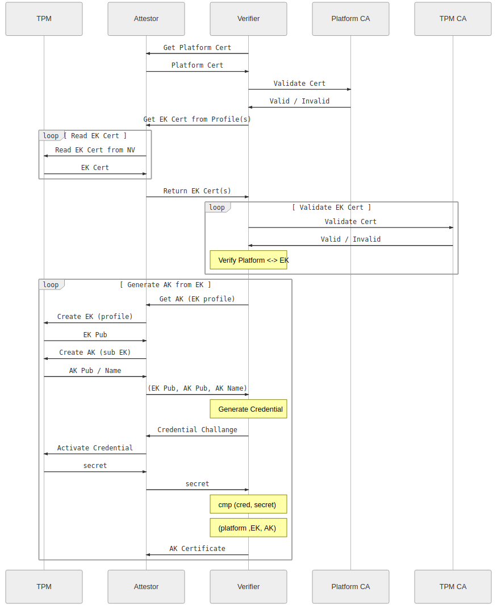
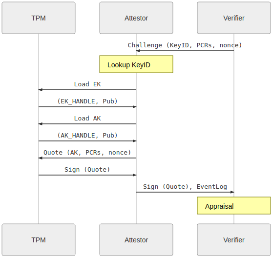
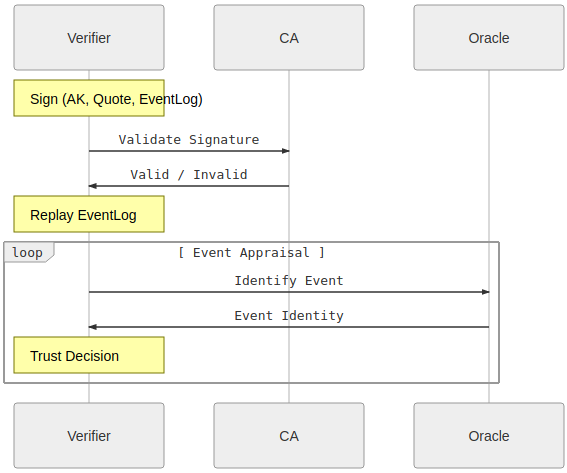

# TPM Remote Attestation protocol using go-tpm and gRPC

This repo contains a sample `gRPC` client server application that uses a Trusted Platform Module for:

* TPM [Remote Attestation](https://tpm2-software.github.io/tpm2-tss/getting-started/2019/12/18/Remote-Attestation.html)
* TPM [Quote-Verify](https://github.com/salrashid123/tpm2/tree/master/quote_verify)
* Sealed and PCR bound Transfer of RSA or AES keys.
* Parse TPM EventLog


Attestation:

( Images taken from [Remote Attestation](https://tpm2-software.github.io/tpm2-tss/getting-started/2019/12/18/Remote-Attestation.html) )




Quote/Verify:



EventLog



>>> **NOTE** the code and procedure outlined here is **NOT** supported by google.


You can use this standalone to setup a gRPC client/server for remote attestation.

There are two parts:

* `attestor`:  a `gRPC` server which accepts connections from a verifier, performs remote attestation, quote/verify and then then securely receives a sealed key from a verifier.  The key is distributed such that it can _only_ get loaded or decoded on the attestor that has the TPM

* `verifier`: a `gRPC` client which connects to the corresponding attestor, and the attestor proves it owns a specific TPM.  Once complete, the verifier will send a sealed RSA or AES Key that can only be decoded by that client.

---

As you can see, the whole protocol is rather complicated but hinges on being able to trust the initial Endorsement Key.   As mentioned, this is normally done by validating that the EndorsementPublic certificate is infact real and signed by a 3rd party (eg, the manufacturer of the TPM).  In the case of google's shielded vTPM, it is signed by google's subordinate CA and includes information about the VM's instance_id value.  This protocol also "validates" the PlatformCA which itself includes a reference (serial# reference) to the EndorsementKey.  I suppose it can contain the hash of the EKcert as another attribute...

---

also see

 - [TPM based TLS using Attested Keys](https://github.com/salrashid123/tls_ak)
 - [Sign, Verify and decode using Google Cloud vTPM Attestation Key and Certificate](https://github.com/salrashid123/gcp-vtpm-ek-ak)
 - [go-attestation](https://github.com/google/go-attestation)


## Setup

We will use a GCP Shielded VM for these tests 

First create two VMs

```bash
gcloud compute instances create attestor --zone=us-central1-a \
    --machine-type=n2d-standard-2  --min-cpu-platform="AMD Milan" \
    --shielded-secure-boot --no-service-account --no-scopes \
    --shielded-vtpm \
    --shielded-integrity-monitoring \
    --confidential-compute


gcloud compute instances create verifier --zone=us-central1-a \
    --machine-type=n2d-standard-2  --min-cpu-platform="AMD Milan" \
    --shielded-secure-boot --no-service-account --no-scopes \
    --shielded-vtpm \
    --shielded-integrity-monitoring \
    --confidential-compute
```

On each, install `go 1.20+` and setup `libtspi-dev`, `gcc` (`apt-get update && apt-get install gcc libtspi-dev`)

```bash
apt-get update
apt-get install libtspi-dev wget gcc git -y

wget https://go.dev/dl/go1.22.3.linux-amd64.tar.gz
rm -rf /usr/local/go && tar -C /usr/local -xzf go1.22.3.linux-amd64.tar.gz
export PATH=$PATH:/usr/local/go/bin/

```

on the **verifier** (which in this case is the client)  VM, edit `/etc/hosts`

and set the value of `attestor.esodemoapp2.com` to the IP of the client (in my case, its `10.128.0.14`).

```bash
$ gcloud compute instances list --filter=name=attestor
NAME      ZONE           MACHINE_TYPE  PREEMPTIBLE  INTERNAL_IP  EXTERNAL_IP      STATUS
attestor  us-central1-a  e2-medium                  10.128.0.14  104.197.204.181  RUNNING
```

```bash
root@verifier:# hostname
verifier

root@verifier:# more /etc/hosts
10.128.0.14 attestor.esodemoapp2.com
```

For GCP Confidential VM's, PCR 0 and 7 are used for attestation and those have default values on the `attestor` vm of:

```bash
$ tpm2_pcrread -o pcrs sha1:0+sha256:0,7
  sha1:
    0 : 0x2AAB58E23EA5120D70A3EBCE56BD0E6D5E3035B7
  sha256:
    0 : 0xA0B5FF3383A1116BD7DC6DF177C0C2D433B9EE1813EA958FA5D166A202CB2A85
    7 : 0x39227C17E8779C0DB03BBB4B6275F3871C97C59B3146768218887B825659E989
```


ofcourse you can use any hostname here but the certificated provided in this repo matches the SAN values for TLS.


## Tests

Now test the client-server by transmitting both an RSA and AES key.


On startup, the verifier will:

1. Verifier contacts the Attestor
2. Attestor returns EKCert (EK), if available*
3. Verifier checks Issuer of EKCert
  
Begin Remote Attestation

4. Verifier Requests Attestation Key (AK). Attestor return AK
5. Verifier uses (EK,AK) to begin Remote Attestation (MakeCredential) which involves using AK,EK to encrypt a value that it sends to Attestor
6. Attestor decodes the secret sent by Verifier (ActivateCredential) and returns the decrypted value to Verifier
7. Verifier confirms the secret sent matches.  Verifier associates AK with EK

End Remote Attestation

Begin Quote/Verify

8. Verifier Requests Quote over PCR values 
9. Attestor generates Quote over PCR value and uses AK to sign
10. Attestor generates EventLog 
11. Attestor returns Quote and EventLog to Verifier 
12. Verifier checks signature of the Attestation is by the AK and the PCR values from the Quote.  Verifier replays the eventLog to confirm derived PCR value.
13. Verifier uses CA private key to sign an x509 certificate tied to the AK.  The verifier _could_ return this x509 back to the attestor over a new (unimplemented) gRPC API call.

End Quote/Verify

Begin Sealed Transfer (PushSecret)

14. Verifier uses EK to encrypt either a local RSA or AES Key 
15. Verifier transmits encrypted Key to Attestor 
16. Attestor either decrypts the AES key or imports the External RSA key into its TPM
17. Attestor generates a test signature using the RSA key or calculates the Hash value of AES key.
18. Attestor returns the signature or hash to Verifier. 
19. Verifier confirms the signature value or hash (thereby confirming the Attestor decoded the RSA or AES key)

End Sealed Transfer

Begin Unrestricted SigningKey Transfer (PullSecret)

20. Verifier Requests Unrestricted Signing Key
21. Attestor generates RSA Key on TPM as a child of EK
22. Attestor uses AK to [Certify](https://github.com/tpm2-software/tpm2-tools/blob/master/man/tpm2_certify.1.md) the new key
23. Attestor transmits the TPM Wire firmat of the RSA key and test signature over some preshared data.
24. Verifier uses AK to confirm the authenticity of the Certification and RSA Public key is attested.
25. Verifier uses RSA Public key to verify the signature provided over preshared data
26. Verifier extracts the public key from the TPM Wireformat and compares it with the Key embedded in the attestation
27. Verifier uses the TPM Wire format Public key to verify the specifications for the unrestricted key (e,g matches template)
28. Verifier uses CA private key to sign an x509certificate tied to the SigningKey.  The verifier _could_ return this x509 back to the attestor over a new (unimplemented) gRPC API call.
    The attestor could use this x509 and private key on its TPM to create an mTLS connection.  See [crypto.Signer for TPM](https://github.com/salrashid123/signer#usage-tls) and [mTLS with TPM bound private key](https://github.com/salrashid123/go_tpm_https_embed) 

End Unrestricted SigningKey Transfer

### AES

#### Attestor AES

```bash
git clone https://github.com/salrashid123/go_tpm_remote_attestation.git
cd go_tpm_remote_attestation

go run src/grpc_attestor.go --grpcport :50051 \
 --unsealPcrs=0,7 \
 --caCertTLS certs/CA_crt.pem \
 --servercert certs/attestor_crt.pem \
 --serverkey certs/attestor_key.pem \
  -useFullAttestation=true --readEventLog=true \
  --platformCertFile certs/platform_cert.der \
  --v=10 -alsologtostderr
```

#### Verifier AES

```bash
git clone https://github.com/salrashid123/go_tpm_remote_attestation.git
cd go_tpm_remote_attestation

# make sure /etc/hosts contains the internal ip for the attestor's vm set as "attestor.esodemoapp2.com" in /etc/hosts

go run src/grpc_verifier.go --importMode=AES  --uid 369c327d-ad1f-401c-aa91-d9b0e69bft67  -aes256Key "G-KaPdSgUkXp2s5v8y/B?E(H+MbQeThW" \
   --host attestor.esodemoapp2.com:50051 \
   --expectedPCRMapSHA256 0:a0b5ff3383a1116bd7dc6df177c0c2d433b9ee1813ea958fa5d166a202cb2a85,7:39227c17e8779c0db03bbb4b6275f3871c97c59b3146768218887b825659e989 \
   --expectedPCRMapSHA1 0:2aab58e23ea5120d70a3ebce56bd0e6d5e3035b7 \
   --caCertTLS certs/CA_crt.pem --caCertIssuer certs/CA_crt.pem --caKeyIssuer certs/CA_key.pem --platformCA certs/CA_crt.pem \
   --readEventLog=true \
   --useFullAttestation=true --v=10 -alsologtostderr 
```


Note, you can get the pcr values for 0,7 on the attestor using [pcr_utils](https://github.com/salrashid123/tpm2/tree/master/pcr_utils).

```log
$ go run main.go --mode=read --pcr=0 -v 10 -alsologtostderr
  I0521 12:11:47.351972   30541 main.go:66] ======= Print PCR  ========
  I0521 12:11:47.353688   30541 main.go:71] PCR(0) a0b5ff3383a1116bd7dc6df177c0c2d433b9ee1813ea958fa5d166a202cb2a85

$ go run main.go --mode=read --pcr=7 -v 10 -alsologtostderr
  I0521 12:11:53.084554   30585 main.go:66] ======= Print PCR  ========
  I0521 12:11:53.086357   30585 main.go:71] PCR(7) 39227c17e8779c0db03bbb4b6275f3871c97c59b3146768218887b825659e989
```

### RSA

#### Attestor RSA

```bash
go run src/grpc_attestor.go --grpcport :50051 \
  --unsealPcrs=0,7 \
  --caCertTLS certs/CA_crt.pem \
  --servercert certs/attestor_crt.pem -useFullAttestation=true  --readEventLog=true \
  --serverkey certs/attestor_key.pem --platformCertFile certs/platform_cert.der  \
  --v=10 -alsologtostderr
```

#### Verifier RSA

```bash
go run src/grpc_verifier.go --importMode=RSA  --uid 369c327d-ad1f-401c-aa91-d9b0e69bft67 \
  --expectedPCRMapSHA256 0:a0b5ff3383a1116bd7dc6df177c0c2d433b9ee1813ea958fa5d166a202cb2a85,7:39227c17e8779c0db03bbb4b6275f3871c97c59b3146768218887b825659e989 \
  --expectedPCRMapSHA1 0:2aab58e23ea5120d70a3ebce56bd0e6d5e3035b7 \
  --rsaCert=certs/tpm_client.crt \
  --readEventLog=true --useFullAttestation=true \
  --caCertTLS certs/CA_crt.pem --caCertIssuer certs/CA_crt.pem --caKeyIssuer certs/CA_key.pem    --platformCA certs/CA_crt.pem \
  --rsaKey=certs/tpm_client.key  --host attestor.esodemoapp2.com:50051   \
  --v=10 -alsologtostderr 
```


#### EventLog

Please see the following for background on the eventlog and how to use it 

- [TPMJS Event Log](https://google.github.io/tpm-js/#pg_attestation)

>> Note, on `GCP Confidential VM`, the default `PCR0` value is shown above:


You can find a full end-to-end trace for the AES example under the `example/` folder

---

### Platform Certificate

The platform certificate used in this protocol is just a sample, static one tied to a ShieldedVM's EKCert serial number.

I did this because i do not know how to generate a platform cert in go.  Instead i used  NSA's [Platform Attribute Certificate Creator (paccor)](https://github.com/nsacyber/paccor) in java to create the cert separately.

What this means is we just make believe/pretend that the platform cert is valid by statically comparing the serialnumbers. In reality the verifier should check the certificate serial number and that a valid privacy ca signed the cert..

[Attribute Certificate](https://github.com/salrashid123/attribute_certificate).

Note a sample serial number that is in the EKCert

```bash
tpm2_nvread -o ekcert.der 0x01c00002
openssl x509 -in ekcert.der -inform DER -outform PEM -out ekcert.pem

# openssl x509 -in ekcert.der -inform DER -outform PEM -out ekcert.pem
openssl x509 -in ekcert.pem -text
Certificate:
    Data:
        Version: 3 (0x2)
        Serial Number:
            63:fe:ef:42:07:e0:a4:6c:2f:80:82:fb:d7:c8:46:13:47:1d:bd
        Signature Algorithm: sha256WithRSAEncryption
        Issuer: C = US, ST = California, L = Mountain View, O = Google LLC, OU = Google Cloud, CN = EK/AK CA Intermediate
        Validity
            Not Before: May 21 11:56:26 2024 GMT
            Not After : May 14 11:56:25 2054 GMT
        Subject: L = us-central1-a, O = Google Compute Engine, OU = srashid-test2, CN = 5839638749371249935
        Subject Public Key Info:
            Public Key Algorithm: rsaEncryption
                Public-Key: (2048 bit)
        X509v3 extensions:
            X509v3 Key Usage: critical
                Key Encipherment
            X509v3 Basic Constraints: critical
                CA:FALSE
            X509v3 Subject Key Identifier: 
                38:FD:1D:8E:EF:2D:3C:00:6B:63:58:0E:64:4C:57:3D:B7:42:FB:A7
            X509v3 Authority Key Identifier: 
                04:6E:73:58:32:C4:A5:CA:C2:39:04:FE:33:7B:59:40:60:68:C8:B4
            Authority Information Access: 
                CA Issuers - URI:http://privateca-content-65d703c4-0000-2bb5-8c60-240588727a78.storage.googleapis.com/141284c118eedaec09f9/ca.crt

```

and the encoded reference of the same in the `platform_cert.der`


```bash
$ openssl asn1parse -inform DER -in certs/platform_cert.der

    0:d=0  hl=4 l=1268 cons: SEQUENCE          
    4:d=1  hl=4 l= 988 cons: SEQUENCE          
    8:d=2  hl=2 l=   1 prim: INTEGER           :01
   11:d=2  hl=3 l= 218 cons: SEQUENCE          
...
  713:d=4  hl=2 l=   3 prim: OBJECT            :X509v3 Authority Key Identifier
  718:d=4  hl=2 l= 113 prim: OCTET STRING      [HEX DUMP]:306F8014B7BAB002A1E7BE34C6C1055C6678E5BB535DA154A154A4523050310B3009060355040613025553310F300D060355040A0C06476F6F676C6531133011060355040B0C0A456E7465727072697365311B301906035504030C12456E746572707269736520526F6F74204341820102
  833:d=3  hl=2 l=  65 cons: SEQUENCE          
  835:d=4  hl=2 l=   3 prim: OBJECT            :X509v3 Certificate Policies
  840:d=4  hl=2 l=  58 prim: OCTET STRING      [HEX DUMP]:3038303606022A033030302E06082B0601050507020230220C20544347205472757374656420506C6174666F726D20456E646F7273656D656E74
  900:d=3  hl=2 l=  94 cons: SEQUENCE          
  902:d=4  hl=2 l=   3 prim: OBJECT            :X509v3 Subject Alternative Name
  907:d=4  hl=2 l=  87 prim: OCTET STRING      [HEX DUMP]:3055A45330513119301706066781050501040C0D4E6F74205370656369666965643119301706066781050501010C0D4E6F74205370656369666965643119301706066781050501050C0D4E6F7420537065636966696564
   
```

This links the platform cert with that specific EKCert

You can verify the Platform cert was signed by a given CA by using [go-attestation.attributecert.AttributeCertificate.CheckSignatureFrom](https://pkg.go.dev/github.com/google/go-attestation@v0.3.2/attributecert#AttributeCertificate.CheckSignatureFrom)


- [`2.1.5 Assertions Made by a Platform Certificate`](https://trustedcomputinggroup.org/wp-content/uploads/IWG_Platform_Certificate_Profile_v1p1_r19_pub_fixed.pdf)

```
3.2 Platform Certificate
This section contains the format for a Platform Certificate conforming to version 1.0 of this specification.
The Platform Certificate makes the assertions listed in section 2.1.6. This certificate format
adheres to RFC 5755 [11] and all requirements and limitations from that specification apply unless otherwise noted.
```

- [Host Integrity at Runtime and Start-up (HIRS)](https://github.com/nsacyber/HIRS/tree/master)


### Applications

This is just an academic exercise (so do not use the code as is).   However, some applications of this


- [TPM based Google Service Account Credentials](https://github.com/salrashid123/oauth2#usage-tpmtokensource)
- [TPM based mTLS](https://github.com/salrashid123/signer#usage-tls)
- [Trusted Platform Module (TPM) recipes with tpm2_tools and go-tpm](https://github.com/salrashid123/tpm2)


### EKCert and AKCert

Google signed Endorsement *Certificates* are available on `GCP Confidential VMs`

- [Sign, Verify and decode using Google Cloud vTPM Attestation Key and Certificate](https://github.com/salrashid123/gcp-vtpm-ek-ak)

On many other platform ([even a raspberry pi w/ TPM chip](https://gist.github.com/salrashid123/d99e698f84e5d35a863225b747af1f48), you can usually extract the the EK certificate bound on the tpm)..

While the API documentation for [getShieldedInstanceIdentity](https://cloud.google.com/compute/docs/reference/rest/v1/instances/getShieldedInstanceIdentity) shows a placeholder for the certificates:

```
{
  "kind": string,
  "signingKey": {
    "ekCert": string,
    "ekPub": string
  },
  "encryptionKey": {
    "ekCert": string,
    "ekPub": string
  }
}
```

it is not populated (see[retrieving-endorsement-key](https://cloud.google.com/compute/shielded-vm/docs/retrieving-endorsement-key))

```bash
gcloud compute instances get-shielded-identity attestor

encryptionKey:
  ekCert: |
    -----BEGIN CERTIFICATE-----
    MIIF5jCCA86gAwIBAgITY/7vQgfgpGwvgIL718hGE0cdvTANBgkqhkiG9w0BAQsF
    ADCBhjELMAkGA1UEBhMCVVMxEzARBgNVBAgTCkNhbGlmb3JuaWExFjAUBgNVBAcT
    DU1vdW50YWluIFZpZXcxEzARBgNVBAoTCkdvb2dsZSBMTEMxFTATBgNVBAsTDEdv
    b2dsZSBDbG91ZDEeMBwGA1UEAxMVRUsvQUsgQ0EgSW50ZXJtZWRpYXRlMCAXDTI0
    MDUyMTExNTYyNloYDzIwNTQwNTE0MTE1NjI1WjBuMRYwFAYDVQQHEw11cy1jZW50
    cmFsMS1hMR4wHAYDVQQKExVHb29nbGUgQ29tcHV0ZSBFbmdpbmUxFjAUBgNVBAsT
    DXNyYXNoaWQtdGVzdDIxHDAaBgNVBAMTEzU4Mzk2Mzg3NDkzNzEyNDk5MzUwggEi
    MA0GCSqGSIb3DQEBAQUAA4IBDwAwggEKAoIBAQDMKrnLJKHjOkXNmw0FOcw22Pnw
    YiemQCIOSxi+K4GeYgTOpHwyrB3XB0Mc2UU0wkhJbmtWxgRIVDbqxTyxRXkYr71+
    hZkQF9fIGdJOEU+FczePdFM42iGa4NiM24rgUFRV9E/JjZxWLrXcUZiewOORpSUC
    yHn8IIV+cTYf66ywniubvUStgbEMMPotNkCUp6nBgu6JTtJiKBW1+MrFbke8laNx
    9p1G7qpLlIGe4zvXvm9E+DxcFYRe2IWa6njmu4LVzZD6FN64LrlYrHcHCnbSslCf
    iDectmmY5GAu4IgJhmT7uERtX+e0FLkG6c2MTj84YLIwktaurmzI1GjG4Fz/AgMB
    AAGjggFgMIIBXDAOBgNVHQ8BAf8EBAMCBSAwDAYDVR0TAQH/BAIwADAdBgNVHQ4E
    FgQUOP0dju8tPABrY1gOZExXPbdC+6cwHwYDVR0jBBgwFoAUBG5zWDLEpcrCOQT+
    M3tZQGBoyLQwgY0GCCsGAQUFBwEBBIGAMH4wfAYIKwYBBQUHMAKGcGh0dHA6Ly9w
    cml2YXRlY2EtY29udGVudC02NWQ3MDNjNC0wMDAwLTJiYjUtOGM2MC0yNDA1ODg3
    MjdhNzguc3RvcmFnZS5nb29nbGVhcGlzLmNvbS8xNDEyODRjMTE4ZWVkYWVjMDlm
    OS9jYS5jcnQwbAYKKwYBBAHWeQIBFQReMFwMDXVzLWNlbnRyYWwxLWECBgCk6UWf
    4AwNc3Jhc2hpZC10ZXN0MgIIUQqQgLjhNQ8MCGF0dGVzdG9yoCAwHqADAgEAoQMB
    Af+iAwEB/6MDAQEApAMBAQClAwEBADANBgkqhkiG9w0BAQsFAAOCAgEAY6u6Bj/f
    6TB/5ublhA2Ph2Pm57Vch0/jbhybTF9a/zM6S2bQ5ih6wrXjbmzlEPGBMLo/DQoj
    AlaQUFPYPTMF/0/eUcr2Rcl8amUtICHhHrdWvoMKEMgGPR4BCefTZjtEVCZ+9bw3
    xQZS7s7iyh4agpELh+7zDVPvNghXC4q6FjGqYI/xbI/jtKmEe0hOaVNmGsMd+D2T
    O0MYi1c4WrTqJ+qVDzL2alnd5zEUXOgJbhGotaoU4UD4n7eEtVeXxiBP7UOeOlWa
    0hOuwRqV+5iy/zEBlihnwmOpFaDF/HRdnT3EUPNqG18EOURsnocf7ReogVqACEQc
    8zqm4TwtmlTxB3Jq8ccH9tL3o6IIVA+Tz0KZSM43ry8pzVh1/G5tHPYlNMHgw1Ge
    HuCMN2RIoOTc2+aOpEiTbQzbDlFx1vMtgrjXyLK+EFECOrE+Tt7X/DwOakaUOXBE
    iuogCRVoQG4TGs0tliEADS8rAxNBU4VTT2FaGk0Z/eC6w1zuvOCPAqAtzEqcR5Pn
    ChVSnFNJPbcWtA9Muou6FZ6FjmE85t4M+M+F/CLJIw5DKkR6Fr6aiaFu7kJJCN55
    iXfLoR5lrydKQj7Kk2M/Q0gGDNCz/BBh1a58AKW477TAICRgOA8ADaXD8cT0HvEV
    l+CEGH6rTqG3YAJPcAY8oKSTpEhAdzRXvkE=
    -----END CERTIFICATE-----
  ekPub: |
    -----BEGIN PUBLIC KEY-----
    MIIBIjANBgkqhkiG9w0BAQEFAAOCAQ8AMIIBCgKCAQEAzCq5yySh4zpFzZsNBTnM
    Ntj58GInpkAiDksYviuBnmIEzqR8Mqwd1wdDHNlFNMJISW5rVsYESFQ26sU8sUV5
    GK+9foWZEBfXyBnSThFPhXM3j3RTONohmuDYjNuK4FBUVfRPyY2cVi613FGYnsDj
    kaUlAsh5/CCFfnE2H+ussJ4rm71ErYGxDDD6LTZAlKepwYLuiU7SYigVtfjKxW5H
    vJWjcfadRu6qS5SBnuM7175vRPg8XBWEXtiFmup45ruC1c2Q+hTeuC65WKx3Bwp2
    0rJQn4g3nLZpmORgLuCICYZk+7hEbV/ntBS5BunNjE4/OGCyMJLWrq5syNRoxuBc
    /wIDAQAB
    -----END PUBLIC KEY-----
kind: compute#shieldedInstanceIdentity
signingKey:
  ekCert: |
    -----BEGIN CERTIFICATE-----
    MIIF5jCCA86gAwIBAgITfd/UjbVsFsyEukfmcBAeX+1VpDANBgkqhkiG9w0BAQsF
    ADCBhjELMAkGA1UEBhMCVVMxEzARBgNVBAgTCkNhbGlmb3JuaWExFjAUBgNVBAcT
    DU1vdW50YWluIFZpZXcxEzARBgNVBAoTCkdvb2dsZSBMTEMxFTATBgNVBAsTDEdv
    b2dsZSBDbG91ZDEeMBwGA1UEAxMVRUsvQUsgQ0EgSW50ZXJtZWRpYXRlMCAXDTI0
    MDUyMTExNTYyNloYDzIwNTQwNTE0MTE1NjI1WjBuMRYwFAYDVQQHEw11cy1jZW50
    cmFsMS1hMR4wHAYDVQQKExVHb29nbGUgQ29tcHV0ZSBFbmdpbmUxFjAUBgNVBAsT
    DXNyYXNoaWQtdGVzdDIxHDAaBgNVBAMTEzU4Mzk2Mzg3NDkzNzEyNDk5MzUwggEi
    MA0GCSqGSIb3DQEBAQUAA4IBDwAwggEKAoIBAQCxHI6PIDhoneD9oGCBw1KxT88H
    HCcJ3BzuJ2U/ubYlPD8ajR2M0zsSGyyIHtDSARYaODypI/OarU+C0lP1oj7EVkyj
    4DQqBDjlKCWXhQnjmf2fHIdLsmEOAFfLBfY53H/CSZ37FFU7eyd17TkYP8l7GANZ
    INOH7L5WZYxcAW4BDD9dQXWW6L+uJYYXNj+VdiGPPobQdT71MIQy77tm+itgu0J0
    5Dj+4GzRD07mlaSYSJYqbJi+2bPXecTf0zFVwRLrhfbTzUxkZcZGBpCIKYXc3BiL
    jp0YsolItPKCP5GRqwkrMhr3i8vzo7AjbWPzS1qkutKo4PLryWukqB9pRSC5AgMB
    AAGjggFgMIIBXDAOBgNVHQ8BAf8EBAMCB4AwDAYDVR0TAQH/BAIwADAdBgNVHQ4E
    FgQUSl92OK/4mLGYrwnyTnmEB3GJpB8wHwYDVR0jBBgwFoAUZ8O73ljj1lF2j7Ma
    PtsHp+yTeuQwgY0GCCsGAQUFBwEBBIGAMH4wfAYIKwYBBQUHMAKGcGh0dHA6Ly9w
    cml2YXRlY2EtY29udGVudC02NWQ1M2IxNC0wMDAwLTIxMmEtYTYzMy04ODNkMjRm
    NTdiYjguc3RvcmFnZS5nb29nbGVhcGlzLmNvbS8wYzNlNzllYjA4OThkMDJlYmIw
    YS9jYS5jcnQwbAYKKwYBBAHWeQIBFQReMFwMDXVzLWNlbnRyYWwxLWECBgCk6UWf
    4AwNc3Jhc2hpZC10ZXN0MgIIUQqQgLjhNQ8MCGF0dGVzdG9yoCAwHqADAgEAoQMB
    Af+iAwEB/6MDAQEApAMBAQClAwEBADANBgkqhkiG9w0BAQsFAAOCAgEATMGgyWEW
    C/KXV0N1z+H0AZ0DlUw7sI125dLidZBcs8mn5NI8OBmWI0O2OSKAAcnaKWtI7qDn
    7MHghp8CHv5oINF0vv753FyW7o/IDOvK5GgAYFBzdjG/d0bxGb+VhjlqGTu9E+Hb
    rdYvcqhZjZHb0bA2p7g1bkELSR7cg2UmIKCVrVbHJIb+s5QolA4KHW+1ym7Wgafz
    9PRWlRqtgmjM6YtT+5nqQD1FskMgYcKtjYGZfYYckvcX4/WAOwRVf/cWiYAQ6iIF
    cONO2kE1Kq526Jn0kRH9Gg/frL4XDZWq3Vrtl5txog1Uu/CiABfevkQPVVawuYgi
    /dH2fcdaZNaci95XdAA0pCvOnPsKIsmdvTSlwW1DLSI4E3o7op0chriAaKUmUNBr
    kdkHgh8j427VVtzscwzWgB8C6cJoEAR4ddKMaQwG7D79wb+Ts566yNLzasOeGOp0
    26+ibG5j1NvZ+6WOkpBYK9pJUPHMayc4NhYGZV/vzLwup1BnYLYrf8oGpFG4CZku
    /d2lh0o+zCegbgAJ1o3pTTFAr15UnyKknPoC+NMVuPLcZkQZcxqpLKWLUhi/Qtxy
    TdKlfyUFvOig40LqjGP/Kz9A53BsbQ4c5rOOHq4QhbJVjo6sTGU5t0pFOciox6rM
    vJt7DCd5fO3Mdkte3Sg2EtOuYEYBNTDDGWY=
    -----END CERTIFICATE-----
  ekPub: |
    -----BEGIN PUBLIC KEY-----
    MIIBIjANBgkqhkiG9w0BAQEFAAOCAQ8AMIIBCgKCAQEAsRyOjyA4aJ3g/aBggcNS
    sU/PBxwnCdwc7idlP7m2JTw/Go0djNM7EhssiB7Q0gEWGjg8qSPzmq1PgtJT9aI+
    xFZMo+A0KgQ45Sgll4UJ45n9nxyHS7JhDgBXywX2Odx/wkmd+xRVO3snde05GD/J
    exgDWSDTh+y+VmWMXAFuAQw/XUF1lui/riWGFzY/lXYhjz6G0HU+9TCEMu+7Zvor
    YLtCdOQ4/uBs0Q9O5pWkmEiWKmyYvtmz13nE39MxVcES64X2081MZGXGRgaQiCmF
    3NwYi46dGLKJSLTygj+RkasJKzIa94vL86OwI21j80tapLrSqODy68lrpKgfaUUg
    uQIDAQAB
    -----END PUBLIC KEY-----

```

An alternative maybe to establish trust with the `ekPub` using out of band trusts as described here (i.e allow the remote party to use gcloud to read and trust the `ekPub`):

** [TPM Key Attestation](https://learn.microsoft.com/en-us/windows-server/identity/ad-ds/manage/component-updates/tpm-key-attestation#BKMK_DeploymentOverview)

quoting from [TPMs without EK certificates](https://safeboot.dev/attestation/):

```
Google Cloud's ShieldedVM service enables vTPM for the guests, although it does not provide an EK in the NVRAM either. The key can be retrieved out of band with these instructions, or the public component can be read from the tpm2 createek command described above. Using the Google Cloud ShieldedVM lookup service can function as an EKcert as far as establishing trust in an instance's vTPM.
```

or maybe you can for example, you can 'force sign' a CA with the ekpublic key (disclaimer, this maybe insecure)

* [Issue CA-signed certificate for TPM public key](https://gist.github.com/salrashid123/10320c153ad6acdc31854c9775c43c0d)

