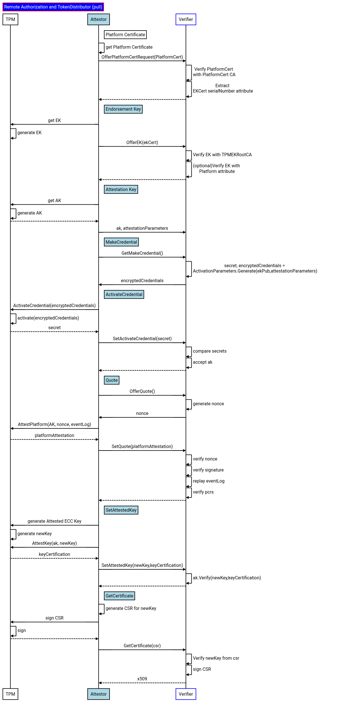

# TPM Remote Attestation protocol using go-tpm and gRPC

This repo contains a sample `gRPC` client server application that uses a Trusted Platform Module for:

* TPM [Remote Attestation](https://tpm2-software.github.io/tpm2-tss/getting-started/2019/12/18/Remote-Attestation.html)
* TPM [Quote-Verify](https://github.com/salrashid123/tpm2/tree/master/quote_verify)
* Sealed and PCR bound Transfer of RSA or AES keys.
* Parse TPM EventLog

>>> **NOTE** the code and procedure outlined here is **NOT** supported by google.


You can use this standalone to setup a gRPC client/server for remote attestation.

There are *TWO* branches to this repo: 

* `pull` (this branch):  In this mode, the attestor is the client initiator that makes an rpc call to the verifier
* `push`:  In this mode, the attestor is the server and the verifier makes an rpc call to the attestor


There are two parts:

* `attestor`: a `gRPC` TPM client which connects to the corresponding verifier and provides apis which allows RemoteAttestation, QuoteVerify and finally transmits an new ECC key and recieves an x509 from the verifier.

* `verifier`:  a `gRPC` server which accepts connections from a attestor, and then instructs the performs remote attestation, quote/verify and then transmits an ECC public key back to the verifier which is certified to exist on that TPM

---

On startup:

1. Attestor contacts the Verifier
2. Attestor sends the Platform Certificate
3. Verifier checks the platform certificate specifications and verifies it with a demo platform CA

4. Attestor sends EKCert (EK)
5. Verifier checks Issuer and Signature of EKCert with CAs
6. Verifier optionally compares EK SerialNumber with PlatformCert

Remote Attestation 

(MakeCredential)
7. Attestor sends AKPublic (AK)
8. Verifier uses EK and AK to generate (secret,encryptedCredential) via MakeCredential
9. Verifier returnes encryptedCredential to Attestor

(ActivateCredential)
10. Attestor uses TPM to decode encryptedCredential and acquire secret
11. Attestor transmit secret to Verifier
12. Verifer compares secrets and accepts AK

Quote/Verify

13. Attestor Quote initiation request to Verifer 
14. Verifer generates random nonce
15. Verifer returns nonce to Attestor
16. Attestor generates Quote over PCR values, nonce and uses AK to sign
17. Attestor generates EventLog 
18. Attestor returns Quote and EventLog to Verifier 
19. Verifier checks signature of the Attestation is by the AK and the PCR values from the Quote and the nonce values match.  Verifier replays the eventLog to confirm derived PCR value.

(optional) Issue New ECC x509

20. Attestor genrate newKey on TPM 
21. Attestor uses AK to certify newKey
22. Attestor transmits newKey and certification data to Verifer
23. Verifer confirms newKey is on the TPM and was certified by AK
24. Attestor uses newKey to generate a CSR
25. Attestor sends CSR to Verifier
26. Verifer confirms CSR's public key is certified newKey
27. Verifer signes csr and issues x509
28. Verifer returns x509 to Attestor



---

also see

 - [TPM based TLS using Attested Keys](https://github.com/salrashid123/tls_ak)
 - [Sign, Verify and decode using Google Cloud vTPM Attestation Key and Certificate](https://github.com/salrashid123/gcp-vtpm-ek-ak)
 - [go-attestation](https://github.com/google/go-attestation)


#### Setup Local TPM

If you want to test locally with a real TPM, you need to acquire your TPM's issuer and intermediate root certificates.

For my laptop, the PCR value and issuers was `certs/ECCert.pem` 

To get the EKCert, install `tpm2_tools` first and then:

```bash
## public key
# tpm2_createek -c /tmp/ek.ctx -G rsa -u /tmp/ek.pub
# tpm2_readpublic -c /tmp/ek.ctx  -o certs/ECCPub.pem -f PEM

## x509
tpm2_getekcertificate -X -o /tmp/ECcert.bin
openssl x509 -in /tmp/ECcert.bin -inform DER -out certs/ECCert.pem
```

The EKCert was in the form:

```bash
$ openssl x509 -in certs/ECCert.pem -inform PEM -noout -text 

Certificate:
    Data:
        Version: 3 (0x2)
        Serial Number:
            7e:36:61:65:3e:7b:5a:81:74:3d:03:f1:1a:92:56:ec:ff:be:04:81
        Signature Algorithm: sha384WithRSAEncryption
        Issuer: C=CH, O=STMicroelectronics NV, CN=STSAFE TPM RSA Intermediate CA 10
        Validity
            Not Before: Apr 16 10:33:45 2023 GMT
            Not After : Dec 31 23:59:59 9999 GMT
        Subject: 
        Subject Public Key Info:
            Public Key Algorithm: rsaEncryption
                Public-Key: (2048 bit)
                Modulus:
                    00:d2:
                Exponent: 65537 (0x10001)
        X509v3 extensions:
            X509v3 Authority Key Identifier: 
                65:70:62:A7:10:56:91:6F:8C:7F:79:8A:92:DD:E6:D8:1D:0A:98:DA
            X509v3 Subject Alternative Name: critical
                DirName:/tcg-at-tpmManufacturer=id:53544D20/tcg-at-tpmModel=ST33KTPM2X/tcg-at-tpmVersion=id:00090100
            X509v3 Subject Directory Attributes: 
                TPM Specification:
    0:d=0  hl=2 l=  12 cons: SEQUENCE          
    2:d=1  hl=2 l=   3 prim:  UTF8STRING        :2.0
    7:d=1  hl=2 l=   1 prim:  INTEGER           :00
   10:d=1  hl=2 l=   2 prim:  INTEGER           :9F


            X509v3 Basic Constraints: critical
                CA:FALSE
            X509v3 Extended Key Usage: 
                Endorsement Key Certificate
            X509v3 Key Usage: critical
                Key Encipherment
            Authority Information Access: 
                CA Issuers - URI:http://sw-center.st.com/STSAFE/stsafetpmrsaint10.crt
    Signature Algorithm: sha384WithRSAEncryption
    Signature Value:
        a3:62:a4:f9:2
```

The next step is to acquire the certification trust chain.  Note that for me the `CAIssuer` is `URI:http://sw-center.st.com/STSAFE/stsafetpmrsaint10.crt` (yours maybe different)

So to get the chains, first get the intermediate

```bash
wget http://sw-center.st.com/STSAFE/stsafetpmrsaint10.crt
openssl x509 -in stsafetpmrsaint10.crt -inform DER -noout -text 
```

Which prints out 

```bash
openssl x509 -in stsafetpmrsaint10.crt -inform DER -out certs/stmtpmekint10.pem

Certificate:
    Data:
        Version: 3 (0x2)
        Serial Number: 1073741840 (0x40000010)
        Signature Algorithm: sha384WithRSAEncryption
        Issuer: C=CH, O=STMicroelectronics NV, CN=STSAFE RSA Root CA 02
        Validity
            Not Before: Jan 20 00:00:00 2022 GMT
            Not After : Jan  1 00:00:00 2042 GMT
        Subject: C=CH, O=STMicroelectronics NV, CN=STSAFE TPM RSA Intermediate CA 10
        Subject Public Key Info:
            Public Key Algorithm: rsaEncryption
                Public-Key: (4096 bit)
                Modulus:
                    00:cb:b5:
                Exponent: 65537 (0x10001)
        X509v3 extensions:
            X509v3 Subject Key Identifier: 
                65:70:62:A7:10:56:91:6F:8C:7F:79:8A:92:DD:E6:D8:1D:0A:98:DA
            X509v3 Authority Key Identifier: 
                7C:C2:8D:BE:6E:59:D8:4A:54:03:46:9B:13:08:00:D2:F8:F0:6D:27
            X509v3 Certificate Policies: critical
                Policy: X509v3 Any Policy
                  CPS: http://sw-center.st.com/STSAFE/
            X509v3 Key Usage: critical
                Certificate Sign, CRL Sign
            X509v3 Basic Constraints: critical
                CA:TRUE, pathlen:0
            Authority Information Access: 
                CA Issuers - URI:http://sw-center.st.com/STSAFE/STSAFERsaRootCA02.crt
            X509v3 CRL Distribution Points: 
                Full Name:
                  URI:http://sw-center.st.com/STSAFE/STSAFERsaRootCA02.crl

    Signature Algorithm: sha384WithRSAEncryption
    Signature Value:
        80:4e:30:4e:14:71:22:39
```

Now get the root by reading the parsed intermediate  `URI:http://sw-center.st.com/STSAFE/STSAFERsaRootCA02.crt`

```bash
wget http://sw-center.st.com/STSAFE/STSAFERsaRootCA02.crt
openssl x509 -in STSAFERsaRootCA02.crt -inform DER -noout -text
openssl x509 -in STSAFERsaRootCA02.crt -inform DER -out certs/stmtpmekroot.pem
```

Now read the PCR's on the Attestor (which in this case is the same laptop as the verifier):

```bash
sudo tpm2_pcrread  sha1:0+sha256:0,7
  sha1:
  sha256:
    0 : 0x7BB4353897632FD086982175A027DAFCC33F61ADBAB4EBFC6D13927B97A8C084
    7 : 0x46D45493DC751AF8C46996EEDAF69D7D4012D46CA8D75BBB141D23103361E59E
```

Note, your system must generate a [tpm2_eventlog](https://github.com/tpm2-software/tpm2-tools/blob/master/man/tpm2_eventlog.1.md) since this is used during quote/verification steps.

To verify that its there, run

```bash
sudo tpm2_eventlog /sys/kernel/security/tpm0/binary_bios_measurements
```

### Verifier

First run the  Verifier

```bash
go run src/server/grpc_verifier.go  \
       --ekintermediateCA=certs/stmtpmekint10.pem --ekrootCA=certs/stmtpmekroot.pem \
       --expectedPCRMapSHA256=0:7bb4353897632fd086982175a027dafcc33f61adbab4ebfc6d13927b97a8c084  \
       --v=40 -alsologtostderr

        I1219 12:29:47.340005 2193152 grpc_verifier.go:136] ======= OfferPlatformCert ========
        I1219 12:29:47.340456 2193152 grpc_verifier.go:156]      PlatformCertificate Issuer: CN=www.intel.com,OU=TrustedSupplyChain,O=Intel Corporation,L=Santa Clara,ST=California,C=US
        I1219 12:29:47.340506 2193152 grpc_verifier.go:157]      PlatformCertificate Version: 2
        I1219 12:29:47.340519 2193152 grpc_verifier.go:159]      PlatformCertificate CredentialSpecification: 
        I1219 12:29:47.340531 2193152 grpc_verifier.go:160]      PlatformCertificate PlatformManufacturer: Intel
        I1219 12:29:47.340542 2193152 grpc_verifier.go:161]      PlatformCertificate PlatformModel: S2600KP
        I1219 12:29:47.340554 2193152 grpc_verifier.go:162]      PlatformCertificate PlatformVersion: H76962-350
        I1219 12:29:47.340566 2193152 grpc_verifier.go:163]      PlatformCertificate PropertiesURI: 
        I1219 12:29:47.340578 2193152 grpc_verifier.go:178]      PlatformCertificate Holder.Issuer: CN=STMicro
        I1219 12:29:47.340597 2193152 grpc_verifier.go:179]      PlatformCertificate Holder.Serial: 449600017855339869538679649152375580078880538087
        I1219 12:29:47.340624 2193152 grpc_verifier.go:180]      PlatformCertificate Holder.Issuer.CommonName: STMicro
        I1219 12:29:47.340642 2193152 grpc_verifier.go:185]      PlatformCertificate TBBSecurityAssertions.Iso9000URI: URL to iso9000 certificate
        I1219 12:29:47.340659 2193152 grpc_verifier.go:186]      PlatformCertificate TBBSecurityAssertions.CcInfo.ProfileOid: 
        I1219 12:29:47.340681 2193152 grpc_verifier.go:187]      PlatformCertificate TBBSecurityAssertions.CcInfo.ProfileURI: 
        I1219 12:29:47.340699 2193152 grpc_verifier.go:188]      PlatformCertificate TBBSecurityAssertions.CcInfo.TargetOid: 
        I1219 12:29:47.340719 2193152 grpc_verifier.go:189]      PlatformCertificate TBBSecurityAssertions.CcInfo.TargetURI: 
        I1219 12:29:47.340738 2193152 grpc_verifier.go:190]      PlatformCertificate TBBSecurityAssertions.CcInfo.Version: CC Version
        I1219 12:29:47.340758 2193152 grpc_verifier.go:192]      PlatformCertificate TCGPlatformSpecification.Version: {1 2 1}
        I1219 12:29:47.340782 2193152 grpc_verifier.go:193]      PlatformCertificate TCGPlatformSpecification.Version.MajorVersion: 1
        I1219 12:29:47.340802 2193152 grpc_verifier.go:194]      PlatformCertificate TCGPlatformSpecification.Version.MinorVersion: 2
        I1219 12:29:47.340822 2193152 grpc_verifier.go:195]      PlatformCertificate TCGPlatformSpecification.Version.Revision: 1
        I1219 12:29:47.340843 2193152 grpc_verifier.go:197]      PlatformCertificate UserNotice.UserNotice.ExplicitText: TCPA Trusted Platform Endorsement
        I1219 12:29:47.340865 2193152 grpc_verifier.go:198]      PlatformCertificate UserNotice.UserNotice.Organization: Credential Type Label
        I1219 12:29:47.340886 2193152 grpc_verifier.go:199]      PlatformCertificate UserNotice.UserNotice.NoticeNumbers: []
        I1219 12:29:47.341040 2193152 grpc_verifier.go:205]  Verified Platform cert signed by privacyCA
        I1219 12:29:47.359221 2193152 grpc_verifier.go:225] ======= OfferEK ========
        I1219 12:29:47.359431 2193152 grpc_verifier.go:262]      TPM Manufacturer id:53544D20
        I1219 12:29:47.359474 2193152 grpc_verifier.go:265]      TPM Model ST33KTPM2X
        I1219 12:29:47.359501 2193152 grpc_verifier.go:269]      TPM Version id:00090100
        I1219 12:29:47.359542 2193152 grpc_verifier.go:298]      TPM Family 2.0
        I1219 12:29:47.359565 2193152 grpc_verifier.go:299]      TPM Level 0
        I1219 12:29:47.359589 2193152 grpc_verifier.go:300]      TPM Revision 159
        I1219 12:29:47.359629 2193152 grpc_verifier.go:315]         EKCertificate ========
        -----BEGIN CERTIFICATE-----
        MIIFDzCCAvegAwIBAgIUfjZhZT57WoF0PQPxGpJW7P++BIEwDQYJKoZIhvcNAQEM
        BQAwWTELMAkGA1UEBhMCQ0gxHjAcBgNVBAoTFVNUTWljcm9lbGVjdHJvbmljcyBO
        VjEqMCgGA1UEAxMhU1RTQUZFIFRQTSBSU0EgSW50ZXJtZWRpYXRlIENBIDEwMCAX
        DTIzMDQxNjEwMzM0NVoYDzk5OTkxMjMxMjM1OTU5WjAAMIIBIjANBgkqhkiG9w0B
        AQEFAAOCAQ8AMIIBCgKCAQEA0shjU+4tGz+FRFoe4SVxNtZA7hGxA1MeC891SLmn
        OMiXGZGgBJGPv+USVLY2OJFln4X94vvNE1Rh06HFG9FoPBA//coeFavi7cjV9GUh
        3beY8wX6ergOMTxl38xbiBN6LKYuqwQ51wuMrOB5Q0n8XIJwjCfnSWGCAo16FadU
        xteEixOuWbHW+If7T/j3FsHzD+QCbCYrQ1AzrHCHNsiwMAyKXdIncJnNaKi8qLDl
        D4IXT2RbjijSoAFWO086Li5gwtVVoMULN4B4d83309EI11LvCiNCWGAJZ7pxTME7
        +WJMurXcJec19c9M4YrjEAEggxfxKc+Bktv1ibCCeOegVwIDAQABo4IBJDCCASAw
        HwYDVR0jBBgwFoAUZXBipxBWkW+Mf3mKkt3m2B0KmNowVwYDVR0RAQH/BE0wS6RJ
        MEcxFjAUBgVngQUCAQwLaWQ6NTM1NDREMjAxFTATBgVngQUCAgwKU1QzM0tUUE0y
        WDEWMBQGBWeBBQIDDAtpZDowMDA5MDEwMDAiBgNVHQkEGzAZMBcGBWeBBQIQMQ4w
        DAwDMi4wAgEAAgIAnzAMBgNVHRMBAf8EAjAAMBAGA1UdJQQJMAcGBWeBBQgBMA4G
        A1UdDwEB/wQEAwIFIDBQBggrBgEFBQcBAQREMEIwQAYIKwYBBQUHMAKGNGh0dHA6
        Ly9zdy1jZW50ZXIuc3QuY29tL1NUU0FGRS9zdHNhZmV0cG1yc2FpbnQxMC5jcnQw
        DQYJKoZIhvcNAQEMBQADggIBAKNipPkkgRUMAyTJh8xWRAmOP2put6d/DEuVsYRn
        hvsVwJPUYc2Ki1hm8fy8OCnRAcChwQDj0tgcyAjol1qusSG5Z+pkIwdet4WLcYiE
        0uf/EWMz4xvsmIDDIpn38flbAM+5XjsVczGC8/WM2DFxSllmmD5BpZDm0tBDnwCU
        3bpBNoeUZ/gGoYNdDxWPnwqc5Zy1+AheaigQzGUPFKRU2xMuBkOTmdJgY357dvLZ
        vVrJUWGSJq8Ee/bRgj/UFFPABLFQgV8S8x7HnMxmwUUwgHC3F94wEs5/mo/VQXbU
        uJ2TlKhT3Dy/3ssKjNgVOnIOb7G54yjg2CzR8ncI9oz0QGJm4P243Zv+iBSsKTXb
        2di1CxWuuE7s23ajExBnTKTfnERfeHbtiT8MUqre02kDHX8ql/xrM0fOq02+JODZ
        U0DnsZI3wXDEvjRy8X+GyiDGU+wnpgycSNzoSAWvvIRxRdqcaZ4QJh9diABX41CE
        teI4QdS32b7LejPcbJH566NhlPReZDFgssIEGjdYYLaGFZdya3YEqgZMfyRfVL16
        93DBivvYwgtyqQj+aKAhAGLJTQEXqdQh662hMPZ5bBQS8FZ8MncS6CodLYvsXJUw
        qYloxK9lcNDk0rkIibqzSUL1+lPbpQwE2xV+LQZbNIyj2hQ6XTYmwrsT+C8Fp/vU
        Cfz7
        -----END CERTIFICATE-----

        I1219 12:29:47.359795 2193152 grpc_verifier.go:330]      EKCert  Issuer CN=STSAFE TPM RSA Intermediate CA 10,O=STMicroelectronics NV,C=CH
        I1219 12:29:47.359868 2193152 grpc_verifier.go:331]      EKCert  IssuingCertificateURL [http://sw-center.st.com/STSAFE/stsafetpmrsaint10.crt]
        I1219 12:29:47.359895 2193152 grpc_verifier.go:332]      EKCert  SerialNumber 720545561707831497387264474846090629232862299265
        I1219 12:29:47.359912 2193152 grpc_verifier.go:334]     EkCert Public Key 
        -----BEGIN PUBLIC KEY-----
        MIIBIjANBgkqhkiG9w0BAQEFAAOCAQ8AMIIBCgKCAQEA0shjU+4tGz+FRFoe4SVx
        NtZA7hGxA1MeC891SLmnOMiXGZGgBJGPv+USVLY2OJFln4X94vvNE1Rh06HFG9Fo
        PBA//coeFavi7cjV9GUh3beY8wX6ergOMTxl38xbiBN6LKYuqwQ51wuMrOB5Q0n8
        XIJwjCfnSWGCAo16FadUxteEixOuWbHW+If7T/j3FsHzD+QCbCYrQ1AzrHCHNsiw
        MAyKXdIncJnNaKi8qLDlD4IXT2RbjijSoAFWO086Li5gwtVVoMULN4B4d83309EI
        11LvCiNCWGAJZ7pxTME7+WJMurXcJec19c9M4YrjEAEggxfxKc+Bktv1ibCCeOeg
        VwIDAQAB
        -----END PUBLIC KEY-----

        I1219 12:29:47.359938 2193152 grpc_verifier.go:337]     Verifying EKCert
        I1219 12:29:47.360217 2193152 grpc_verifier.go:363]      EKCert Includes tcg-kp-EKCertificate ExtendedKeyUsage 2.23.133.8.1
        I1219 12:29:47.361563 2193152 grpc_verifier.go:387]     EKCert Verified
        I1219 12:29:47.361591 2193152 grpc_verifier.go:404] =============== end OfferEK ===============
        I1219 12:29:47.816001 2193152 grpc_verifier.go:409] ======= OfferAK ========
        I1219 12:29:47.816263 2193152 grpc_verifier.go:444]       ak public 
        -----BEGIN PUBLIC KEY-----
        MIIBIjANBgkqhkiG9w0BAQEFAAOCAQ8AMIIBCgKCAQEAmZCLU9GPIebaiLIKP9WZ
        YSqw07/VO/mEkxMHIb8QTXwo63CIf8OFmt4TTO+nIBhF3Hk4K6ztNTFce6Wgj3Bk
        dz/OJ4A+GlDSO4TjmqQmMNKmDGGLXxowB9BZKJx2e9PiaTbrhMH8TWt0GGtE0lE8
        xBuiV0Ld+5VIoN/+pvH2EPSQHDv9GKRG+4yZ3wnyb3gh9AJgvbUgjaMZnQ2jC4Lt
        a5ph+7c7e4189XUgvvDxhf5GXELChmPceg8iOcvvn69XkrXjAq4/c6REl92REsMu
        UVBD9GAxOobgXb6PIWKjrTKUMA66bGQJrdf/FJD/kc8O/rt202oQHfK+rxEROe4J
        JwIDAQAB
        -----END PUBLIC KEY-----

        I1219 12:29:47.816300 2193152 grpc_verifier.go:451] =============== end GetAK ===============
        I1219 12:29:47.817185 2193152 grpc_verifier.go:457] ======= GetMakeCredential ========
        I1219 12:29:47.817229 2193152 grpc_verifier.go:468] =============== end GetMakeCredential ===============
        I1219 12:29:47.817739 2193152 grpc_verifier.go:482]       Outbound Secret: RrCeEupGOpUqOS6w/j+ZdJCsB3uSD7rn9X1kh6Hqs7Q=
        I1219 12:29:48.732192 2193152 grpc_verifier.go:499] ======= SetActivateCredential ========
        I1219 12:29:48.732248 2193152 grpc_verifier.go:523] =============== end SetActivateCredential ===============
        I1219 12:29:48.733143 2193152 grpc_verifier.go:528] ======= OfferQuote ========
        I1219 12:29:48.733215 2193152 grpc_verifier.go:547] =============== end OfferQuote ===============
        I1219 12:29:51.701628 2193152 grpc_verifier.go:554] ======= SetQuote ========
        I1219 12:29:51.704311 2193152 grpc_verifier.go:599]       quote-attested public 
        -----BEGIN PUBLIC KEY-----
        MIIBIjANBgkqhkiG9w0BAQEFAAOCAQ8AMIIBCgKCAQEAmZCLU9GPIebaiLIKP9WZ
        YSqw07/VO/mEkxMHIb8QTXwo63CIf8OFmt4TTO+nIBhF3Hk4K6ztNTFce6Wgj3Bk
        dz/OJ4A+GlDSO4TjmqQmMNKmDGGLXxowB9BZKJx2e9PiaTbrhMH8TWt0GGtE0lE8
        xBuiV0Ld+5VIoN/+pvH2EPSQHDv9GKRG+4yZ3wnyb3gh9AJgvbUgjaMZnQ2jC4Lt
        a5ph+7c7e4189XUgvvDxhf5GXELChmPceg8iOcvvn69XkrXjAq4/c6REl92REsMu
        UVBD9GAxOobgXb6PIWKjrTKUMA66bGQJrdf/FJD/kc8O/rt202oQHfK+rxEROe4J
        JwIDAQAB
        -----END PUBLIC KEY-----

        I1219 12:29:51.704500 2193152 grpc_verifier.go:623]      PCR: 0, verified: true value: 7bb4353897632fd086982175a027dafcc33f61adbab4ebfc6d13927b97a8c084
        I1219 12:29:51.704521 2193152 grpc_verifier.go:623]      PCR: 1, verified: true value: 0e2c30270bbf1e52967a5ebedc6cdffb7f5166c70fb5fbda021ab5db4f87ca80
        I1219 12:29:51.704531 2193152 grpc_verifier.go:623]      PCR: 2, verified: true value: f8650efffd171c5d05d0aface51ef1ab216e25b7660faa6d6b9d1731b7c2f748
        I1219 12:29:51.704539 2193152 grpc_verifier.go:623]      PCR: 3, verified: true value: 3d458cfe55cc03ea1f443f1562beec8df51c75e14a9fcf9a7234a13f198e7969
        I1219 12:29:51.704548 2193152 grpc_verifier.go:623]      PCR: 4, verified: true value: f75dc309511a6cd8ece093f69696344540714814b4b2cd0c78a9b7e585da0f1d
        I1219 12:29:51.704557 2193152 grpc_verifier.go:623]      PCR: 5, verified: true value: 07ffb98f19e294b075eeac8405a8121ee3be0aceb7a5c3dfa4c204a0e7f492f8
        I1219 12:29:51.704564 2193152 grpc_verifier.go:623]      PCR: 6, verified: true value: 3d458cfe55cc03ea1f443f1562beec8df51c75e14a9fcf9a7234a13f198e7969
        I1219 12:29:51.704572 2193152 grpc_verifier.go:623]      PCR: 7, verified: true value: 46d45493dc751af8c46996eedaf69d7d4012d46ca8d75bbb141d23103361e59e
        I1219 12:29:51.704579 2193152 grpc_verifier.go:623]      PCR: 8, verified: true value: ff953f45135e1da2129957b5cedb8561001ca97e8fe3d45c9f1675d60481fbde
        I1219 12:29:51.704586 2193152 grpc_verifier.go:623]      PCR: 9, verified: true value: 302930637ddf7b87c3776c2ef4e275d40a5dc0018a6684e298804c3d1fd1a502
        I1219 12:29:51.704593 2193152 grpc_verifier.go:623]      PCR: 10, verified: true value: c3ebd1c735e77a46c9c99d8ca6aaecbf2fc083eb3ae33ce24c7b4e279b865bea
        I1219 12:29:51.704601 2193152 grpc_verifier.go:623]      PCR: 11, verified: true value: b6acfabc5ddd888d0ad5f4154ea940fe302528eea116dcc881aeddab2b119f91
        I1219 12:29:51.704608 2193152 grpc_verifier.go:623]      PCR: 12, verified: true value: 0000000000000000000000000000000000000000000000000000000000000000
        I1219 12:29:51.704615 2193152 grpc_verifier.go:623]      PCR: 13, verified: true value: 0000000000000000000000000000000000000000000000000000000000000000
        I1219 12:29:51.704622 2193152 grpc_verifier.go:623]      PCR: 14, verified: true value: 0000000000000000000000000000000000000000000000000000000000000000
        I1219 12:29:51.704628 2193152 grpc_verifier.go:623]      PCR: 15, verified: true value: 0000000000000000000000000000000000000000000000000000000000000000
        I1219 12:29:51.704635 2193152 grpc_verifier.go:623]      PCR: 16, verified: true value: 0000000000000000000000000000000000000000000000000000000000000000
        I1219 12:29:51.704643 2193152 grpc_verifier.go:623]      PCR: 17, verified: true value: ffffffffffffffffffffffffffffffffffffffffffffffffffffffffffffffff
        I1219 12:29:51.704650 2193152 grpc_verifier.go:623]      PCR: 18, verified: true value: ffffffffffffffffffffffffffffffffffffffffffffffffffffffffffffffff
        I1219 12:29:51.704657 2193152 grpc_verifier.go:623]      PCR: 19, verified: true value: ffffffffffffffffffffffffffffffffffffffffffffffffffffffffffffffff
        I1219 12:29:51.704664 2193152 grpc_verifier.go:623]      PCR: 20, verified: true value: ffffffffffffffffffffffffffffffffffffffffffffffffffffffffffffffff
        I1219 12:29:51.704671 2193152 grpc_verifier.go:623]      PCR: 21, verified: true value: ffffffffffffffffffffffffffffffffffffffffffffffffffffffffffffffff
        I1219 12:29:51.704678 2193152 grpc_verifier.go:623]      PCR: 22, verified: true value: ffffffffffffffffffffffffffffffffffffffffffffffffffffffffffffffff
        I1219 12:29:51.704685 2193152 grpc_verifier.go:623]      PCR: 23, verified: true value: 0000000000000000000000000000000000000000000000000000000000000000
        I1219 12:29:51.704692 2193152 grpc_verifier.go:634]      quotes verified
        I1219 12:29:51.705518 2193152 grpc_verifier.go:660]      secureBoot State enabled: [true]
        I1219 12:29:51.705627 2193152 grpc_verifier.go:666] =============== end SetQuote ===============
        I1219 12:29:52.880904 2193152 grpc_verifier.go:671] ======= SetAttestedKey ========
        I1219 12:29:52.880944 2193152 grpc_verifier.go:686]         New PublicKey ========
        I1219 12:29:52.881194 2193152 grpc_verifier.go:708]      Key AuthPolicy []
        I1219 12:29:52.881210 2193152 grpc_verifier.go:718]      Key TPM Properties mask: 262258
        I1219 12:29:52.881227 2193152 grpc_verifier.go:721]      Key Expected Properties mask 262258
        I1219 12:29:52.881282 2193152 grpc_verifier.go:751]      key verified 
        -----BEGIN PUBLIC KEY-----
        MFkwEwYHKoZIzj0CAQYIKoZIzj0DAQcDQgAECabv/8CPrN0S+N9BJEwxVK+RUqag
        gxo+gg8KEDacYKTGaTpAZ7WlfXjnsX0FlDCwmjKe4VNSEP+2XG72i+qKJw==
        -----END PUBLIC KEY-----

        I1219 12:29:52.881300 2193152 grpc_verifier.go:753] =============== end SetAttestedKey ===============
        I1219 12:29:53.005091 2193152 grpc_verifier.go:758] ======= GetCertificate ========
        I1219 12:29:53.005286 2193152 grpc_verifier.go:779] Creating public x509
        I1219 12:29:53.010471 2193152 grpc_verifier.go:843] =============== end GetCertificate ===============
```


### Attestor

Now run the Attestor:

```bash
export VERIFIER_ADDRESS=127.0.0.1
sudo go run src/client/grpc_attestor.go -host $VERIFIER_ADDRESS:50051 --v=10 -alsologtostderr

        I1219 12:29:47.332479 2193240 grpc_attestor.go:102] =============== OfferPlatformCert ===============
        I1219 12:29:47.341418 2193240 grpc_attestor.go:118] Verified Platform Cert
        I1219 12:29:47.341472 2193240 grpc_attestor.go:120] =============== OfferEK ===============
        I1219 12:29:47.358245 2193240 grpc_attestor.go:140] ECCert with available Issuer: CN=STSAFE TPM RSA Intermediate CA 10,O=STMicroelectronics NV,C=CH
        I1219 12:29:47.361999 2193240 grpc_attestor.go:175] Verified EK Cert
        I1219 12:29:47.362054 2193240 grpc_attestor.go:177] =============== OfferAK ===============
        I1219 12:29:47.816647 2193240 grpc_attestor.go:216] Verified AK 
        I1219 12:29:47.816725 2193240 grpc_attestor.go:218] =============== GetMakeCredential ===============
        I1219 12:29:48.730924 2193240 grpc_attestor.go:249] EncryptedCredentials Secret 46b09e12ea463a952a392eb0fe3f997490ac077b920fbae7f57d6487a1eab3b4
        I1219 12:29:48.731006 2193240 grpc_attestor.go:251] =============== SetActivateCredential ===============
        I1219 12:29:48.732633 2193240 grpc_attestor.go:261] SetActivateCredential complete 
        I1219 12:29:48.732682 2193240 grpc_attestor.go:263] =============== OfferQuote ===============
        I1219 12:29:48.733607 2193240 grpc_attestor.go:272] OfferQuote complete 
        I1219 12:29:48.733759 2193240 grpc_attestor.go:274] =============== SetQuote ===============
        I1219 12:29:51.706030 2193240 grpc_attestor.go:305] SetQuote complete 
        I1219 12:29:51.706112 2193240 grpc_attestor.go:307] =============== SetAttestedKey ===============
        I1219 12:29:52.879937 2193240 grpc_attestor.go:358] Generated ECC Public 
        -----BEGIN PUBLIC KEY-----
        MFkwEwYHKoZIzj0CAQYIKoZIzj0DAQcDQgAECabv/8CPrN0S+N9BJEwxVK+RUqag
        gxo+gg8KEDacYKTGaTpAZ7WlfXjnsX0FlDCwmjKe4VNSEP+2XG72i+qKJw==
        -----END PUBLIC KEY-----
        I1219 12:29:52.881690 2193240 grpc_attestor.go:376] SetAttestedKey complete 
        I1219 12:29:52.881767 2193240 grpc_attestor.go:378] =============== GetCertificate ===============
        I1219 12:29:52.881826 2193240 grpc_attestor.go:380] Creating CSR
        I1219 12:29:53.004223 2193240 grpc_attestor.go:413] CSR 
        -----BEGIN CERTIFICATE REQUEST-----
        MIIBUDCB9gIBADBxMQswCQYDVQQGEwJVUzETMBEGA1UECBMKQ2FsaWZvcm5pYTEW
        MBQGA1UEBxMNTW91bnRhaW4gVmlldzEQMA4GA1UEChMHQWNtZSBDbzETMBEGA1UE
        CxMKRW50ZXJwcmlzZTEOMAwGA1UEAxMFbXl0cG0wWTATBgcqhkjOPQIBBggqhkjO
        PQMBBwNCAAQJpu//wI+s3RL430EkTDFUr5FSpqCDGj6CDwoQNpxgpMZpOkBntaV9
        eOexfQWUMLCaMp7hU1IQ/7ZcbvaL6oonoCMwIQYJKoZIhvcNAQkOMRQwEjAQBgNV
        HREECTAHggVteXRwbTAKBggqhkjOPQQDAgNJADBGAiEA3gTgKY25AEd4DTe6hTFa
        WhaFqC1yPATCTOLr5I/0QusCIQDTMRGlHa0t8rqLpomUFuxV2cZ79RIgIRY2sHMT
        +N2e5Q==
        -----END CERTIFICATE REQUEST-----

        I1219 12:29:53.010977 2193240 grpc_attestor.go:426] Isued Certificate: 
        -----BEGIN CERTIFICATE-----
        MIIC5DCCAcygAwIBAgIQdCptUsa/9+ha7ecHPOtfNDANBgkqhkiG9w0BAQsFADBM
        MQswCQYDVQQGEwJVUzEPMA0GA1UECgwGR29vZ2xlMRMwEQYDVQQLDApFbnRlcnBy
        aXNlMRcwFQYDVQQDDA5TaW5nbGUgUm9vdCBDQTAeFw0yNTEyMTkxNzI5NTNaFw0y
        NjEyMTkxNzI5NTNaMHExCzAJBgNVBAYTAlVTMRMwEQYDVQQIEwpDYWxpZm9ybmlh
        MRYwFAYDVQQHEw1Nb3VudGFpbiBWaWV3MRAwDgYDVQQKEwdBY21lIENvMRMwEQYD
        VQQLEwpFbnRlcnByaXNlMQ4wDAYDVQQDEwVteXRwbTBZMBMGByqGSM49AgEGCCqG
        SM49AwEHA0IABAmm7//Aj6zdEvjfQSRMMVSvkVKmoIMaPoIPChA2nGCkxmk6QGe1
        pX1457F9BZQwsJoynuFTUhD/tlxu9ovqiiejaDBmMA4GA1UdDwEB/wQEAwIHgDAT
        BgNVHSUEDDAKBggrBgEFBQcDAjAMBgNVHRMBAf8EAjAAMB8GA1UdIwQYMBaAFOzw
        6lNTP58j3MEOMRA3B97e527zMBAGA1UdEQQJMAeCBW15dHBtMA0GCSqGSIb3DQEB
        CwUAA4IBAQCHDPAP3kYiYihi8dDSNI/iOJtqp3Bf+pdquxtmpdGerTyoz1mDLNXX
        kSXrWzhLVZWoP7EhZi6UZTCvGGcB8xooqh8dVn6f4JxfTxapLYbrjbh0Jbs/gt9a
        E2hRPu3/RfMJFro2ALUMFOmtmYtDlLoWF1ifB7NcuhBE9rktIAAWb4os3BmLI0OT
        WDPY9f7lFq6cddGxfDhwnSPyFiVJ5EgAg3KCdWkT1APu1nPZOgfqD7irM2cC3IBY
        MlW3Od/TFTtnyPMVJ+NqSHRPc+EIEpCMW8uv9TSCbMFJ+XrCkgqjrVrRAmEsE//t
        Qzirmgn/EZGiGXj+ox1HRvfLsZo7NhbM
        -----END CERTIFICATE-----

        I1219 12:29:53.011093 2193240 grpc_attestor.go:428] GetCertificate complete 

```


---

## Setup on GCE

If you want to instead test with GCP VM:

First create a VM

```bash
gcloud compute instances create attestor --zone=us-central1-a \
    --machine-type=n2d-standard-2  --min-cpu-platform="AMD Milan" \
    --shielded-secure-boot --no-service-account --no-scopes \
    --shielded-vtpm --confidential-compute-type=SEV \
    --shielded-integrity-monitoring 

gcloud compute firewall-rules create allow-tpm-verifier \
   --action allow --direction INGRESS   --source-ranges 0.0.0.0/0    --rules tcp:50051
```

### Attestor VM

Install `go 1.20+` and setup `libtspi-dev`, `gcc` (`apt-get update && apt-get install gcc libtspi-dev tpm2-tools`)

```bash
apt-get update
apt-get install libtspi-dev wget gcc git tpm2-tools -y

wget https://go.dev/dl/go1.22.3.linux-amd64.tar.gz
rm -rf /usr/local/go && tar -C /usr/local -xzf go1.22.3.linux-amd64.tar.gz
export PATH=$PATH:/usr/local/go/bin/
```

Get the external IP

```bash
$ gcloud compute instances list --filter=name=attestor
NAME      ZONE           MACHINE_TYPE    PREEMPTIBLE  INTERNAL_IP    EXTERNAL_IP    STATUS
attestor  us-central1-a  n2d-standard-2               10.128.15.208  34.121.64.117  RUNNING
```

For GCP Confidential VM's, PCR 0 and 7 are used for attestation and those have default values on the `attestor` vm of:

```bash
# tpm2_pcrread -o pcrs sha1:0+sha256:0,7
  sha1:
    0 : 0x2AAB58E23EA5120D70A3EBCE56BD0E6D5E3035B7
  sha256:
    0 : 0xA0B5FF3383A1116BD7DC6DF177C0C2D433B9EE1813EA958FA5D166A202CB2A85
    7 : 0x59CE152EB723A82C172B04DC3628C799F2CE322C328D75F30E1A9F01233CB4BB
```

```bash
export VERIFIER_ADDRESS=10.128.15.208

go run src/client/grpc_attestor.go  -alsologtostderr -v 50 -host $VERIFIER_ADDRESS:50051
```

### Verifier

First get the Attestor EK Signing certificates.

```bash
### EK 
## get the EK

gcloud compute instances get-shielded-identity attestor \
   --format=json --zone=us-central1-a | jq -r '.encryptionKey.ekCert' > certs/ekcert.pem

openssl x509 -inform pem -text -in certs/ekcert.pem
### gives a 
#            Authority Information Access: 
#                CA Issuers - URI:http://privateca-content-65d53b14-0000-212a-a633-883d24f57bb8.storage.googleapis.com/0c3e79eb0898d02ebb0a/ca.crt


## get the intermediate from the ek
# Issuer: C=US, ST=California, L=Mountain View, O=Google LLC, OU=Google Cloud, CN=EK/AK CA Intermediate

curl -s $(openssl x509 -in certs/ekcert.pem -noout -text | grep -Po "((?<=CA Issuers - URI:)http://.*)$") | openssl x509 -inform DER -outform PEM \
   -out certs/ek_intermediate.pem

## get the root from the intermediate
curl -s $(openssl x509 -in certs/ek_intermediate.pem -noout -text | grep -Po "((?<=CA Issuers - URI:)http://.*)$") | openssl x509 \
    -inform DER -outform PEM -out certs/ek_root.pem
```

Now run the verifier:

```bash
go run src/grpc_verifier.go  \
       --ekintermediateCA=certs/ek_intermediate.pem  --ekrootCA=certs/ek_root.pem  --expectedPCRMapSHA256=0:a0b5ff3383a1116bd7dc6df177c0c2d433b9ee1813ea958fa5d166a202cb2a85 \
        --v=10 -alsologtostderr
```


---

### Platform Certificate

The platform certificate used in this protocol is just a sample, static one I downloaded from the [go-attestation testdata](https://github.com/google/go-attestation/tree/master/attributecert/testdata).

Specifically, [Intel_pc1.cer](https://github.com/google/go-attestation/blob/master/attributecert/testdata/Intel_pc1.cer) which is verified against [IntelSigningKey_20April2017.cer](https://github.com/google/go-attestation/blob/master/attributecert/testdata/IntelSigningKey_20April2017.cer)

Ideally, the Platform Certificate contains a reference back to the TPM's EKCertificate [`pg 12: Assertions Made by a Platform Certificate`](https://trustedcomputinggroup.org/wp-content/uploads/IWG_Platform_Certificate_Profile_v1p1_r19_pub_fixed.pdf)


```
2.1.5.2 EK Certificates
126 This assertion is used by the Privacy-CA to verify that the platform contains a unique TPM
127 referenced by this Platform Certificate.
128 This SHALL be an unambiguous indication of the EK Certificates of the TPM incorporated
129 into the platform. The Platform Certificate SHALL contain references to all TCG required
130 Endorsement Key (EK) Certificates. The “TCG Infrastructure Working Group Reference
131 Architecture for Interoperability (Part I)” [2] requires the TPM Manufacturer to issue an EK
132 Certificate for each TPM Endorsement Key. The Platform Certificate MAY also contain
133 references to optional EK Certificates, such as those issued by the Platform OEM or Platform
134 Owner. 
```

However, the test platform certs here don't include this.

instead, i just used the serial number in the EKCert 

For example, if the EKCert is:

```bash
## ekpublic
$ tpm2_createek -c ek.ctx -G rsa -u ek.pub 
$ tpm2_readpublic -c ek.ctx -o ek.pem -f PEM -Q

## ekcert
$ tpm2_getekcertificate -X -o ECcert.bin
$ openssl x509 -in ECcert.bin -inform DER -noout -text

$  openssl x509 -inform pem -text -in ECCert.pem
Certificate:
    Data:
        Version: 3 (0x2)
        Serial Number:
            24:eb:bd:b3:08:6f:8a:ab:e5:d6:91:d5:55:f9:d0:14:e7:5f:29:bb
        Signature Algorithm: sha256WithRSAEncryption
        Issuer: C=CH, O=STMicroelectronics NV, CN=STM TPM EK Intermediate CA 06
        Validity
            Not Before: Sep 25 00:00:00 2020 GMT
            Not After : Dec 31 00:00:00 2049 GMT
        Subject: 
        Subject Public Key Info:
            Public Key Algorithm: rsaEncryption
                Public-Key: (2048 bit)
                Modulus:
                    00:f9:2b:c1:d6:d6:66:74:df:10:e2:7f:ff:ea:73:
                    8f:0e:e0:4d:92:49:ed:4c:45:13:3b:c6:09:b5:a8:
                    72:a6:00:3a:2e:08:9a:5c:ad:16:ee:c6:11:05:1d:
                    76:d9:56:f4:43:6a:38:da:3c:bd:ef:c2:49:b8:c4:
                    85:d3:fa:de:9c:1d:82:aa:82:22:56:99:bf:65:dc:
                    8a:07:7d:c3:d6:0b:91:01:cf:05:09:8c:07:e1:b8:
                    ef:fe:da:f4:5a:eb:ea:ad:84:26:1a:26:93:db:f0:
                    0a:fd:b4:ba:9d:55:34:f5:fe:6a:0b:16:0d:77:0a:
                    46:8f:8c:38:e7:57:34:4c:53:91:95:07:f9:d5:6e:
                    95:9e:96:87:87:25:0d:c0:bf:a0:0d:72:0d:1e:85:
                    b5:af:99:24:54:a0:13:d4:29:b9:22:78:db:31:57:
                    49:ac:96:4a:3f:e5:d1:2b:65:ab:50:eb:2e:17:d8:
                    43:a5:f5:19:c7:9c:65:69:ae:b4:ae:44:dc:bc:42:
                    85:c6:e6:b2:c1:90:09:74:64:2f:0a:63:8a:64:99:
                    21:1d:7c:b9:84:7d:8c:5b:d4:71:ed:c0:af:2b:64:
                    fa:49:d1:20:53:ed:5f:8d:85:84:03:ce:d3:57:81:
                    c9:38:67:95:24:0a:0d:e9:b1:b3:f4:31:71:08:fa:
                    aa:7b
                Exponent: 65537 (0x10001)
        X509v3 extensions:
            X509v3 Authority Key Identifier: 
                FB:17:D7:0D:73:48:70:E9:19:C4:E8:E6:03:97:5E:66:4E:0E:43:DE
            X509v3 Subject Alternative Name: critical
                DirName:/tcg-at-tpmManufacturer=id:53544D20/tcg-at-tpmModel=ST33HTPHAHD8/tcg-at-tpmVersion=id:00010102
            X509v3 Subject Directory Attributes: 
                TPM Specification:
    0:d=0  hl=2 l=  12 cons: SEQUENCE          
    2:d=1  hl=2 l=   3 prim:  UTF8STRING        :2.0
    7:d=1  hl=2 l=   1 prim:  INTEGER           :00
   10:d=1  hl=2 l=   2 prim:  INTEGER           :8A


            X509v3 Basic Constraints: critical
                CA:FALSE
            X509v3 Extended Key Usage: 
                Endorsement Key Certificate
            X509v3 Key Usage: critical
                Key Encipherment
            Authority Information Access: 
                CA Issuers - URI:http://secure.globalsign.com/stmtpmekint06.crt
    Signature Algorithm: sha256WithRSAEncryption

```

Then the attribute Certificate may include the serial number as such

```text
     PlatformCertificate Issuer: CN=www.intel.com,OU=Transparent Supply Chain,O=Intel Corporation,L=Santa Clara,ST=CA,C=US
     PlatformCertificate Version: 2
     PlatformCertificate CredentialSpecification: 
     PlatformCertificate PlatformManufacturer: Intel
     PlatformCertificate PlatformModel: DE3815TYKH
     PlatformCertificate PlatformVersion: H26998-402
     PlatformCertificate PropertiesURI: 
     PlatformCertificate Holder.Issuer: CN=STM TPM EK Intermediate CA 06
     PlatformCertificate Holder.Serial: 24EBBDB3086F8AABE5D691D555F9D014E75F29BB
     PlatformCertificate Holder.Issuer.CommonName: C=CH, O=STMicroelectronics NV, CN=STM TPM EK Intermediate CA 06
     PlatformCertificate TBBSecurityAssertions.Iso9000URI: 
     PlatformCertificate TBBSecurityAssertions.CcInfo.ProfileOid: 
     PlatformCertificate TBBSecurityAssertions.CcInfo.ProfileURI: 
     PlatformCertificate TBBSecurityAssertions.CcInfo.TargetOid: 
     PlatformCertificate TBBSecurityAssertions.CcInfo.TargetURI: 
     PlatformCertificate TBBSecurityAssertions.CcInfo.Version: 
     PlatformCertificate TCGPlatformSpecification.Version: {1 2 1}
     PlatformCertificate TCGPlatformSpecification.Version.MajorVersion: 1
     PlatformCertificate TCGPlatformSpecification.Version.MinorVersion: 2
     PlatformCertificate TCGPlatformSpecification.Version.Revision: 1
     PlatformCertificate UserNotice.UserNotice.ExplicitText: 
     PlatformCertificate UserNotice.UserNotice.Organization: 
     PlatformCertificate UserNotice.UserNotice.NoticeNumbers: []
```

Note the serialNumber in the attribute certificate and EKCertificate

```
3.2 Platform Certificate
This section contains the format for a Platform Certificate conforming to version 1.0 of this specification.
The Platform Certificate makes the assertions listed in section 2.1.6. This certificate format
adheres to RFC 5755 [11] and all requirements and limitations from that specification apply unless otherwise noted.
```

Note: attribute cert parsing is [supported in openssl](https://github.com/openssl/openssl/issues/14648) but i haven't tried using this.

You can also use [paccor](https://github.com/salrashid123/attribute_certificate0.)


### Applications

This is just an academic exercise (so do not use the code as is).   However, some applications of this


- [TPM based Google Service Account Credentials](https://github.com/salrashid123/oauth2#usage-tpmtokensource)
- [TPM based mTLS](https://github.com/salrashid123/signer#usage-tls)
- [Trusted Platform Module (TPM) recipes with tpm2_tools and go-tpm](https://github.com/salrashid123/tpm2)

